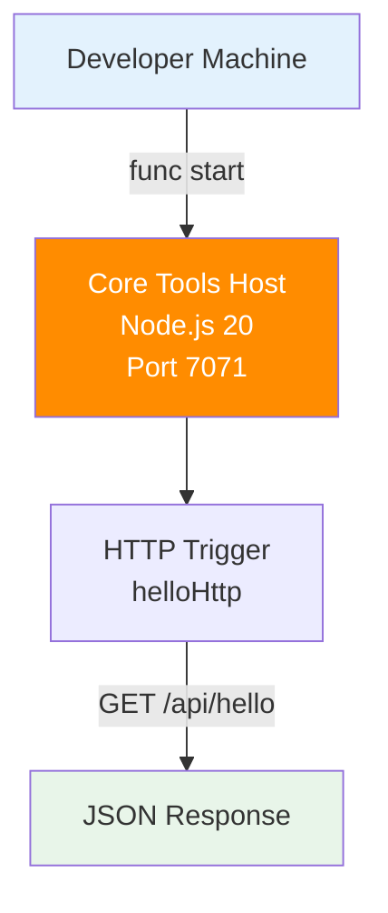

---
validation:
  az_cli:
    last_tested: 2026-04-10
    cli_version: "2.83.0"
    core_tools_version: "4.8.0"
    result: pass
  bicep:
    last_tested: null
    result: not_tested
content_sources:
  - type: mslearn-adapted
    url: https://learn.microsoft.com/azure/azure-functions/functions-reference-node
  - type: mslearn-adapted
    url: https://learn.microsoft.com/azure/azure-functions/create-first-function-cli-node
  - type: mslearn-adapted
    url: https://learn.microsoft.com/azure/azure-functions/functions-scale
---

# 01 - Run Locally (Premium)

Run the sample Azure Functions Node.js v4 app on your machine before deploying to the Premium (EP1) plan. This track uses Linux shell examples; the same workflow works on Windows with equivalent commands.

## Prerequisites

- You completed the [Language Guide overview](../../index.md) and have Node.js 20+, Core Tools v4, and Azure CLI installed.
- You are signed in to Azure CLI (`az login`).

| Tool | Version | Purpose |
|---|---|---|
| Node.js | 20+ | Local runtime and package execution |
| Azure Functions Core Tools | v4 | Local host and publishing |
| Azure CLI | 2.61+ | Azure resource provisioning and management |

!!! info "Plan basics"
    Premium (Elastic Premium, EP1) provides always-warm instances, VNet integration, deployment slots, and unlimited timeout support. Unlike Consumption, Premium keeps at least one instance always warm — eliminating cold-start latency for production APIs.

## What You'll Build

You will create a Node.js v4 HTTP-triggered function named `helloHttp` and run it locally with Azure Functions Core Tools.
You will validate the local route at `/api/hello/{name?}` and confirm the function returns a JSON payload.

!!! info "Infrastructure Context"
    **Plan**: Premium (EP1) | **Runtime**: Node.js 20 | **Local dev**: Core Tools v4

    This tutorial runs entirely on your local machine. No Azure resources are created. The project structure you build here will be deployed to a Premium plan in Tutorial 02.

    <!-- diagram-id: what-you-ll-build -->


## Steps

### Step 1 — Initialize project

```bash
func init node-guide-premium --worker-runtime node --language javascript
cd node-guide-premium
npm install @azure/functions
```

Expected output (abridged):

```text
Writing package.json
Writing .gitignore
Writing host.json
Writing local.settings.json
Writing /data/GitHub/azure-functions-practical-guide/apps/nodejs/.vscode/extensions.json
```

### Step 2 — Create the v4 handler

Save the following as `src/functions/helloHttp.js`:

```javascript
const { app } = require('@azure/functions');

app.http('helloHttp', {
    methods: ['GET'],
    route: 'hello/{name?}',
    handler: async (request, context) => {
        const name = request.params.name || request.query.get('name') || 'world';
        context.log(`Handled hello for ${name}`);
        return { status: 200, jsonBody: { message: `Hello, ${name}` } };
    }
});
```

### Step 3 — Run host and test

```bash
func start
```

Expected output:

```text
Azure Functions Core Tools
Core Tools Version:       4.8.0
Function Runtime Version: 4.1036.1.23224

Functions:

        helloHttp: [GET] http://localhost:7071/api/hello/{name?}

For detailed output, run func with --verbose flag.
```

In a second terminal, test the endpoint:

```bash
curl --request GET "http://localhost:7071/api/hello"
```

Expected output:

```json
{"message":"Hello, world"}
```

```bash
curl --request GET "http://localhost:7071/api/hello/Azure"
```

Expected output:

```json
{"message":"Hello, Azure"}
```

### Step 4 — Review Premium-specific notes

- Premium plans require Azure Files content share settings (`WEBSITE_CONTENTAZUREFILECONNECTIONSTRING` and `WEBSITE_CONTENTSHARE`) for content storage during provisioning.
- Use an EP plan such as EP1 and configure always-ready capacity for low-latency APIs.
- Premium supports unlimited function timeout (`"functionTimeout": "-1"` in host.json).
- Use long-form CLI flags (for example, `--resource-group`) for maintainable runbooks.

## Verification

```text
Functions:
    helloHttp: [GET] http://localhost:7071/api/hello/{name?}
```

Confirm that the host lists `helloHttp`, then run `curl --request GET "http://localhost:7071/api/hello"` and verify a `200 OK` response with a JSON body `{"message":"Hello, world"}`.

## See Also
- [Tutorial Overview & Plan Chooser](../index.md)
- [Node.js Language Guide](../../index.md)
- [Platform: Hosting Plans](../../../../platform/hosting.md)
- [Operations: Deployment](../../../../operations/deployment.md)
- [Recipes Index](../../recipes/index.md)

## Sources
- [Azure Functions Node.js developer guide (Microsoft Learn)](https://learn.microsoft.com/azure/azure-functions/functions-reference-node)
- [Create your first Azure Function with Core Tools (Microsoft Learn)](https://learn.microsoft.com/azure/azure-functions/create-first-function-cli-node)
- [Azure Functions hosting options (Microsoft Learn)](https://learn.microsoft.com/azure/azure-functions/functions-scale)
