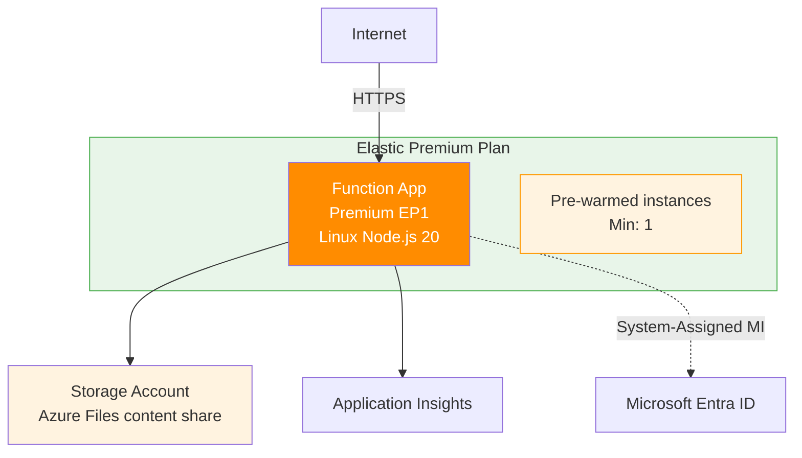

---
hide:
  - toc
validation:
  az_cli:
    last_tested: 2026-04-10
    cli_version: "2.83.0"
    core_tools_version: "4.8.0"
    result: pass
  bicep:
    last_tested: null
    result: not_tested
content_sources:
  - type: mslearn-adapted
    url: https://learn.microsoft.com/azure/azure-functions/functions-reference-node
  - type: mslearn-adapted
    url: https://learn.microsoft.com/azure/azure-functions/create-first-function-cli-node
  - type: mslearn-adapted
    url: https://learn.microsoft.com/azure/azure-functions/functions-scale
---

# 02 - First Deploy (Premium)

Deploy a Node.js Function App to an Elastic Premium plan (`EP1`) with always-warm instances, then publish code and verify the app is live.

## Prerequisites

- You completed [01 - Run Locally](01-local-run.md).
- You are signed in to Azure CLI and have Contributor access.
- You already exported: `$RG`, `$APP_NAME`, `$PLAN_NAME`, `$STORAGE_NAME`, `$LOCATION` (use `koreacentral` for this guide).

## What You'll Build

- A Linux Node.js Function App on Elastic Premium (`EP1`) with runtime settings.
- Always-warm instances for production latency requirements.
- A first deployment pipeline (`func azure functionapp publish`) and endpoint verification.

!!! info "Infrastructure Context"
    **Plan**: Premium (EP1) | **Network**: Public (VNet optional) | **Always warm**: ✅

    Premium deploys with pre-warmed instances, Azure Files content share for deployment, and optional VNet integration. Storage uses connection string authentication by default.

    <!-- diagram-id: what-you-ll-build -->


## Steps

1. Set environment variables for the deployment.

    ```bash
    export RG="rg-func-node-prem-demo"
    export LOCATION="koreacentral"
    export STORAGE_NAME="stndprem0410"
    export PLAN_NAME="plan-ndprem-04100022"
    export APP_NAME="func-ndprem-04100022"
    ```

    | Command/Parameter | Purpose |
    |-------------------|---------|
    | `export RG="..."` | Sets the resource group name for the deployment. |
    | `export LOCATION="..."` | Chooses the Azure region for the deployment. |
    | `export STORAGE_NAME="..."` | Defines a unique name for the storage account. |
    | `export PLAN_NAME="..."` | Sets the name for the Elastic Premium plan. |
    | `export APP_NAME="..."` | Defines a globally unique name for the Function App. |

    !!! tip "Globally unique names required"
        Both `$APP_NAME` and `$STORAGE_NAME` must be globally unique across all Azure subscriptions. If you get a naming conflict, append a random suffix (e.g., `func-ndprem-04091234`).

2. Authenticate and set subscription context.

    ```bash
    az login
    az account set --subscription "<subscription-id>"
    ```

    | Command/Parameter | Purpose |
    |-------------------|---------|
    | `az login` | Authenticates your CLI session with Azure. |
    | `az account set --subscription` | Targets the specific Azure subscription for resource creation. |

3. Create resource group.

    ```bash
    az group create \
      --name "$RG" \
      --location "$LOCATION"
    ```

    | Command/Parameter | Purpose |
    |-------------------|---------|
    | `az group create` | Provisions a new Azure resource group container. |
    | `--name "$RG"` | Specifies the resource group name. |
    | `--location "$LOCATION"` | Sets the geographical region for the group. |

    Expected output (abridged):

    ```json
    {
      "name": "rg-func-node-prem-demo",
      "location": "koreacentral",
      "properties": {
        "provisioningState": "Succeeded"
      }
    }
    ```

4. Create storage account.

    ```bash
    az storage account create \
      --name "$STORAGE_NAME" \
      --resource-group "$RG" \
      --location "$LOCATION" \
      --sku "Standard_LRS" \
      --kind "StorageV2" \
      --allow-blob-public-access false
    ```

    | Command/Parameter | Purpose |
    |-------------------|---------|
    | `az storage account create` | Provisions a new Azure Storage account. |
    | `--sku "Standard_LRS"` | Selects locally-redundant storage for cost-efficiency. |
    | `--kind "StorageV2"` | Uses the general-purpose v2 storage account type. |
    | `--allow-blob-public-access false` | Disables public access to blobs for better security. |

    Expected output (abridged):

    ```json
    {
      "name": "<storage-account-name>",
      "location": "koreacentral",
      "kind": "StorageV2",
      "provisioningState": "Succeeded"
    }
    ```

5. Create the Premium plan (EP1, Linux).

    ```bash
    az functionapp plan create \
      --name "$PLAN_NAME" \
      --resource-group "$RG" \
      --location "$LOCATION" \
      --sku "EP1" \
      --is-linux
    ```

    | Command/Parameter | Purpose |
    |-------------------|---------|
    | `az functionapp plan create` | Provisions an Elastic Premium hosting plan. |
    | `--sku "EP1"` | Selects the entry-level Premium tier. |
    | `--is-linux` | Configures the plan for Linux-based workers. |

    Expected output (abridged):

    ```json
    {
      "name": "<plan-name>",
      "location": "koreacentral",
      "sku": {
        "name": "EP1",
        "tier": "ElasticPremium"
      },
      "provisioningState": "Succeeded"
    }
    ```

6. Create the Function App on the Premium plan.

    ```bash
    az functionapp create \
      --name "$APP_NAME" \
      --resource-group "$RG" \
      --plan "$PLAN_NAME" \
      --storage-account "$STORAGE_NAME" \
      --runtime "node" \
      --runtime-version "20" \
      --functions-version "4" \
      --os-type "Linux"
    ```

    | Command/Parameter | Purpose |
    |-------------------|---------|
    | `az functionapp create` | Provisions the core Function App resource. |
    | `--plan "$PLAN_NAME"` | Links the app to the Elastic Premium plan. |
    | `--runtime "node"` | Selects the Node.js execution environment. |
    | `--runtime-version "20"` | Pins the Node.js version to v20. |
    | `--functions-version "4"` | Uses version 4 of the Azure Functions runtime host. |
    | `--os-type "Linux"` | Deploys the app on a Linux infrastructure. |

    !!! warning "Node.js 20 EOL approaching"
        Azure CLI warns: `Use node version 24 as 20 will reach end-of-life on 2026-04-30`. Consider using `--runtime-version 22` or later for new projects.

    Expected output (abridged):

    ```json
    {
      "name": "func-ndprem-04100022",
      "state": "Running",
      "kind": "functionapp,linux",
      "defaultHostName": "func-ndprem-04100022.azurewebsites.net"
    }
    ```

    !!! info "Application Insights auto-created"
        `az functionapp create` automatically creates an Application Insights resource with the **same name** as the function app (e.g., `func-ndprem-04100022`), not `$APP_NAME-ai`. The `APPLICATIONINSIGHTS_CONNECTION_STRING` app setting is auto-configured.

    !!! warning "Enterprise policy: Shared key access"
        Some enterprise subscriptions enforce Azure Policy that sets `allowSharedKeyAccess: false` on all storage accounts. Premium (EP1) requires `WEBSITE_CONTENTAZUREFILECONNECTIONSTRING` with a connection string that uses shared key access to create the content file share during provisioning. If your subscription has this policy, the Function App creation will fail with a 403 error. Solutions:

        - Request a policy exemption from your Azure administrator
        - Use Flex Consumption (FC1) which supports identity-based blob storage without shared keys
        - Use Dedicated (B1) which uses `WEBSITE_RUN_FROM_PACKAGE` without a content file share

7. Publish the app.

    ```bash
    cd apps/nodejs
    func azure functionapp publish "$APP_NAME"
    ```

    | Command/Parameter | Purpose |
    |-------------------|---------|
    | `cd apps/nodejs` | Moves the terminal into the source code directory. |
    | `func azure functionapp publish` | Bundles, uploads, and deploys the app source code. |

    Expected output (abridged):

    ```text
    Getting site publishing info...
    Uploading package...
    Uploading 49.36 MB [##############################################################]
    Upload completed successfully.
    Deployment completed successfully.
    Syncing triggers...
    ```

    !!! note "EventHub placeholder required"
        If your app includes an Event Hub trigger, the function host may fail to start without a valid `EventHubConnection` setting. Set a placeholder:

        ```bash
        az functionapp config appsettings set \
          --name "$APP_NAME" \
          --resource-group "$RG" \
          --settings "EventHubConnection__fullyQualifiedNamespace=placeholder.servicebus.windows.net"
        ```

    | Command/Parameter | Purpose |
    |-------------------|---------|
    | `az functionapp config appsettings set` | Updates the application settings for the Function App. |
    | `--settings` | Defines the key-value pairs required by the function triggers. |

8. Validate deployment.

    ```bash
    az functionapp function list \
      --name "$APP_NAME" \
      --resource-group "$RG" \
      --output table
    ```

    | Command/Parameter | Purpose |
    |-------------------|---------|
    | `az functionapp function list` | Queries ARM to retrieve the list of indexed functions. |
    | `--output table` | Formats the function list as a readable text table. |

    !!! tip "Function indexing delay"
        After the first publish, it may take 30–60 seconds for all functions to appear in the ARM API. If the list is empty, wait and retry.

    Expected output (abridged — showing key functions):

    ```text
    Name                                          Language
    --------------------------------------------  ----------
    func-ndprem-04100022/helloHttp                node
    func-ndprem-04100022/health                   node
    func-ndprem-04100022/info                     node
    func-ndprem-04100022/queueProcessor           node
    func-ndprem-04100022/blobProcessor            node
    func-ndprem-04100022/scheduledCleanup         node
    ```

    !!! note "Language field"
        The `Language` column shows `node`, not `Javascript`. This is the actual value returned by the ARM API for Node.js v4 apps.

9. Test the deployed endpoints.

    ```bash
    curl --request GET "https://$APP_NAME.azurewebsites.net/api/health"
    ```

    | Command/Parameter | Purpose |
    |-------------------|---------|
    | `curl --request GET` | Sends an HTTP GET request to verify the health endpoint. |

    Expected output:

    ```json
    {"status":"healthy","timestamp":"2026-04-09T15:42:13.827Z","version":"1.0.0"}
    ```

    ```bash
    curl --request GET "https://$APP_NAME.azurewebsites.net/api/hello/Azure"
    ```

    | Command/Parameter | Purpose |
    |-------------------|---------|
    | `curl --request GET` | Sends an HTTP GET request to verify the hello endpoint. |


    Expected output:

    ```json
    {"message":"Hello, Azure"}
    ```

## Verification

The output confirms that Azure indexed your function definitions and the app serves requests. Verify:

- `az functionapp function list` shows functions with language `node`
- `curl` to the health endpoint returns `200 OK` with `{"status":"healthy",...}`
- `curl` to `/api/hello/Azure` returns `{"message":"Hello, Azure"}`

## See Also
- [Tutorial Overview & Plan Chooser](../index.md)
- [Node.js Language Guide](../../index.md)
- [Platform: Hosting Plans](../../../../platform/hosting.md)
- [Operations: Deployment](../../../../operations/deployment.md)
- [Recipes Index](../../recipes/index.md)

## Sources
- [Azure Functions Node.js developer guide (Microsoft Learn)](https://learn.microsoft.com/azure/azure-functions/functions-reference-node)
- [Create your first Azure Function with Core Tools (Microsoft Learn)](https://learn.microsoft.com/azure/azure-functions/create-first-function-cli-node)
- [Azure Functions hosting options (Microsoft Learn)](https://learn.microsoft.com/azure/azure-functions/functions-scale)
