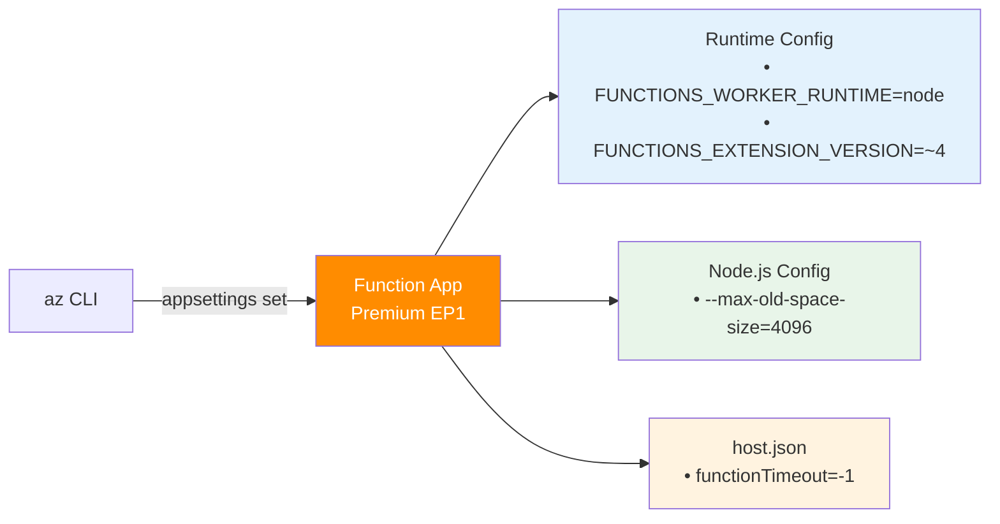

---
hide:
  - toc
validation:
  az_cli:
    last_tested: 2026-04-10
    cli_version: "2.83.0"
    core_tools_version: "4.8.0"
    result: pass
  bicep:
    last_tested: null
    result: not_tested
content_sources:
  - type: mslearn-adapted
    url: https://learn.microsoft.com/azure/azure-functions/functions-reference-node
  - type: mslearn-adapted
    url: https://learn.microsoft.com/azure/azure-functions/create-first-function-cli-node
  - type: mslearn-adapted
    url: https://learn.microsoft.com/azure/azure-functions/functions-scale
---

# 03 - Configuration (Premium)

Manage environment settings, runtime options, and host behavior per environment.

## Prerequisites

- You completed [02 - First Deploy](02-first-deploy.md).
- Your function app is running on the Premium plan and responding to HTTP requests.

| Tool | Version | Purpose |
|---|---|---|
| Node.js | 20+ | Local runtime and package execution |
| Azure Functions Core Tools | v4 | Local host and publishing |
| Azure CLI | 2.61+ | Azure resource provisioning and management |

!!! info "Plan basics"
    Premium provides always-warm instances, VNet integration, deployment slots, and unlimited timeout support.

## What You'll Build

You will apply required app settings for the Node.js worker and runtime extension, then validate effective settings in Azure.
You will also tune host-level timeout behavior appropriate for the Premium plan characteristics.

!!! info "Infrastructure Context"
    **Plan**: Premium (EP1) | **Config model**: `siteConfig.appSettings` (classic)

    Premium uses the classic `siteConfig.appSettings` model — all settings are managed via `az functionapp config appsettings set`. Unlike Flex Consumption, there are no platform-managed settings that block manual updates.

    <!-- diagram-id: what-you-ll-build -->


## Steps

### Step 1 — Configure app settings

```bash
az functionapp config appsettings set \
  --name "$APP_NAME" \
  --resource-group "$RG" \
  --settings \
    "FUNCTIONS_WORKER_RUNTIME=node" \
    "FUNCTIONS_EXTENSION_VERSION=~4" \
    "languageWorkers__node__arguments=--max-old-space-size=4096"
```

Expected output (abridged):

```json
[
  {
    "name": "FUNCTIONS_WORKER_RUNTIME",
    "value": "node"
  },
  {
    "name": "FUNCTIONS_EXTENSION_VERSION",
    "value": "~4"
  },
  {
    "name": "languageWorkers__node__arguments",
    "value": "--max-old-space-size=4096"
  }
]
```

### Step 2 — Configure host timeout

Premium supports unlimited function timeout. Set `functionTimeout` to `"-1"` in `host.json`:

```json
{
  "version": "2.0",
  "functionTimeout": "-1"
}
```

!!! tip "Timeout comparison by plan"
    | Plan | Default timeout | Maximum |
    |---|---|---|
    | Consumption | 5 min | 10 min |
    | Flex Consumption | 30 min | Unlimited (with `always-ready`) |
    | Premium | 30 min | Unlimited (`-1`) |
    | Dedicated | 30 min | Unlimited (`-1`) |

### Step 3 — Validate effective config

```bash
az functionapp config appsettings list \
  --name "$APP_NAME" \
  --resource-group "$RG" \
  --output table
```

Expected output (key rows):

```text
Name                              Value
--------------------------------  -------------------------
FUNCTIONS_WORKER_RUNTIME          node
FUNCTIONS_EXTENSION_VERSION       ~4
languageWorkers__node__arguments  --max-old-space-size=4096
```

### Step 4 — Verify platform-managed settings

Premium automatically creates these settings during provisioning:

```bash
az functionapp config appsettings list \
  --name "$APP_NAME" \
  --resource-group "$RG" \
  --query "[?name=='WEBSITE_CONTENTAZUREFILECONNECTIONSTRING' || name=='WEBSITE_CONTENTSHARE' || name=='AzureWebJobsStorage'].{Name:name, Value:'(set)'}" \
  --output table
```

Expected output:

```text
Name                                      Value
----------------------------------------  -------
AzureWebJobsStorage                       (set)
WEBSITE_CONTENTAZUREFILECONNECTIONSTRING   (set)
WEBSITE_CONTENTSHARE                       (set)
```

!!! warning "Do not delete content share settings"
    `WEBSITE_CONTENTAZUREFILECONNECTIONSTRING` and `WEBSITE_CONTENTSHARE` are required by Premium for Azure Files-based deployment. Removing them will cause the function app to fail.

### Plan-specific notes

- Premium plans require Azure Files content share settings (`WEBSITE_CONTENTAZUREFILECONNECTIONSTRING` and `WEBSITE_CONTENTSHARE`) for content storage behavior.
- All app settings can be freely set/updated via `az functionapp config appsettings set` (unlike Flex Consumption which blocks `FUNCTIONS_WORKER_RUNTIME`).
- Use an EP plan such as EP1 and configure always-ready capacity for low-latency APIs.
- Use long-form CLI flags for maintainable runbooks.

## Verification

```text
Name                              Value
--------------------------------  -------------------------
FUNCTIONS_WORKER_RUNTIME          node
FUNCTIONS_EXTENSION_VERSION       ~4
languageWorkers__node__arguments  --max-old-space-size=4096
```

The table confirms required Node.js worker settings are applied to the deployed app.

## See Also
- [Tutorial Overview & Plan Chooser](../index.md)
- [Node.js Language Guide](../../index.md)
- [Platform: Hosting Plans](../../../../platform/hosting.md)
- [Operations: Deployment](../../../../operations/deployment.md)
- [Recipes Index](../../recipes/index.md)

## Sources
- [Azure Functions Node.js developer guide (Microsoft Learn)](https://learn.microsoft.com/azure/azure-functions/functions-reference-node)
- [Create your first Azure Function with Core Tools (Microsoft Learn)](https://learn.microsoft.com/azure/azure-functions/create-first-function-cli-node)
- [Azure Functions hosting options (Microsoft Learn)](https://learn.microsoft.com/azure/azure-functions/functions-scale)
