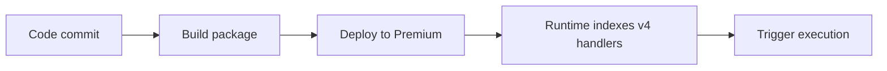

# 04 - Logging and Monitoring (Premium)

Capture structured logs, query telemetry, and validate operational visibility.

## Prerequisites

| Tool | Version | Purpose |
|---|---|---|
| Node.js | 20+ | Local runtime and package execution |
| Azure Functions Core Tools | v4 | Local host and publishing |
| Azure CLI | 2.61+ | Azure resource provisioning and management |

!!! info "Plan basics"
    Premium provides always-warm instances, VNet integration, deployment slots, and unlimited timeout support.

## What You'll Build

You will emit structured application logs from a Node.js HTTP function and connect the app to Application Insights.
You will query recent traces to verify that runtime events are captured and searchable.

## Steps



### Step 1 - Log with context

```javascript
const { app } = require('@azure/functions');

app.http('status', {
    methods: ['GET'],
    handler: async (_request, context) => {
        context.log('status endpoint called');
        return { status: 200, jsonBody: { status: 'ok' } };
    }
});
```

### Step 2 - Enable and verify telemetry

```bash
az monitor app-insights component create --app $APP_NAME-ai --location $LOCATION --resource-group $RG --kind web
az functionapp config appsettings set --name $APP_NAME --resource-group $RG --settings "APPLICATIONINSIGHTS_CONNECTION_STRING=<connection-string>"
```

### Step 3 - Query traces

```bash
az monitor app-insights query --app $APP_NAME-ai --analytics-query "traces | take 20" --output json
```

### Plan-specific notes

- Premium plans require Azure Files content share settings (`WEBSITE_CONTENTAZUREFILECONNECTIONSTRING` and `WEBSITE_CONTENTSHARE`) for standard content storage behavior.
- Use an EP plan such as EP1 and configure always-ready capacity for low-latency APIs.
- Use long-form CLI flags for maintainable runbooks.

## Verification

```json
{
  "tables": [
    {
      "name": "PrimaryResult",
      "columns": [
        { "name": "timestamp", "type": "datetime" },
        { "name": "message", "type": "string" },
        { "name": "severityLevel", "type": "int" }
      ],
      "rows": [
        ["2026-04-08T08:10:13.0000000Z", "status endpoint called", 1]
      ]
    }
  ]
}
```

The query result proves telemetry ingestion is active for your Function App.

## See Also
- [Tutorial Overview & Plan Chooser](../index.md)
- [Node.js Language Guide](../../index.md)
- [Platform: Hosting Plans](../../../../platform/hosting.md)
- [Operations: Deployment](../../../../operations/deployment.md)
- [Recipes Index](../../recipes/index.md)

## Sources
- [Azure Functions Node.js developer guide (Microsoft Learn)](https://learn.microsoft.com/azure/azure-functions/functions-reference-node)
- [Create your first Azure Function with Core Tools (Microsoft Learn)](https://learn.microsoft.com/azure/azure-functions/create-first-function-cli-node)
- [Azure Functions hosting options (Microsoft Learn)](https://learn.microsoft.com/azure/azure-functions/functions-scale)
