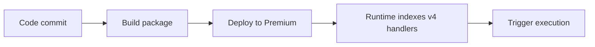

# 05 - Infrastructure as Code (Premium)

Deploy repeatable infrastructure with Bicep and parameterized environments.

## Prerequisites

| Tool | Version | Purpose |
|---|---|---|
| Node.js | 20+ | Local runtime and package execution |
| Azure Functions Core Tools | v4 | Local host and publishing |
| Azure CLI | 2.61+ | Azure resource provisioning and management |

!!! info "Plan basics"
    Premium provides always-warm instances, VNet integration, deployment slots, and unlimited timeout support.

## What You'll Build

You will deploy the complete Premium infrastructure stack from Bicep, including storage, hosting plan, and Linux Function App resources.
You will then verify the deployment state using Azure Resource Manager deployment metadata.

## Steps



### Step 1 - Define Bicep template

Below is a simplified Premium template showing key resources. The repository template at `infra/premium/main.bicep` adds VNet integration, private endpoints, private DNS, and full RBAC configuration using a single `baseName` parameter.

```bicep
param location string = resourceGroup().location
param baseName string

var functionAppName = '${baseName}-func'
var storageAccountName = toLower(replace('${baseName}storage', '-', ''))
var appServicePlanName = '${baseName}-plan'
var contentShareName = toLower(replace('${baseName}-content', '-', ''))

resource storage 'Microsoft.Storage/storageAccounts@2023-05-01' = {
  name: storageAccountName
  location: location
  sku: { name: 'Standard_LRS' }
  kind: 'StorageV2'
}

resource plan 'Microsoft.Web/serverfarms@2024-04-01' = {
  name: appServicePlanName
  location: location
  sku: {
    name: 'EP1'
    tier: 'ElasticPremium'
  }
  kind: 'elastic'
  properties: {
    reserved: true
  }
}

resource functionApp 'Microsoft.Web/sites@2024-04-01' = {
  name: functionAppName
  location: location
  kind: 'functionapp,linux'
  identity: {
    type: 'SystemAssigned'
  }
  properties: {
    serverFarmId: plan.id
    httpsOnly: true
    siteConfig: {
      linuxFxVersion: 'NODE|20'
      appSettings: [
        { name: 'FUNCTIONS_EXTENSION_VERSION'; value: '~4' }
        { name: 'FUNCTIONS_WORKER_RUNTIME'; value: 'node' }
        { name: 'AzureWebJobsStorage__accountName'; value: storage.name }
        { name: 'AzureWebJobsStorage__credential'; value: 'managedidentity' }
        { name: 'WEBSITE_CONTENTAZUREFILECONNECTIONSTRING'; value: '...' }
        { name: 'WEBSITE_CONTENTSHARE'; value: contentShareName }
      ]
    }
  }
}
```

### Step 2 - Deploy template

```bash
az deployment group create --resource-group $RG --template-file infra/premium/main.bicep --parameters baseName=$BASE_NAME
```

### Step 3 - Verify deployment state

```bash
az deployment group show --resource-group $RG --name main --output json
```

### Plan-specific notes

- Premium plans require Azure Files content share settings (`WEBSITE_CONTENTAZUREFILECONNECTIONSTRING` and `WEBSITE_CONTENTSHARE`) for standard content storage behavior.
- The repository template (`infra/premium/main.bicep`) includes full VNet integration with private endpoints and DNS zones, plus RBAC role assignments for identity-based storage.
- Use an EP plan such as EP1 and configure always-ready capacity for low-latency APIs.
- Use long-form CLI flags for maintainable runbooks.

## Verification

```json
{
  "name": "main",
  "properties": {
    "provisioningState": "Succeeded",
    "mode": "Incremental",
    "timestamp": "2026-04-08T08:40:03.0000000Z"
  }
}
```

A `Succeeded` provisioning state confirms the Bicep deployment completed for the selected plan.

## See Also
- [Tutorial Overview & Plan Chooser](../index.md)
- [Node.js Language Guide](../../index.md)
- [Platform: Hosting Plans](../../../../platform/hosting.md)
- [Operations: Deployment](../../../../operations/deployment.md)
- [Recipes Index](../../recipes/index.md)

## Sources
- [Azure Functions Node.js developer guide (Microsoft Learn)](https://learn.microsoft.com/azure/azure-functions/functions-reference-node)
- [Create your first Azure Function with Core Tools (Microsoft Learn)](https://learn.microsoft.com/azure/azure-functions/create-first-function-cli-node)
- [Azure Functions hosting options (Microsoft Learn)](https://learn.microsoft.com/azure/azure-functions/functions-scale)
