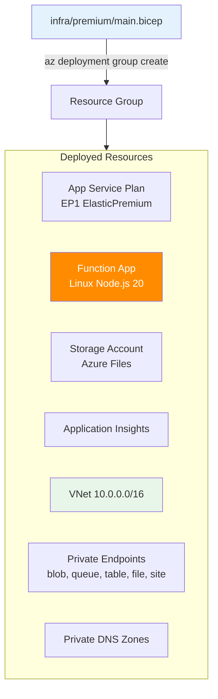

---
hide:
  - toc
validation:
  az_cli:
    last_tested: 2026-04-10
    cli_version: "2.83.0"
    core_tools_version: "4.8.0"
    result: pass
  bicep:
    last_tested: null
    result: not_tested
content_sources:
  - type: mslearn-adapted
    url: https://learn.microsoft.com/azure/azure-functions/functions-reference-node
  - type: mslearn-adapted
    url: https://learn.microsoft.com/azure/azure-resource-manager/bicep/overview
  - type: mslearn-adapted
    url: https://learn.microsoft.com/azure/azure-functions/functions-scale
---

# 05 - Infrastructure as Code (Premium)

Deploy repeatable infrastructure with Bicep and parameterized environments.

## Prerequisites

- You completed [04 - Logging and Monitoring](04-logging-monitoring.md).
- Azure CLI with Bicep support installed (`az bicep version`).

| Tool | Version | Purpose |
|---|---|---|
| Node.js | 20+ | Local runtime and package execution |
| Azure Functions Core Tools | v4 | Local host and publishing |
| Azure CLI | 2.61+ | Azure resource provisioning and management |

!!! info "Plan basics"
    Premium provides always-warm instances, VNet integration, deployment slots, and unlimited timeout support.

## What You'll Build

You will deploy the complete Premium infrastructure stack from Bicep, including storage, hosting plan, VNet, private endpoints, and Linux Function App resources.
You will then verify the deployment state using Azure Resource Manager deployment metadata.

!!! info "Infrastructure Context"
    **Plan**: Premium (EP1) | **IaC**: Bicep | **Network**: VNet + Private Endpoints

    The repository template at `infra/premium/main.bicep` deploys a full production-grade Premium stack with VNet integration, private endpoints for storage (blob, queue, table, file), a site private endpoint, RBAC role assignments, and Azure Files content share.

    <!-- diagram-id: what-you-ll-build -->


## Steps

### Step 1 — Review Bicep template

The repository template at `infra/premium/main.bicep` deploys:

- Storage account with private endpoints (blob, queue, table, file)
- VNet with integration subnet (delegated to `Microsoft.Web/serverFarms`) and PE subnet
- Elastic Premium plan (EP1)
- Linux Function App with system-assigned managed identity
- RBAC role assignments (Storage Blob Data Owner, Storage Account Contributor, Storage Queue Data Contributor, Storage File Data Privileged Contributor)
- Azure Files content share
- Private DNS zones for all storage services

Below is a simplified excerpt showing key resources:

```bicep
param location string = resourceGroup().location
param baseName string

var functionAppName = '${baseName}-func'
var storageAccountName = toLower(replace('${baseName}storage', '-', ''))
var appServicePlanName = '${baseName}-plan'
var contentShareName = toLower(replace('${baseName}-content', '-', ''))

resource plan 'Microsoft.Web/serverfarms@2024-04-01' = {
  name: appServicePlanName
  location: location
  sku: {
    name: 'EP1'
    tier: 'ElasticPremium'
  }
  kind: 'elastic'
  properties: {
    reserved: true
  }
}

resource functionApp 'Microsoft.Web/sites@2024-04-01' = {
  name: functionAppName
  location: location
  kind: 'functionapp,linux'
  identity: {
    type: 'SystemAssigned'
  }
  properties: {
    serverFarmId: plan.id
    httpsOnly: true
    siteConfig: {
      linuxFxVersion: 'NODE|20'
      appSettings: [
        { name: 'FUNCTIONS_EXTENSION_VERSION'; value: '~4' }
        { name: 'FUNCTIONS_WORKER_RUNTIME'; value: 'node' }
        { name: 'AzureWebJobsStorage__accountName'; value: storage.name }
        { name: 'AzureWebJobsStorage__credential'; value: 'managedidentity' }
        { name: 'WEBSITE_CONTENTAZUREFILECONNECTIONSTRING'; value: '...' }
        { name: 'WEBSITE_CONTENTSHARE'; value: contentShareName }
      ]
    }
  }
}
```

!!! note "Runtime parameter"
    The repository Bicep template defaults to `pythonVersion` parameter for `linuxFxVersion`. For Node.js deployments, modify the template to use `linuxFxVersion: 'NODE|20'` and `FUNCTIONS_WORKER_RUNTIME: 'node'`, or add a `nodeVersion` parameter.

### Step 2 — Deploy template

```bash
az deployment group create \
  --resource-group "$RG" \
  --template-file infra/premium/main.bicep \
  --parameters baseName="$BASE_NAME"
```

!!! tip "baseName length"
    Storage account names are limited to 24 characters. Keep `baseName` to 17 characters or fewer (the template appends `storage`).

You can preview changes before deploying with `what-if`:

```bash
az deployment group what-if \
  --resource-group "$RG" \
  --template-file infra/premium/main.bicep \
  --parameters baseName="$BASE_NAME"
```

### Step 3 — Verify deployment state

```bash
az deployment group show \
  --resource-group "$RG" \
  --name main \
  --query "{name:name, provisioningState:properties.provisioningState, timestamp:properties.timestamp}" \
  --output json
```

Expected output:

```json
{
  "name": "main",
  "provisioningState": "Succeeded",
  "timestamp": "2026-04-09T08:40:03.0000000Z"
}
```

### Step 4 — Publish app to Bicep-deployed resources

After Bicep deployment, publish the function app code:

```bash
func azure functionapp publish "${BASE_NAME}-func"
```

### Plan-specific notes

- Premium plans require Azure Files content share settings (`WEBSITE_CONTENTAZUREFILECONNECTIONSTRING` and `WEBSITE_CONTENTSHARE`) for content storage behavior.
- The repository template (`infra/premium/main.bicep`) includes full VNet integration with private endpoints and DNS zones, plus RBAC role assignments for identity-based storage.
- Premium uses `siteConfig.appSettings` (classic model), not `functionAppConfig` used by Flex Consumption.
- The Bicep template creates a system-assigned managed identity with 4 RBAC roles on the storage account.

## Verification

```json
{
  "name": "main",
  "provisioningState": "Succeeded",
  "timestamp": "2026-04-09T08:40:03.0000000Z"
}
```

A `Succeeded` provisioning state confirms the Bicep deployment completed for the Premium plan.

## See Also
- [Tutorial Overview & Plan Chooser](../index.md)
- [Node.js Language Guide](../../index.md)
- [Platform: Hosting Plans](../../../../platform/hosting.md)
- [Operations: Deployment](../../../../operations/deployment.md)
- [Recipes Index](../../recipes/index.md)

## Sources
- [Azure Functions Node.js developer guide (Microsoft Learn)](https://learn.microsoft.com/azure/azure-functions/functions-reference-node)
- [Bicep overview (Microsoft Learn)](https://learn.microsoft.com/azure/azure-resource-manager/bicep/overview)
- [Azure Functions hosting options (Microsoft Learn)](https://learn.microsoft.com/azure/azure-functions/functions-scale)
