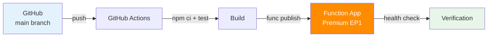

---
hide:
  - toc
validation:
  az_cli:
    last_tested: 2026-04-10
    cli_version: "2.83.0"
    core_tools_version: "4.8.0"
    result: pass
  bicep:
    last_tested: null
    result: not_tested
content_sources:
  - type: mslearn-adapted
    url: https://learn.microsoft.com/azure/azure-functions/functions-reference-node
  - type: mslearn-adapted
    url: https://learn.microsoft.com/azure/azure-functions/functions-continuous-deployment
  - type: mslearn-adapted
    url: https://learn.microsoft.com/azure/azure-functions/functions-scale
---

# 06 - CI/CD (Premium)

Automate build and deployment with GitHub Actions and environment gates.

## Prerequisites

- You completed [05 - Infrastructure as Code](05-infrastructure-as-code.md).
- Your function app is deployed and responding to requests.

| Tool | Version | Purpose |
|---|---|---|
| Node.js | 20+ | Local runtime and package execution |
| Azure Functions Core Tools | v4 | Local host and publishing |
| Azure CLI | 2.61+ | Azure resource provisioning and management |

!!! info "Plan basics"
    Premium provides always-warm instances, VNet integration, deployment slots, and unlimited timeout support.

## What You'll Build

You will define a GitHub Actions workflow that builds and deploys your Node.js Functions app on each push to `main`.
You will validate release health from runtime logs after the deployment finishes.

!!! info "Infrastructure Context"
    **Plan**: Premium (EP1) | **CI/CD**: GitHub Actions | **Deploy method**: `func azure functionapp publish`

    <!-- diagram-id: what-you-ll-build -->


## Steps

### Step 1 — Create workflow

Create `.github/workflows/deploy-node-premium.yml`:

```yaml
name: deploy-node-premium
on:
  push:
    branches: [ main ]
jobs:
  deploy:
    runs-on: ubuntu-latest
    steps:
      - uses: actions/checkout@v4
      - uses: actions/setup-node@v4
        with:
          node-version: '20'
      - run: npm ci
        working-directory: apps/nodejs
      - run: npm test --if-present
        working-directory: apps/nodejs
      - uses: Azure/functions-action@v1
        with:
          app-name: ${{ secrets.APP_NAME }}
          package: 'apps/nodejs'
          publish-profile: ${{ secrets.AZURE_FUNCTIONAPP_PUBLISH_PROFILE }}
```

### Step 2 — Store secrets

1. Download the publish profile:

    ```bash
    az functionapp deployment list-publishing-profiles \
      --name "$APP_NAME" \
      --resource-group "$RG" \
      --xml
    ```

2. Add GitHub Actions secrets in your repository settings:

    - `APP_NAME`: Your function app name (e.g., `func-ndprem-04100022`)
    - `AZURE_FUNCTIONAPP_PUBLISH_PROFILE`: The full XML content from the previous command

### Step 3 — Validate release

After deployment, verify the app is running with the latest code:

```bash
curl --request GET "https://$APP_NAME.azurewebsites.net/api/health"
```

Expected output:

```json
{"status":"healthy","timestamp":"2026-04-09T15:42:13.827Z","version":"1.0.0"}
```

!!! warning "`az functionapp log tail` does not exist"
    Some tutorials reference `az functionapp log tail` — this command does not exist in Azure CLI 2.83.0. Use one of these alternatives:

    - **App Insights query**: `az monitor app-insights query --app "$APP_NAME" --resource-group "$RG" --analytics-query "traces | where timestamp > ago(5m) | take 20"`
    - **Log stream via webapp**: `az webapp log tail --name "$APP_NAME" --resource-group "$RG"` (may return 404 on some plans)
    - **Azure Portal**: Navigate to Function App → Monitor → Log stream

### Step 4 — Verify via Application Insights

```bash
az monitor app-insights query \
  --app "$APP_NAME" \
  --resource-group "$RG" \
  --analytics-query "traces | where timestamp > ago(5m) and message contains 'Executing' | project timestamp, message | take 5" \
  --output json
```

Expected output (abridged):

```json
{
  "tables": [
    {
      "rows": [
        ["2026-04-09T15:42:26Z", "Executing 'Functions.health' (Reason='...')"]
      ]
    }
  ]
}
```

### Plan-specific notes

- Premium supports deployment slots — use staging slots for zero-downtime deployments in production.
- Premium auto-provisions Azure Files content share for deployment — the GitHub Actions workflow can use `func azure functionapp publish` or the `Azure/functions-action`.
- Use long-form CLI flags for maintainable runbooks.

## Verification

Confirm:

1. The GitHub Actions workflow passes (build + deploy).
2. `curl` to the health endpoint returns `200 OK` with `{"status":"healthy",...}`.
3. Application Insights shows recent function execution traces.

## See Also
- [Tutorial Overview & Plan Chooser](../index.md)
- [Node.js Language Guide](../../index.md)
- [Platform: Hosting Plans](../../../../platform/hosting.md)
- [Operations: Deployment](../../../../operations/deployment.md)
- [Recipes Index](../../recipes/index.md)

## Sources
- [Azure Functions Node.js developer guide (Microsoft Learn)](https://learn.microsoft.com/azure/azure-functions/functions-reference-node)
- [Continuous deployment for Azure Functions (Microsoft Learn)](https://learn.microsoft.com/azure/azure-functions/functions-continuous-deployment)
- [Azure Functions hosting options (Microsoft Learn)](https://learn.microsoft.com/azure/azure-functions/functions-scale)
