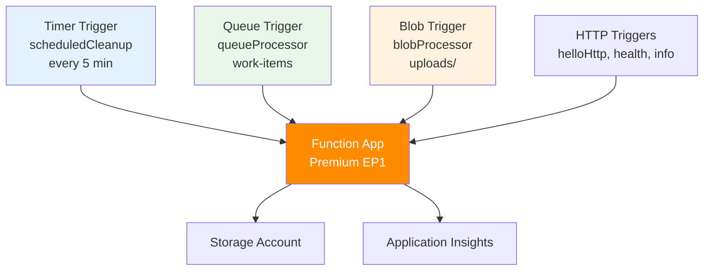

---
validation:
  az_cli:
    last_tested: 2026-04-10
    cli_version: 2.83.0
    core_tools_version: 4.8.0
    result: pass
  bicep:
    last_tested:
    result: not_tested
content_sources:

  - type: mslearn-adapted
    url: https://learn.microsoft.com/en-us/azure/azure-functions/functions-reference-node
  - type: mslearn-adapted
    url: https://learn.microsoft.com/en-us/azure/azure-functions/functions-triggers-bindings
  - type: mslearn-adapted
    url: https://learn.microsoft.com/en-us/azure/azure-functions/functions-scale
content_validation:
  status: verified
  last_reviewed: '2026-05-23'
  reviewer: agent
  core_claims:
    - claim: This page uses Microsoft Learn as the primary source basis for its Azure-specific guidance.
      source: https://learn.microsoft.com/en-us/azure/azure-functions/functions-reference-node
      verified: true
---
# 07 - Extending Triggers (Premium)

Add queue, timer, and blob triggers with the Node.js v4 APIs and verify they execute on the Premium plan.

## Prerequisites

- You completed [06 - CI/CD](06-ci-cd.md).
- Your function app is deployed and has storage resources (queue, blob containers).

| Tool | Version | Purpose |
|---|---|---|
| Node.js | 20+ | Local runtime and package execution |
| Azure Functions Core Tools | v4 | Local host and publishing |
| Azure CLI | 2.61+ | Azure resource provisioning and management |

!!! info "Plan basics"
    Premium provides always-warm instances, VNet integration, deployment slots, and unlimited timeout support.

## What You'll Build

You will extend your app with a timer trigger (`scheduledCleanup`), a queue trigger (`queueProcessor`), and a blob trigger (`blobProcessor`).
You will deploy, send test messages, and verify trigger execution via Application Insights.

!!! info "Infrastructure Context"
    **Plan**: Premium (EP1) | **Triggers**: HTTP + Timer + Queue + Blob

    Premium supports all Azure Functions triggers with no timeout limits. Queue and blob triggers use the `AzureWebJobsStorage` or a dedicated connection string.

    <!-- diagram-id: what-you-ll-build -->


## Steps

### Step 1 — Add timer trigger

The reference app includes `scheduledCleanup` in `src/functions/scheduled.js`:

```javascript
const { app } = require('@azure/functions');

app.timer('scheduledCleanup', {
    schedule: '0 */5 * * * *',
    handler: async (_timer, context) => {
        context.log(`Scheduled cleanup ran at ${new Date().toISOString()}`);
    }
});
```

### Step 2 — Add queue trigger

The reference app includes `queueProcessor` in `src/functions/queueProcessor.js`:

```javascript
const { app } = require('@azure/functions');

app.storageQueue('queueProcessor', {
    queueName: 'work-items',
    connection: 'QueueStorage',
    handler: async (queueItem, context) => {
        context.log(`Queue item received: ${JSON.stringify(queueItem)}`);
    }
});
```

### Step 3 — Add blob trigger

The reference app includes `blobProcessor` in `src/functions/blobProcessor.js`:

```javascript
const { app, output } = require('@azure/functions');

const blobOutput = output.storageBlob({
    path: 'processed/{name}',
    connection: 'AzureWebJobsStorage',
});

app.storageBlob('blobProcessor', {
    path: 'uploads/{name}',
    connection: 'AzureWebJobsStorage',
    source: 'EventGrid',
    return: blobOutput,
    handler: async (blob, context) => {
        context.log(`Blob processed: ${context.triggerMetadata.name}, Size: ${blob.length} bytes`);
        return blob;
    }
});
```

### Step 4 — Create storage resources

```bash
az storage queue create \
  --name "work-items" \
  --account-name "$STORAGE_NAME" \
  --auth-mode key

az storage container create \
  --name "uploads" \
  --account-name "$STORAGE_NAME" \
  --auth-mode key

az storage container create \
  --name "processed" \
  --account-name "$STORAGE_NAME" \
  --auth-mode key
```

| CLI element | Explanation |
|---|---|
| Command(s) | `az storage queue create`, `az storage container create` |
| Key flags | `--name`, `--account-name`, `--auth-mode` |
| Variables | `$STORAGE_NAME` |
| Expected result | Azure CLI returns provisioning details; confirm the resource name and successful provisioning state before continuing. |


### Step 5 — Configure queue connection

Set the `QueueStorage` connection string for the queue trigger:

```bash
CONN_STR=$(az storage account show-connection-string \
  --name "$STORAGE_NAME" \
  --resource-group "$RG" \
  --query connectionString \
  --output tsv)

az functionapp config appsettings set \
  --name "$APP_NAME" \
  --resource-group "$RG" \
  --settings "QueueStorage=$CONN_STR"
```

| CLI element | Explanation |
|---|---|
| Command(s) | `az storage account show-connection-string`, `az functionapp config appsettings set` |
| Key flags | `--name`, `--resource-group`, `--query`, `--output`, `--settings` |
| Variables | `$STORAGE_NAME`, `$RG`, `$APP_NAME`, `$CONN_STR` |
| Expected result | Azure CLI applies the configuration change; confirm the returned JSON or follow-up query shows the expected value. |


### Step 6 — Deploy and verify trigger indexing

```bash
func azure functionapp publish "$APP_NAME"
```

After publishing, verify all triggers are indexed:

```bash
az functionapp function list \
  --name "$APP_NAME" \
  --resource-group "$RG" \
  --query "[].{Name:name, Language:language}" \
  --output table
```

| CLI element | Explanation |
|---|---|
| Command(s) | `az functionapp function list` |
| Key flags | `--name`, `--resource-group`, `--query`, `--output` |
| Variables | `$APP_NAME`, `$RG` |
| Expected result | Azure CLI returns the requested resource data; verify names, IDs, status fields, or metric values match the scenario. |


Expected output (key rows):

```text
Name                                          Language
--------------------------------------------  ----------
func-ndprem-04100022/helloHttp                node
func-ndprem-04100022/health                   node
func-ndprem-04100022/scheduledCleanup         node
func-ndprem-04100022/queueProcessor           node
func-ndprem-04100022/blobProcessor            node
func-ndprem-04100022/timerLab                 node
```

!!! note "Function indexing may require restart"
    If `queueProcessor` shows as disabled or fails to index, restart the function app after setting the `QueueStorage` connection:

    ```bash
    az functionapp restart --name "$APP_NAME" --resource-group "$RG"
    ```

    | CLI element | Explanation |
    |---|---|
    | Command(s) | `az functionapp restart` |
    | Key flags | `--name`, `--resource-group` |
    | Variables | `$APP_NAME`, `$RG` |
    | Expected result | Azure CLI completes successfully and returns JSON, table, or no output depending on the command; verify the next documented check before continuing. |


### Step 7 — Test queue trigger

Send a test message to the queue:

```bash
az storage message put \
  --queue-name "work-items" \
  --content '{"task":"validate-premium","priority":"high"}' \
  --account-name "$STORAGE_NAME" \
  --auth-mode key
```

| CLI element | Explanation |
|---|---|
| Command(s) | `az storage message put` |
| Key flags | `--queue-name`, `--content`, `--account-name`, `--auth-mode` |
| Variables | `$STORAGE_NAME` |
| Expected result | Azure CLI completes successfully and returns JSON, table, or no output depending on the command; verify the next documented check before continuing. |


Expected output:

```json
{
  "content": "{\"task\":\"validate-premium\",\"priority\":\"high\"}",
  "id": "32d6a0d5-d2c0-426a-8516-96f1d63f5337",
  "insertionTime": "2026-04-09T15:45:05+00:00"
}
```

### Step 8 — Test blob trigger

Upload a test file to the `uploads` container:

```bash
echo "Premium blob trigger test" > /tmp/test-blob.txt
az storage blob upload \
  --container-name "uploads" \
  --file "/tmp/test-blob.txt" \
  --name "test-premium.txt" \
  --account-name "$STORAGE_NAME" \
  --auth-mode key \
  --overwrite
```

| CLI element | Explanation |
|---|---|
| Command(s) | `az storage blob upload` |
| Key flags | `--container-name`, `--file`, `--name`, `--account-name`, `--auth-mode`, `--overwrite` |
| Variables | `$STORAGE_NAME` |
| Expected result | Azure CLI completes successfully and returns JSON, table, or no output depending on the command; verify the next documented check before continuing. |


### Step 9 — Verify trigger execution via Application Insights

Wait 2–3 minutes for telemetry ingestion, then query:

```bash
az monitor app-insights query \
  --app "$APP_NAME" \
  --resource-group "$RG" \
  --analytics-query "requests | where timestamp > ago(30m) | summarize count() by name | order by count_ desc" \
  --output json
```

| CLI element | Explanation |
|---|---|
| Command(s) | `az monitor app-insights query` |
| Key flags | `--app`, `--resource-group`, `--analytics-query`, `--output` |
| Variables | `$APP_NAME`, `$RG` |
| Expected result | Azure CLI returns the requested resource data; verify names, IDs, status fields, or metric values match the scenario. |


Expected output (abridged):

```json
{
  "tables": [
    {
      "rows": [
        ["health", 3],
        ["helloHttp", 2],
        ["queueProcessor", 2],
        ["scheduledCleanup", 1],
        ["logLevels", 1]
      ]
    }
  ]
}
```

You can also search for specific trigger executions:

```bash
az monitor app-insights query \
  --app "$APP_NAME" \
  --resource-group "$RG" \
  --analytics-query "traces | where timestamp > ago(30m) and message contains 'queueProcessor' | project timestamp, message | take 5" \
  --output json
```

| CLI element | Explanation |
|---|---|
| Command(s) | `az monitor app-insights query` |
| Key flags | `--app`, `--resource-group`, `--analytics-query`, `--output` |
| Variables | `$APP_NAME`, `$RG` |
| Expected result | Azure CLI returns the requested resource data; verify names, IDs, status fields, or metric values match the scenario. |


Expected output:

```json
{
  "tables": [
    {
      "rows": [
        ["2026-04-09T15:47:07Z", "Executed 'Functions.queueProcessor' (Succeeded, Id=..., Duration=31ms)"],
        ["2026-04-09T15:47:07Z", "Executing 'Functions.queueProcessor' (Reason='New queue message detected on 'work-items'.')"]
      ]
    }
  ]
}
```

### Plan-specific notes

- Premium plans support all trigger types with no timeout limits.
- Queue and blob triggers on Premium benefit from always-warm instances — no cold-start delay for the first trigger after idle.
- Blob triggers use EventGrid-based source by default in v4 — initial blob trigger processing may take up to 10 minutes for the first event.
- Use `connection: 'AzureWebJobsStorage'` for blob triggers if the storage is the same account used for the function app.

## Verification

```text
Functions:
    helloHttp: [GET] http://localhost:7071/api/hello/{name?}
    scheduledCleanup: timerTrigger
    queueProcessor: queueTrigger
    blobProcessor: blobTrigger
```

Confirm:

1. All triggers are indexed (visible in `az functionapp function list` or local `func start`).
2. Queue message is processed — visible in App Insights `requests` table.
3. Timer trigger fires every 5 minutes — visible in App Insights.
4. Blob trigger fires when a file is uploaded to `uploads/` container.

## See Also
- [Tutorial Overview & Plan Chooser](../index.md)
- [Node.js Language Guide](../../index.md)
- [Platform: Hosting Plans](../../../../platform/hosting.md)
- [Operations: Deployment](../../../../operations/deployment.md)
- [Recipes Index](../../recipes/index.md)

## Sources
- [Azure Functions Node.js developer guide (Microsoft Learn)](https://learn.microsoft.com/en-us/azure/azure-functions/functions-reference-node)
- [Azure Functions triggers and bindings (Microsoft Learn)](https://learn.microsoft.com/en-us/azure/azure-functions/functions-triggers-bindings)
- [Azure Functions hosting options (Microsoft Learn)](https://learn.microsoft.com/en-us/azure/azure-functions/functions-scale)
