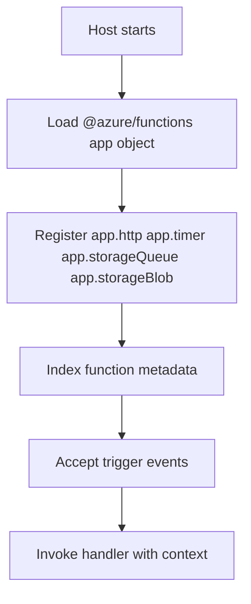

# Node.js v4 Programming Model

This deep dive explains the Node.js v4 code-first model for Azure Functions. It covers registration APIs, trigger patterns, request and response handling, and practical composition patterns for production-ready apps.

## Main Content

The v4 model removes per-function `function.json` authoring for normal scenarios and registers triggers directly in code.



### Project Layout

```text
project-root/
├── src/
│   └── functions/
│       ├── httpTrigger.js
│       ├── timerTrigger.js
│       └── queueTrigger.js
├── host.json
├── local.settings.json
└── package.json
```

### HTTP Trigger Pattern

```javascript
const { app } = require('@azure/functions');

app.http('helloHttp', {
    methods: ['GET'],
    authLevel: 'function',
    route: 'hello/{name?}',
    handler: async (request, context) => {
        const name = request.params.name || request.query.get('name') || 'world';
        context.log(`Request received for ${name}`);
        return {
            status: 200,
            jsonBody: {
                message: `Hello, ${name}`,
                model: 'nodejs-v4'
            }
        };
    }
});
```

### Timer Trigger Pattern

```javascript
const { app } = require('@azure/functions');

app.timer('cleanupTimer', {
    schedule: '0 */5 * * * *',
    handler: async (timer, context) => {
        context.log(`Timer fired at ${timer.scheduleStatus?.last || 'first-run'}`);
    }
});
```

### Queue Trigger Pattern

```javascript
const { app } = require('@azure/functions');

app.storageQueue('processOrders', {
    queueName: 'orders',
    connection: 'AzureWebJobsStorage',
    handler: async (queueItem, context) => {
        context.log(`Processing order ${queueItem.orderId}`);
    }
});
```

### Blob Trigger Pattern

```javascript
const { app } = require('@azure/functions');

app.storageBlob('ingestBlob', {
    path: 'incoming/{name}',
    connection: 'AzureWebJobsStorage',
    handler: async (blob, context) => {
        context.log(`Blob length: ${blob.length}`);
    }
});
```

### ESM Variant

```javascript
import { app } from '@azure/functions';

app.http('ping', {
    methods: ['GET'],
    handler: async (_request, context) => {
        context.log('Ping called');
        return { body: 'pong' };
    }
});
```

### Request Data Access

- Query: `request.query.get('name')`
- Route params: `request.params.name`
- Body JSON: `await request.json()`
- Headers: `request.headers.get('x-correlation-id')`

### Response Construction

- JSON response: `{ status: 200, jsonBody: { ok: true } }`
- Text response: `{ status: 200, body: 'ok' }`
- Error response: `{ status: 400, jsonBody: { error: 'invalid-input' } }`

### Local Initialization

```bash
func init MyProject --worker-runtime node --language javascript --model v4
func new --template "HTTP trigger" --name httpTrigger
func start
```

## See Also
- [Node.js Language Guide](index.md)
- [Node.js Runtime](nodejs-runtime.md)
- [Tutorial Overview & Plan Chooser](tutorial/index.md)
- [Recipes Index](recipes/index.md)

## Sources
- [Azure Functions Node.js developer guide (Microsoft Learn)](https://learn.microsoft.com/azure/azure-functions/functions-reference-node)
- [Azure Functions hosting options (Microsoft Learn)](https://learn.microsoft.com/azure/azure-functions/functions-scale)
- [Azure Functions Core Tools (Microsoft Learn)](https://learn.microsoft.com/azure/azure-functions/functions-run-local)
