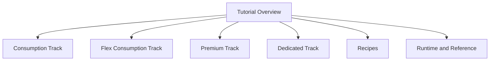

---
content_sources:
  references:
    - type: mslearn-adapted
      url: https://learn.microsoft.com/en-us/azure/azure-functions/functions-reference-powershell
    - type: mslearn-adapted
      url: https://learn.microsoft.com/en-us/azure/azure-functions/functions-scale
    - type: mslearn-adapted
      url: https://learn.microsoft.com/en-us/azure/azure-functions/flex-consumption-plan
  diagrams:
    - id: powershell-language-guide
      type: flowchart
      source: self-generated
      justification: Flow view of powershell language guide, synthesized from Microsoft Learn documentation cited on this page.
      based_on:
        - https://learn.microsoft.com/en-us/azure/azure-functions/functions-reference-powershell
        - https://learn.microsoft.com/en-us/azure/azure-functions/functions-scale
        - https://learn.microsoft.com/en-us/azure/azure-functions/flex-consumption-plan
---
# PowerShell Language Guide

This guide maps Azure Functions platform concepts to the PowerShell programming model. PowerShell functions are a natural fit for automation, Azure resource operations, and glue code that already relies on Azure PowerShell (`Az`) modules.

<!-- diagram-id: powershell-language-guide -->


!!! tip "Architecture first"
    Before diving into PowerShell-specific details, review [Platform](../../platform/index.md) for language-agnostic guidance on hosting, scaling, networking, reliability, and security.

## When PowerShell Is a Good Fit

- **Azure automation** — orchestrating resource operations with the `Az` module, scheduled with a timer trigger.
- **Operational glue** — reacting to queue, Event Grid, or HTTP events with concise scripts.
- **Teams already invested in PowerShell** — reusing existing modules and skills.

For high-throughput, low-latency APIs or heavy compute, prefer a compiled or richer runtime (.NET, Java) — see [Language Guides Overview](../index.md).

## Programming Model

PowerShell functions use the **classic scripting model**: each function is a folder containing a `run.ps1` script and a `function.json` binding definition. This differs from the decorator/code-first models in Python (v2) and Node.js (v4).

```text
PSFunctionApp
 | - MyHttpFunction
 | | - run.ps1
 | | - function.json
 | - host.json
 | - requirements.psd1
 | - profile.ps1
```

See [PowerShell Programming Model](powershell-programming-model.md) for `param` blocks, `Push-OutputBinding`, and binding patterns.

## Start Here

1. Choose your hosting plan in [Tutorial Overview & Plan Chooser](tutorial/index.md).
2. Follow one full tutorial track from local run through CI/CD.
3. Use recipes to add integrations (HTTP, Timer, Queue, Blob, Key Vault, and more).
4. Keep runtime/reference docs open during production hardening.

## What's Covered

| Area | Document | Scope |
|------|----------|-------|
| Tutorial | [Overview & Plan Chooser](tutorial/index.md) | Select Consumption, Flex Consumption, Premium, or Dedicated |
| Tutorial track | [Consumption (Y1)](tutorial/consumption/01-local-run.md) | 7-step flow for classic serverless |
| Tutorial track | [Flex Consumption (FC1)](tutorial/flex-consumption/01-local-run.md) | 7-step flow for modern default serverless |
| Tutorial track | [Premium (EP)](tutorial/premium/01-local-run.md) | 7-step flow for always-warm/VNet scenarios |
| Tutorial track | [Dedicated (App Service)](tutorial/dedicated/01-local-run.md) | 7-step flow for fixed-capacity hosting |
| Recipes | [Recipes Index](recipes/index.md) | Practical implementation recipes |
| Runtime model | [PowerShell Programming Model](powershell-programming-model.md) | `run.ps1`, `function.json`, binding patterns |
| Runtime internals | [PowerShell Runtime](powershell-runtime.md) | Worker behavior, versions, dependency management |
| CLI | [CLI Cheatsheet](cli-cheatsheet.md) | `az` and `func` operational commands |
| Host settings | [host.json Reference](host-json.md) | Concurrency, retry, logging, and managed dependency settings |
| Configuration | [Environment Variables](environment-variables.md) | Key app and platform environment settings |
| Limits | [Platform Limits](platform-limits.md) | Timeouts, payloads, scaling, and service constraints |
| Diagnostics | [Troubleshooting](troubleshooting.md) | Common failures and troubleshooting flow |

## Supported Versions

| Functions runtime | PowerShell version | .NET version | Notes |
|---|---|---|---|
| 4.x | PowerShell 7.4 | .NET 8 | Generally available; supported on all plans |
| 4.x | PowerShell 7.6 (preview) | .NET 10 | Windows-only (Premium, Dedicated, Consumption) |

Flex Consumption supports PowerShell 7.4 on Linux. See [PowerShell Runtime](powershell-runtime.md) for version selection details.

## PowerShell-Specific Considerations

- **Managed dependencies** (`requirements.psd1` auto-download) are **not supported on Flex Consumption** — bundle modules in a `Modules` folder instead.
- **Concurrency** is single-threaded by default; tune with `PSWorkerInProcConcurrencyUpperBound` or `FUNCTIONS_WORKER_PROCESS_COUNT`.
- **Cold start** — avoid `Install-Module` at runtime; use `Save-Module`/`Save-PSResource` at build time.

## Cross-Language Context

If your team supports multiple stacks, compare PowerShell with:

- [Python guide](../python/index.md)
- [Node.js guide](../nodejs/index.md)
- [.NET guide](../dotnet/index.md)
- [Java guide](../java/index.md)

## See Also

- [Language Guides Overview](../index.md)
- [Platform: Architecture](../../platform/architecture/index.md)
- [Platform: Hosting](../../platform/hosting.md)
- [Operations: Deployment](../../operations/deployment.md)
- [Operations: Monitoring](../../operations/monitoring.md)

## Sources

- [Azure Functions PowerShell developer guide (Microsoft Learn)](https://learn.microsoft.com/en-us/azure/azure-functions/functions-reference-powershell)
- [Azure Functions hosting options (Microsoft Learn)](https://learn.microsoft.com/en-us/azure/azure-functions/functions-scale)
- [Flex Consumption plan (Microsoft Learn)](https://learn.microsoft.com/en-us/azure/azure-functions/flex-consumption-plan)
</content>
