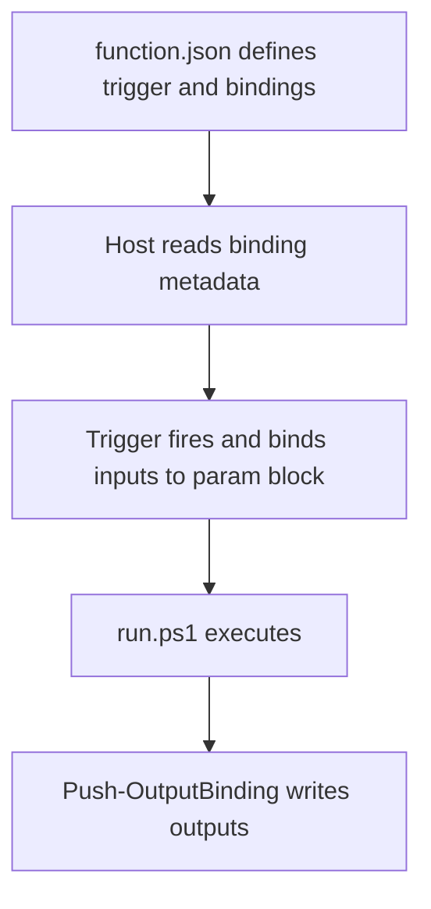

---
content_sources:
  references:
    - type: mslearn-adapted
      url: https://learn.microsoft.com/en-us/azure/azure-functions/functions-reference-powershell
    - type: mslearn-adapted
      url: https://learn.microsoft.com/en-us/azure/azure-functions/functions-triggers-bindings
    - type: mslearn-adapted
      url: https://learn.microsoft.com/en-us/azure/azure-functions/functions-bindings-http-webhook
  diagrams:
    - id: powershell-programming-model
      type: flowchart
      source: self-generated
      justification: Flow view of powershell programming model, synthesized from Microsoft Learn documentation cited on this page.
      based_on:
        - https://learn.microsoft.com/en-us/azure/azure-functions/functions-reference-powershell
        - https://learn.microsoft.com/en-us/azure/azure-functions/functions-triggers-bindings
---
# PowerShell Programming Model

Azure Functions PowerShell uses a **file-based programming model**. Each function is a folder that contains a `run.ps1` script and a `function.json` file that declares the trigger and bindings. Unlike the Python v2 or Node.js v4 code-first models, triggers and bindings are configured in JSON, not in code.

<!-- diagram-id: powershell-programming-model -->


## Project Structure

```text
PSFunctionApp
 | - HttpExample
 | | - run.ps1
 | | - function.json
 | - host.json
 | - local.settings.json
 | - requirements.psd1
 | - profile.ps1
```

- **`host.json`** — app-wide host configuration (shared by all functions).
- **`requirements.psd1`** — managed dependencies (PowerShell modules).
- **`profile.ps1`** — runs once per worker on cold start (e.g. `Connect-AzAccount -Identity`).
- **Each function folder** — one `run.ps1` + one `function.json`.

## function.json: Declaring Triggers and Bindings

The `function.json` lists bindings. Each has a `type`, a `direction` (`in` or `out`), and a `name` that maps to a parameter (input) or `Push-OutputBinding -Name` (output).

```json
{
  "bindings": [
    {
      "type": "httpTrigger",
      "direction": "in",
      "name": "Request",
      "authLevel": "function",
      "methods": ["get", "post"]
    },
    {
      "type": "http",
      "direction": "out",
      "name": "Response"
    }
  ]
}
```

## run.ps1: The param Block

Input bindings arrive as named parameters. Because PowerShell binds by name, parameter order does not matter, but matching the `function.json` order is a good practice. The optional `$TriggerMetadata` parameter carries extra trigger information.

```powershell
param($Request, $TriggerMetadata)

$name = $Request.Query.Name
if (-not $name) { $name = $Request.Body.Name }

Push-OutputBinding -Name Response -Value ([HttpResponseContext]@{
    StatusCode = [System.Net.HttpStatusCode]::OK
    Body       = "Hello $name"
})
```

## Reading Input

Trigger and input bindings are read as parameters. For HTTP, the `$Request` is an `HttpRequestContext` with these properties:

| Property | Description |
|---|---|
| `Body` | Request body, deserialized (JSON → hashtable, otherwise string). |
| `Headers` | Case-insensitive dictionary of request headers. |
| `Method` | HTTP method. |
| `Params` | Route parameters. |
| `Query` | Query-string parameters. |
| `Url` | Full request URL. |

## Writing Output

Use `Push-OutputBinding` to write to any output binding. Its `-Name` maps to the binding `name` in `function.json`.

```powershell
# HTTP response (singleton — a second call errors unless you pass -Clobber)
Push-OutputBinding -Name Response -Value ([HttpResponseContext]@{
    StatusCode = [System.Net.HttpStatusCode]::OK
    Body       = "done"
})

# Queue output (collection — call repeatedly to push multiple messages)
Push-OutputBinding -Name outQueue -Value "message-1"
Push-OutputBinding -Name outQueue -Value "message-2"
```

| Element | Explanation |
|---|---|
| `Push-OutputBinding -Name` | Target output binding, matching `function.json`. |
| `-Clobber` | Overwrite a singleton output value instead of appending. |
| `HttpResponseContext` | Typed HTTP response object (`StatusCode`, `Body`, `Headers`, `ContentType`). |

## Data Types

Binding parameters must be one of: `Hashtable`, `string`, `byte[]`, `int`, `double`, `HttpRequestContext`, `HttpResponseContext`. You can type-cast bindings, for example a blob input as a string:

```powershell
param([string] $InputBlob)
```

## Modules via entryPoint

Instead of `run.ps1`, you can point `function.json` at a module function with `scriptFile` + `entryPoint`:

```json
{
  "scriptFile": "../lib/PSFunction.psm1",
  "entryPoint": "Invoke-PSTestFunc",
  "bindings": []
}
```

## See Also

- [PowerShell Language Guide](index.md)
- [PowerShell Runtime](powershell-runtime.md)
- [host.json Reference](host-json.md)
- [Recipes: HTTP API](recipes/http-api.md)

## Sources

- [PowerShell developer reference (Microsoft Learn)](https://learn.microsoft.com/en-us/azure/azure-functions/functions-reference-powershell)
- [Triggers and bindings (Microsoft Learn)](https://learn.microsoft.com/en-us/azure/azure-functions/functions-triggers-bindings)
- [HTTP trigger binding (Microsoft Learn)](https://learn.microsoft.com/en-us/azure/azure-functions/functions-bindings-http-webhook)
</content>
