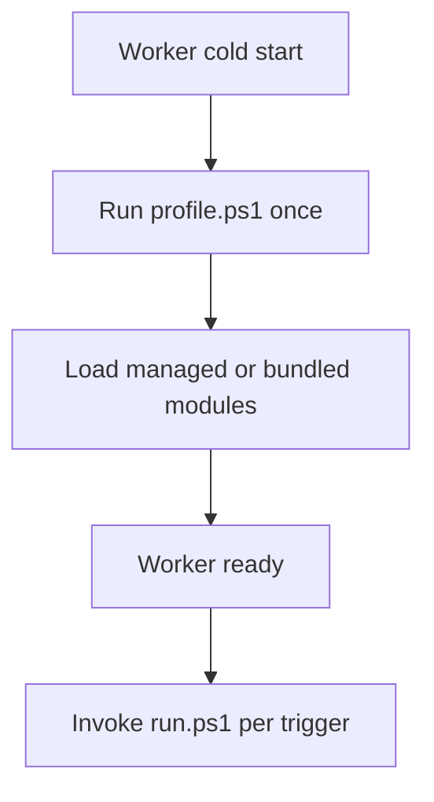

---
content_sources:
  references:
    - type: mslearn-adapted
      url: https://learn.microsoft.com/en-us/azure/azure-functions/functions-reference-powershell
    - type: mslearn-adapted
      url: https://learn.microsoft.com/en-us/azure/azure-functions/language-support-policy
  diagrams:
    - id: powershell-runtime
      type: flowchart
      source: self-generated
      justification: Flow view of the powershell worker runtime, synthesized from Microsoft Learn documentation cited on this page.
      based_on:
        - https://learn.microsoft.com/en-us/azure/azure-functions/functions-reference-powershell
---
# PowerShell Runtime

This page covers how the Azure Functions PowerShell worker executes your code: version selection, dependency management, cold start, and concurrency.

<!-- diagram-id: powershell-runtime -->


## PowerShell Versions

| Functions runtime | PowerShell version | .NET version | Availability |
|---|---|---|---|
| 4.x | PowerShell 7.4 | .NET 8 | GA — all plans |
| 4.x | PowerShell 7.6 (preview) | .NET 10 | Windows-only (Premium, Dedicated, Consumption) |

Print `$PSVersionTable` from any function to see the current version. PowerShell function apps must pin an explicit major.minor version (`7.4` or `7.6`); the legacy `~7` value maps to `7.0.x` and is not auto-upgraded.

### Selecting a Version Locally

Add `FUNCTIONS_WORKER_RUNTIME_VERSION` to `local.settings.json`:

```json
{
  "IsEncrypted": false,
  "Values": {
    "AzureWebJobsStorage": "",
    "FUNCTIONS_WORKER_RUNTIME": "powershell",
    "FUNCTIONS_WORKER_RUNTIME_VERSION": "7.4"
  }
}
```

## Dependency Management

There are two ways to manage PowerShell modules:

### Managed Dependencies (requirements.psd1)

Azure Functions automatically downloads and updates modules listed in `requirements.psd1`. Enabled by default in new apps.

```powershell
@{
    'Az' = '9.*'
}
```

Requires `managedDependency.enabled: true` in `host.json` and outbound access to `https://www.powershellgallery.com`.

!!! warning "Not supported on Flex Consumption"
    Managed dependencies are **not** available on the Flex Consumption plan. Bundle modules in a `Modules` folder instead (see below). This is also the recommended approach for other Linux SKUs.

### Bundled Modules (Modules folder)

Save modules into a `Modules` folder at the app root at build time:

```powershell
Save-Module -Name Az.Accounts -Path ./Modules
# or
Save-PSResource -Name Az.Accounts -Path ./Modules
```

The worker adds `Modules` to `$env:PSModulePath` for autoloading. This avoids external dependencies and version drift from auto-upgrades.

## Cold Start and profile.ps1

`profile.ps1` runs once per worker instance on cold start (and once per runspace when concurrency is enabled). Use it for one-time setup such as managed identity authentication:

```powershell
if ($env:MSI_SECRET) {
    Connect-AzAccount -Identity
}
```

!!! tip "Avoid Install-Module at runtime"
    Running `Install-Module` on each invocation causes performance problems. Use `Save-Module`/`Save-PSResource` before publishing.

## Concurrency

PowerShell functions process one invocation at a time by default. Two levers increase throughput:

| Setting | Effect |
|---|---|
| `FUNCTIONS_WORKER_PROCESS_COUNT` | Runs multiple worker processes per instance (higher CPU/memory overhead). |
| `PSWorkerInProcConcurrencyUpperBound` | Creates multiple runspaces in one process (lower overhead). Defaults to 1,000 on 4.x. |

!!! warning "Race conditions with Azure PowerShell"
    Azure PowerShell keeps process-level context/state. Enabling in-process concurrency with state-changing operations can cause race conditions. If you suspect one, set `PSWorkerInProcConcurrencyUpperBound` to `1` and use process-level isolation instead.

## See Also

- [PowerShell Language Guide](index.md)
- [PowerShell Programming Model](powershell-programming-model.md)
- [host.json Reference](host-json.md)
- [Platform Limits](platform-limits.md)

## Sources

- [PowerShell developer reference (Microsoft Learn)](https://learn.microsoft.com/en-us/azure/azure-functions/functions-reference-powershell)
- [Language support policy (Microsoft Learn)](https://learn.microsoft.com/en-us/azure/azure-functions/language-support-policy)
</content>
