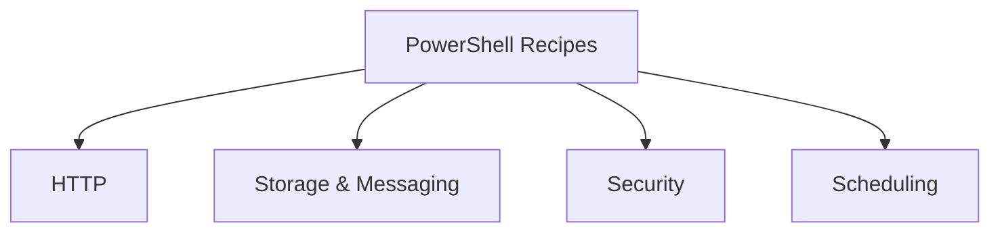

---
content_sources:
  diagrams:
    - id: powershell-recipes
      type: graph
      source: self-generated
      justification: Category view of the PowerShell recipes, synthesized from Microsoft Learn documentation cited on this page.
      based_on:
        - https://learn.microsoft.com/en-us/azure/azure-functions/functions-reference-powershell
        - https://learn.microsoft.com/en-us/azure/azure-functions/functions-triggers-bindings
        - https://learn.microsoft.com/en-us/azure/azure-functions/functions-best-practices
---
# PowerShell Recipes

The Recipes section provides implementation-focused patterns for common Azure Functions integrations in PowerShell.

Use these documents when you already understand the platform basics and need practical, reusable building blocks. PowerShell functions use the classic `function.json` binding model with `param` inputs and `Push-OutputBinding` outputs.

<!-- diagram-id: powershell-recipes -->

!!! tip "Pair recipes with platform guidance"
    For architecture and plan behavior that applies across all languages, see [Platform](../../../platform/index.md).

## Recipe categories

### HTTP

| Recipe | Description |
|--------|-------------|
| [HTTP API Patterns](http-api.md) | Route design, request parsing, and structured responses with `HttpResponseContext`. |
| [HTTP Authentication](http-auth.md) | Function auth levels, function keys, and token validation patterns. |

### Storage & Messaging

| Recipe | Description |
|--------|-------------|
| [Blob Storage](blob-storage.md) | Blob trigger and blob binding patterns for file processing. |
| [Queue Storage](queue.md) | Queue trigger consumer patterns and output bindings. |
| [Service Bus](service-bus.md) | Enterprise messaging with queue/topic triggers and dead-lettering. |

### Security

| Recipe | Description |
|--------|-------------|
| [Key Vault](key-vault.md) | Secret retrieval using Key Vault references and the Az module. |
| [Managed Identity](managed-identity.md) | Passwordless authentication via `Connect-AzAccount -Identity`. |

### Scheduling

| Recipe | Description |
|--------|-------------|
| [Timer Trigger](timer.md) | Scheduled jobs, cron semantics, and idempotent batch execution. |

## How to consume recipes effectively

1. Start from your trigger pattern (HTTP, timer, queue, blob, Service Bus).
2. Apply security baseline patterns first (Managed Identity and Key Vault).
3. Validate hosting-plan constraints in [Platform: Hosting](../../../platform/hosting.md).
4. Add monitoring/alerts using [Operations](../../../operations/index.md) guidance.

## See Also

- [PowerShell Language Guide](../index.md)
- [PowerShell Tutorial](../tutorial/index.md)
- [Platform: Triggers and Bindings](../../../platform/triggers-and-bindings.md)
- [Troubleshooting](../troubleshooting.md)

## Sources

- [PowerShell developer reference (Microsoft Learn)](https://learn.microsoft.com/en-us/azure/azure-functions/functions-reference-powershell)
- [Azure Functions trigger and binding concepts (Microsoft Learn)](https://learn.microsoft.com/en-us/azure/azure-functions/functions-triggers-bindings)
- [Azure Functions best practices (Microsoft Learn)](https://learn.microsoft.com/en-us/azure/azure-functions/functions-best-practices)
