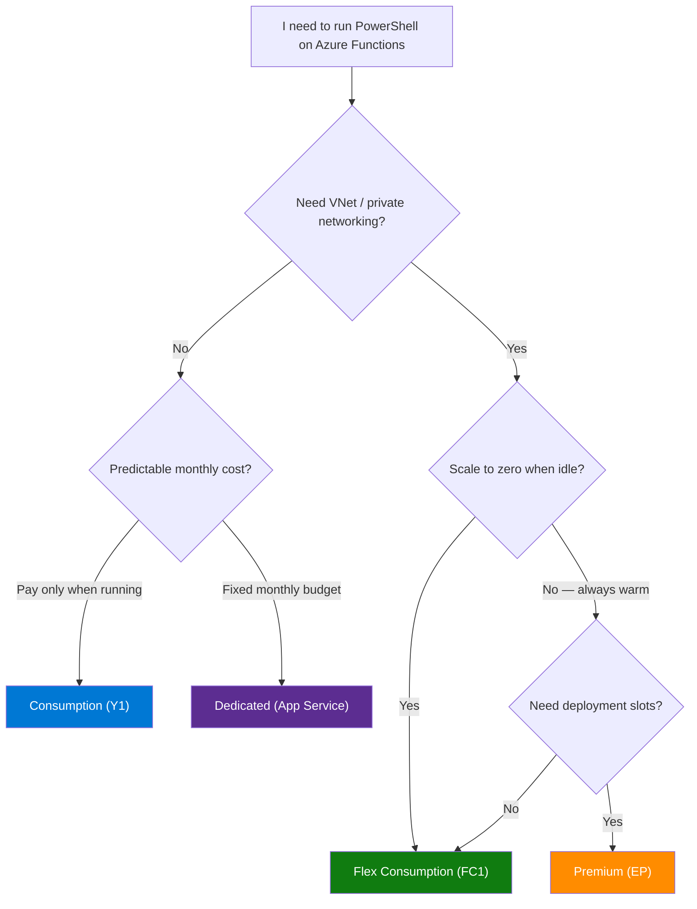
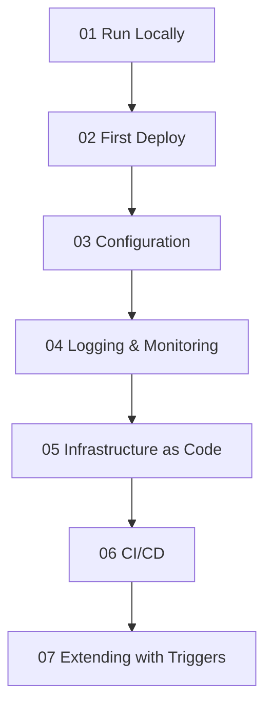

---
content_sources:
  diagrams:
    - id: which-plan-should-i-start-with
      type: flowchart
      source: self-generated
      justification: Flow view of the PowerShell hosting plan decision, synthesized from Microsoft Learn documentation cited on this page.
      based_on:
        - https://learn.microsoft.com/en-us/azure/azure-functions/functions-scale
        - https://learn.microsoft.com/en-us/azure/azure-functions/flex-consumption-plan
        - https://learn.microsoft.com/en-us/azure/azure-functions/functions-premium-plan
    - id: powershell-plan-tracks
      type: flowchart
      source: self-generated
      justification: Flow view of the shared seven-step journey across all PowerShell tutorial tracks, synthesized from Microsoft Learn documentation cited on this page.
      based_on:
        - https://learn.microsoft.com/en-us/azure/azure-functions/functions-scale
        - https://learn.microsoft.com/en-us/azure/azure-functions/functions-reference-powershell
---
# Tutorial — Choose Your Hosting Plan

This tutorial section provides **four independent, step-by-step tracks** — one for each Azure Functions hosting plan. Every track covers the same seven topics so you can follow the complete journey from local development to production on whichever plan fits your PowerShell workload.

## Which Plan Should I Start With?

<!-- diagram-id: which-plan-should-i-start-with -->

> **Not sure yet?** Start with **Flex Consumption** — it offers scale-to-zero with VNet integration and is Microsoft's recommended default for new projects. PowerShell 7.4 runs on Flex Consumption (Linux).

## Plan Comparison at a Glance

| Feature | Consumption (Y1) | Flex Consumption (FC1) | Premium (EP) | Dedicated (ASP) |
|---------|:-----------------:|:----------------------:|:------------:|:----------------:|
| **Scale to zero** | ✅ | ✅ | ❌ (min 1 instance) | ❌ |
| **VNet integration** | ❌ | ✅ | ✅ | ✅ (Standard+) |
| **Deployment slots** | ✅ (Windows only) | ❌ | ✅ | ✅ (Standard+) |
| **Default timeout** | 5 min | 30 min | 30 min | 30 min |
| **PowerShell version** | 7.4 | 7.4 | 7.4 (7.6 preview, Windows) | 7.4 (7.6 preview, Windows) |
| **Managed dependencies** | ✅ | ❌ (bundle `Modules`) | ✅ | ✅ |
| **OS** | Windows / Linux | Linux only | Windows / Linux | Windows / Linux |

!!! warning "Managed dependencies on Flex Consumption"
    The `requirements.psd1` managed dependency feature is **not** supported on Flex Consumption. Bundle modules in a `Modules` folder instead. See [PowerShell Runtime](../powershell-runtime.md#dependency-management).

## Tutorial Tracks

Each track contains the same seven steps. Pick your plan and follow from start to finish.

<!-- diagram-id: powershell-plan-tracks -->

### ☁️ [Consumption (Y1)](consumption/01-local-run.md)

Classic serverless — pay only when your functions execute. Best for lightweight, event-driven workloads that don't need VNet access.

| Step | Topic |
|------|-------|
| 01 | [Run Locally](consumption/01-local-run.md) |
| 02 | [First Deploy](consumption/02-first-deploy.md) |
| 03 | [Configuration](consumption/03-configuration.md) |
| 04 | [Logging & Monitoring](consumption/04-logging-monitoring.md) |
| 05 | [Infrastructure as Code](consumption/05-infrastructure-as-code.md) |
| 06 | [CI/CD](consumption/06-ci-cd.md) |
| 07 | [Extending with Triggers](consumption/07-extending-triggers.md) |

### ⚡ [Flex Consumption (FC1)](flex-consumption/01-local-run.md)

Next-generation serverless — scale-to-zero with VNet integration. Microsoft's recommended default for new projects. PowerShell 7.4 on Linux.

| Step | Topic |
|------|-------|
| 01 | [Run Locally](flex-consumption/01-local-run.md) |
| 02 | [First Deploy](flex-consumption/02-first-deploy.md) |
| 03 | [Configuration](flex-consumption/03-configuration.md) |
| 04 | [Logging & Monitoring](flex-consumption/04-logging-monitoring.md) |
| 05 | [Infrastructure as Code](flex-consumption/05-infrastructure-as-code.md) |
| 06 | [CI/CD](flex-consumption/06-ci-cd.md) |
| 07 | [Extending with Triggers](flex-consumption/07-extending-triggers.md) |

### 🚀 [Premium (EP)](premium/01-local-run.md)

Always-warm instances with VNet support and deployment slots. Best for latency-sensitive workloads or long-running functions.

| Step | Topic |
|------|-------|
| 01 | [Run Locally](premium/01-local-run.md) |
| 02 | [First Deploy](premium/02-first-deploy.md) |
| 03 | [Configuration](premium/03-configuration.md) |
| 04 | [Logging & Monitoring](premium/04-logging-monitoring.md) |
| 05 | [Infrastructure as Code](premium/05-infrastructure-as-code.md) |
| 06 | [CI/CD](premium/06-ci-cd.md) |
| 07 | [Extending with Triggers](premium/07-extending-triggers.md) |

### 🖥️ [Dedicated (App Service Plan)](dedicated/01-local-run.md)

Traditional App Service hosting with predictable pricing. Best when you already have an App Service Plan with spare capacity.

| Step | Topic |
|------|-------|
| 01 | [Run Locally](dedicated/01-local-run.md) |
| 02 | [First Deploy](dedicated/02-first-deploy.md) |
| 03 | [Configuration](dedicated/03-configuration.md) |
| 04 | [Logging & Monitoring](dedicated/04-logging-monitoring.md) |
| 05 | [Infrastructure as Code](dedicated/05-infrastructure-as-code.md) |
| 06 | [CI/CD](dedicated/06-ci-cd.md) |
| 07 | [Extending with Triggers](dedicated/07-extending-triggers.md) |

## What Each Step Covers

| Step | Topic | You Will Learn |
|------|-------|----------------|
| 01 | **Run Locally** | Scaffold a PowerShell app, run with Core Tools, test endpoints |
| 02 | **First Deploy** | Provision Azure resources and deploy your first function app |
| 03 | **Configuration** | Manage app settings, connection strings, and module dependencies |
| 04 | **Logging & Monitoring** | Configure Application Insights and structured logging |
| 05 | **Infrastructure as Code** | Define all resources in Bicep, deploy reproducibly |
| 06 | **CI/CD** | Automate build and deploy with GitHub Actions |
| 07 | **Extending with Triggers** | Add Timer, Queue, and Blob triggers beyond HTTP |

## See Also

- [PowerShell Language Guide](../index.md)
- [Scaling and Plans](../../../platform/scaling.md)
- [Networking](../../../platform/networking.md)

## Sources

- [Azure Functions hosting options (Microsoft Learn)](https://learn.microsoft.com/en-us/azure/azure-functions/functions-scale)
- [Flex Consumption plan (Microsoft Learn)](https://learn.microsoft.com/en-us/azure/azure-functions/flex-consumption-plan)
- [PowerShell developer reference (Microsoft Learn)](https://learn.microsoft.com/en-us/azure/azure-functions/functions-reference-powershell)
