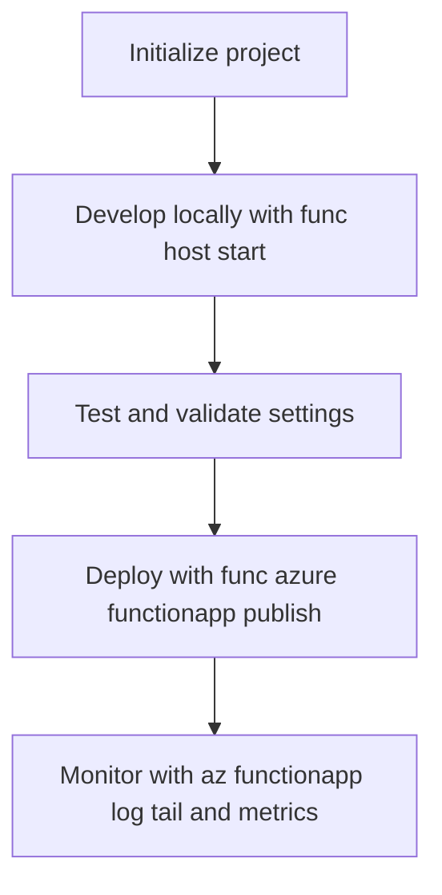

---
content_sources:

  - type: mslearn-adapted
    url: https://learn.microsoft.com/en-us/azure/azure-functions/functions-run-local
  - type: mslearn-adapted
    url: https://learn.microsoft.com/en-us/cli/azure/functionapp
  - type: mslearn-adapted
    url: https://learn.microsoft.com/en-us/azure/azure-functions/functions-develop-local
---
# CLI Cheatsheet

Quick reference for the most commonly used commands when developing, deploying, and managing Azure Functions Python apps.

<!-- diagram-id: cli-cheatsheet -->


| CLI element | Explanation |
|---|---|
| Command(s) | `az functionapp log tail and` |
| Key flags | None |
| Variables | None |
| Expected result | Azure CLI completes successfully and returns JSON, table, or no output depending on the command; verify the next documented check before continuing. |


## Azure Functions Core Tools (`func`)

The `func` CLI is used for local development, testing, and deploying function apps.

### Local Development

```bash
# Start the local Functions host
func host start

# Start on a custom port
func host start --port 7072

# Start with verbose logging
func host start --verbose

# Create a new function (interactive)
func new

# Create a new function (non-interactive)
func new --name MyFunction --template "HTTP trigger" --authlevel anonymous
```

### Deployment

```bash
# Deploy to Azure (recommended for Python)
func azure functionapp publish $APP_NAME --python

# Deploy to a staging slot
func azure functionapp publish $APP_NAME --slot staging --python

# Deploy with remote build (ensures Linux-compatible packages)
func azure functionapp publish $APP_NAME --python --build remote

# Fetch app settings from Azure to local
func azure functionapp fetch-app-settings $APP_NAME
```

### Settings Management

```bash
# Add a local setting
func settings add KEY VALUE

# List local settings
func settings list

# Decrypt local settings
func settings decrypt

# Encrypt local settings
func settings encrypt
```

## Azure CLI: Function App (`az functionapp`)

### Create and Manage

```bash
# Create a function app on Consumption plan
az functionapp create \
  --name $APP_NAME \
  --resource-group $RG \
  --storage-account $STORAGE_NAME \
  --consumption-plan-location eastus \
  --runtime python \
  --runtime-version 3.11 \
  --functions-version 4 \
  --os-type linux

# Show function app details
az functionapp show \
  --name $APP_NAME \
  --resource-group $RG

# Delete a function app
az functionapp delete \
  --name $APP_NAME \
  --resource-group $RG

# Restart the function app
az functionapp restart \
  --name $APP_NAME \
  --resource-group $RG

# Stop the function app
az functionapp stop \
  --name $APP_NAME \
  --resource-group $RG

# Start the function app
az functionapp start \
  --name $APP_NAME \
  --resource-group $RG
```

| CLI element | Explanation |
|---|---|
| Command(s) | `az functionapp create`, `az functionapp show`, `az functionapp delete`, `az functionapp restart`, plus 2 more |
| Key flags | `--name`, `--resource-group`, `--storage-account`, `--consumption-plan-location`, `--runtime`, `--runtime-version`, `--functions-version`, `--os-type` |
| Variables | `$APP_NAME`, `$RG`, `$STORAGE_NAME` |
| Expected result | Azure CLI completes the removal request; verify the target no longer appears in follow-up `show` or `list` output. |


### App Settings

```bash
# Set app settings
az functionapp config appsettings set \
  --name $APP_NAME \
  --resource-group $RG \
  --settings "KEY1=value1" "KEY2=value2"

# List all app settings
az functionapp config appsettings list \
  --name $APP_NAME \
  --resource-group $RG

# Delete an app setting
az functionapp config appsettings delete \
  --name $APP_NAME \
  --resource-group $RG \
  --setting-names KEY1
```

| CLI element | Explanation |
|---|---|
| Command(s) | `az functionapp config appsettings set`, `az functionapp config appsettings list`, `az functionapp config appsettings delete` |
| Key flags | `--name`, `--resource-group`, `--settings`, `--setting-names` |
| Variables | `$APP_NAME`, `$RG` |
| Expected result | Azure CLI completes the removal request; verify the target no longer appears in follow-up `show` or `list` output. |


### Configuration

```bash
# Set Flex Consumption maximum instance count
az functionapp scale config set \
  --resource-group $RG \
  --name $APP_NAME \
  --maximum-instance-count <count>

# Configure Flex always-ready instances for HTTP triggers
az functionapp scale config always-ready set \
  --resource-group $RG \
  --name $APP_NAME \
  --settings http=<count>

# Set minimum TLS version
az functionapp config set \
  --name $APP_NAME \
  --resource-group $RG \
  --min-tls-version 1.2

# Enable HTTPS only
az functionapp update \
  --name $APP_NAME \
  --resource-group $RG \
  --set httpsOnly=true

# Show configuration
az functionapp config show \
  --name $APP_NAME \
  --resource-group $RG
```

| CLI element | Explanation |
|---|---|
| Command(s) | `az functionapp scale config set`, `az functionapp scale config always-ready`, `az functionapp config set`, `az functionapp update`, plus 1 more |
| Key flags | `--resource-group`, `--name`, `--maximum-instance-count`, `--settings`, `--min-tls-version`, `--set` |
| Variables | `$RG`, `$APP_NAME` |
| Expected result | Azure CLI applies the configuration change; confirm the returned JSON or follow-up query shows the expected value. |


### Deployment Slots

```bash
# Create a staging slot
az functionapp deployment slot create \
  --name $APP_NAME \
  --resource-group $RG \
  --slot staging

# Swap staging to production
az functionapp deployment slot swap \
  --name $APP_NAME \
  --resource-group $RG \
  --slot staging \
  --target-slot production

# List slots
az functionapp deployment slot list \
  --name $APP_NAME \
  --resource-group $RG

# Delete a slot
az functionapp deployment slot delete \
  --name $APP_NAME \
  --resource-group $RG \
  --slot staging
```

| CLI element | Explanation |
|---|---|
| Command(s) | `az functionapp deployment slot create`, `az functionapp deployment slot swap`, `az functionapp deployment slot list`, `az functionapp deployment slot delete` |
| Key flags | `--name`, `--resource-group`, `--slot`, `--target-slot` |
| Variables | `$APP_NAME`, `$RG` |
| Expected result | Azure CLI completes the removal request; verify the target no longer appears in follow-up `show` or `list` output. |


### Identity and Keys

```bash
# Enable system-assigned Managed Identity
az functionapp identity assign \
  --name $APP_NAME \
  --resource-group $RG

# Show identity
az functionapp identity show \
  --name $APP_NAME \
  --resource-group $RG

# List function keys
az functionapp function keys list \
  --name $APP_NAME \
  --resource-group $RG \
  --function-name health

# List host keys
az functionapp keys list \
  --name $APP_NAME \
  --resource-group $RG
```

| CLI element | Explanation |
|---|---|
| Command(s) | `az functionapp identity assign`, `az functionapp identity show`, `az functionapp function keys list`, `az functionapp keys list` |
| Key flags | `--name`, `--resource-group`, `--function-name` |
| Variables | `$APP_NAME`, `$RG` |
| Expected result | Azure CLI applies the configuration change; confirm the returned JSON or follow-up query shows the expected value. |


### Logs

```bash
# Stream live logs
az functionapp log tail \
  --name $APP_NAME \
  --resource-group $RG

# Download logs
az functionapp log download \
  --name $APP_NAME \
  --resource-group $RG \
  --log-file /tmp/func-logs.zip
```

| CLI element | Explanation |
|---|---|
| Command(s) | `az functionapp log tail`, `az functionapp log download` |
| Key flags | `--name`, `--resource-group`, `--log-file` |
| Variables | `$APP_NAME`, `$RG` |
| Expected result | Azure CLI completes successfully and returns JSON, table, or no output depending on the command; verify the next documented check before continuing. |


### CORS

```bash
# Add allowed origins
az functionapp cors add \
  --name $APP_NAME \
  --resource-group $RG \
  --allowed-origins "https://example.com" "http://localhost:3000"

# Show CORS settings
az functionapp cors show \
  --name $APP_NAME \
  --resource-group $RG

# Remove an origin
az functionapp cors remove \
  --name $APP_NAME \
  --resource-group $RG \
  --allowed-origins "http://localhost:3000"
```

| CLI element | Explanation |
|---|---|
| Command(s) | `az functionapp cors add`, `az functionapp cors show`, `az functionapp cors remove` |
| Key flags | `--name`, `--resource-group`, `--allowed-origins` |
| Variables | `$APP_NAME`, `$RG` |
| Expected result | Azure CLI completes the removal request; verify the target no longer appears in follow-up `show` or `list` output. |


## Azure CLI: Resource Groups (`az group`)

```bash
# Create a resource group
az group create \
  --name $RG \
  --location eastus

# List resource groups
az group list --output table

# Delete a resource group (and ALL resources in it)
az group delete \
  --name $RG \
  --yes --no-wait
```

| CLI element | Explanation |
|---|---|
| Command(s) | `az group create`, `az group list`, `az group delete` |
| Key flags | `--name`, `--location`, `--output`, `--yes`, `--no-wait` |
| Variables | `$RG` |
| Expected result | Azure CLI completes the removal request; verify the target no longer appears in follow-up `show` or `list` output. |


## Azure CLI: Deployments (`az deployment group`)

```bash
# Deploy Bicep template
az deployment group create \
  --resource-group $RG \
  --template-file infra/main.bicep \
  --parameters appName=$APP_NAME

# Validate a Bicep template (dry run)
az deployment group validate \
  --resource-group $RG \
  --template-file infra/main.bicep \
  --parameters appName=$APP_NAME

# Show deployment status
az deployment group show \
  --resource-group $RG \
  --name main

# List deployments
az deployment group list \
  --resource-group $RG \
  --output table
```

| CLI element | Explanation |
|---|---|
| Command(s) | `az deployment group create`, `az deployment group validate`, `az deployment group show`, `az deployment group list` |
| Key flags | `--resource-group`, `--template-file`, `--parameters`, `--name`, `--output` |
| Variables | `$RG`, `$APP_NAME` |
| Expected result | Azure CLI returns provisioning details; confirm the resource name and successful provisioning state before continuing. |


## Azure CLI: Monitoring

```bash
# Create a metric alert
az monitor metrics alert create \
  --name "func-errors" \
  --resource-group $RG \
  --scopes "<function-app-resource-id>" \
  --condition "total Http5xx > 10" \
  --window-size 5m

# Query Application Insights logs
az monitor app-insights query \
  --app your-appinsights \
  --analytics-query "requests | take 10"

# List metrics
az monitor metrics list \
  --resource "<function-app-resource-id>" \
  --metric "FunctionExecutionCount"
```

| CLI element | Explanation |
|---|---|
| Command(s) | `az monitor metrics alert create`, `az monitor app-insights query`, `az monitor metrics list` |
| Key flags | `--name`, `--resource-group`, `--scopes`, `--condition`, `--window-size`, `--app`, `--analytics-query`, `--resource`, `--metric` |
| Variables | `$RG` |
| Expected result | Azure CLI returns provisioning details; confirm the resource name and successful provisioning state before continuing. |


## Quick Reference Table

| Task | Command |
|------|---------|
| Start locally | `func host start` |
| Deploy to Azure | `func azure functionapp publish $APP_NAME --python` |
| Set app setting | `az functionapp config appsettings set --name $APP_NAME --resource-group $RG --settings "KEY=value"` |
| Stream logs | `az functionapp log tail --name $APP_NAME --resource-group $RG` |
| Create slot | `az functionapp deployment slot create --name $APP_NAME --resource-group $RG --slot staging` |
| Swap slot | `az functionapp deployment slot swap --name $APP_NAME --resource-group $RG --slot staging` |
| Enable identity | `az functionapp identity assign --name $APP_NAME --resource-group $RG` |
| Deploy Bicep | `az deployment group create --resource-group $RG --template-file infra/main.bicep` |

## See Also
- [Deployments](../../operations/deployment.md)

## Sources
- [Azure Functions Core Tools Reference (Microsoft Learn)](https://learn.microsoft.com/en-us/azure/azure-functions/functions-run-local)
- [Azure Functions CLI Reference (Microsoft Learn)](https://learn.microsoft.com/en-us/cli/azure/functionapp)
- [Develop Azure Functions Locally (Microsoft Learn)](https://learn.microsoft.com/en-us/azure/azure-functions/functions-develop-local)
