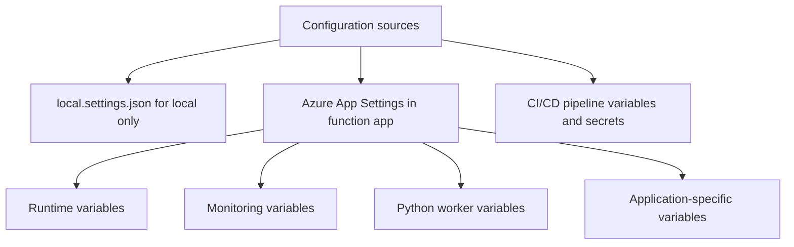

---
content_sources:
  - type: mslearn-adapted
    url: https://learn.microsoft.com/azure/azure-functions/functions-reference-python
---

# Environment Variables

Azure Functions uses environment variables for runtime configuration, connection strings, and application settings. This reference documents the important variables, where they are configured, and their default values.

<!-- diagram-id: environment-variables -->


## Configuration Locations

| Context | Where to Set | File |
|---------|-------------|------|
| **Local development** | `local.settings.json` (in the `Values` object) | Not committed to source control |
| **Azure (production)** | App Settings in the Azure Portal or via `az functionapp config appsettings set` | Stored encrypted in the platform |
| **CI/CD** | Deployment pipeline sets app settings | GitHub Actions secrets, Azure DevOps variables |

### local.settings.json Example

```json
{
  "IsEncrypted": false,
  "Values": {
    "FUNCTIONS_WORKER_RUNTIME": "python",
    "FUNCTIONS_EXTENSION_VERSION": "~4",
    "AzureWebJobsStorage": "UseDevelopmentStorage=true",
    "APPLICATIONINSIGHTS_CONNECTION_STRING": "",
    "AZURE_FUNCTIONS_ENVIRONMENT": "Development",
    "LOG_LEVEL": "DEBUG"
  }
}
```

> **Important:** `local.settings.json` is only used during local development with `func host start`. It is not deployed to Azure. In Azure, the equivalent settings are configured as App Settings.

## Runtime Variables

These variables are required or consumed by the Azure Functions runtime:

| Variable | Purpose | Default | Required |
|----------|---------|---------|----------|
| `FUNCTIONS_WORKER_RUNTIME` | Tells the host which language worker to use | — | **Yes** |
| `FUNCTIONS_EXTENSION_VERSION` | Functions runtime version (`~4` for v4) | — | **Yes** (in Azure) |
| `AzureWebJobsStorage` | Connection string or identity-based settings for the internal storage account used by the Functions host. On Flex Consumption, use identity-based format (`AzureWebJobsStorage__accountName`) | — | **Yes** (for non-HTTP triggers, Durable Functions, timer triggers) |
| `AzureWebJobsFeatureFlags` | Feature flags for the Functions host | — | No (legacy scenarios only) |
| `AZURE_FUNCTIONS_ENVIRONMENT` | Current environment name (`Development`, `Staging`, `Production`) | `Production` | No |
| `WEBSITE_SITE_NAME` | Name of the function app (set automatically by Azure) | — | No (auto-set) |
| `WEBSITE_HOSTNAME` | Hostname of the function app (e.g., `your-func.azurewebsites.net`) | — | No (auto-set) |

### FUNCTIONS_WORKER_RUNTIME

Must be set to `python`. Without this, the Azure Functions host does not know to start the Python language worker.

```bash
az functionapp config appsettings set \
  --name $APP_NAME \
  --resource-group $RG \
  --settings "FUNCTIONS_WORKER_RUNTIME=python"
```

### FUNCTIONS_EXTENSION_VERSION

Specifies the major version of the Azure Functions runtime. Use `~4` to pin to the latest 4.x release:

```bash
az functionapp config appsettings set \
  --name $APP_NAME \
  --resource-group $RG \
  --settings "FUNCTIONS_EXTENSION_VERSION=~4"
```

### AzureWebJobsFeatureFlags

Current runtimes (4.x+) enable worker indexing by default, so this setting is not required for the v2 Python programming model.

> **Note:** Older runtimes (< 4.x) may need this flag.

```bash
az functionapp config appsettings set \
  --name $APP_NAME \
  --resource-group $RG \
  --settings "AzureWebJobsFeatureFlags=EnableWorkerIndexing"
```

### AzureWebJobsStorage

Connection string (classic Consumption, Premium) or identity-based settings (Flex Consumption) for the Azure Storage account used by the Functions host for internal operations (lease management, timer state, Durable Functions state). For HTTP-only apps running locally, you can use Azurite:

```
AzureWebJobsStorage=UseDevelopmentStorage=true
```

For identity-based connections (required on Flex Consumption, optional on other plans), use the suffix pattern:

```
AzureWebJobsStorage__accountName=$STORAGE_NAME
```

## Monitoring Variables

| Variable | Purpose | Default | Required |
|----------|---------|---------|----------|
| `APPLICATIONINSIGHTS_CONNECTION_STRING` | Connection to Application Insights for telemetry | — | **Recommended** |
| `LOG_LEVEL` | Custom variable for application-level log configuration | `INFO` | No (app-defined) |

OpenTelemetry mode is configured in `host.json` using `telemetryMode`, not by a `TELEMETRY_MODE` environment variable:

```json
{
  "telemetryMode": "OpenTelemetry"
}
```

### APPLICATIONINSIGHTS_CONNECTION_STRING

This is the primary way to connect your function app to Application Insights. When set, the Functions runtime automatically sends request traces, dependency calls, exceptions, and performance counters:

```bash
az functionapp config appsettings set \
  --name $APP_NAME \
  --resource-group $RG \
  --settings "APPLICATIONINSIGHTS_CONNECTION_STRING=InstrumentationKey=xxx;IngestionEndpoint=https://eastus-8.in.applicationinsights.azure.com/"
```

> **Tip:** Use the full connection string format rather than just the `APPINSIGHTS_INSTRUMENTATIONKEY`. The connection string supports regional endpoints and Private Link.

## Python Worker Variables

| Variable | Purpose | Default | Required |
|----------|---------|---------|----------|
| `PYTHON_THREADPOOL_THREAD_COUNT` | Number of threads in the Python worker's thread pool | Python 3.9+ uses Python's `ThreadPoolExecutor` default (`min(32, os.cpu_count() + 4)`); Python 3.6-3.8 defaults to `1` | No |
| `FUNCTIONS_WORKER_PROCESS_COUNT` | Number of Python worker processes | `1` | No |
| `PYTHON_ISOLATE_WORKER_DEPENDENCIES` | Isolate worker dependencies from function dependencies | Python 3.13+ defaults to isolation; earlier versions require explicit `1` when needed | No |

### PYTHON_THREADPOOL_THREAD_COUNT

Controls the thread pool size for synchronous function execution. Increase this if your functions are I/O-bound (waiting on HTTP calls, database queries):

```bash
az functionapp config appsettings set \
  --name $APP_NAME \
  --resource-group $RG \
  --settings "PYTHON_THREADPOOL_THREAD_COUNT=16"
```

### FUNCTIONS_WORKER_PROCESS_COUNT

Run multiple Python worker processes to increase throughput. Each process handles requests independently:

```bash
az functionapp config appsettings set \
  --name $APP_NAME \
  --resource-group $RG \
  --settings "FUNCTIONS_WORKER_PROCESS_COUNT=4"
```

> **Caution:** More worker processes means more memory usage. On the Consumption plan, stay within the 1.5 GB memory limit per instance. On Flex Consumption, size worker count against the configured instance memory (512 MB, 2048 MB, or 4096 MB).

## Application-Specific Variables

These are custom variables defined by the reference application:

| Variable | Purpose | Default | Required |
|----------|---------|---------|----------|
| `LOG_LEVEL` | Application log level (DEBUG, INFO, WARNING, ERROR) | `INFO` | No |
| `EXTERNAL_API_URL` | URL for the external dependency demo endpoint | — | No |
| `COSMOS_ENDPOINT` | Cosmos DB account endpoint (for SDK access) | — | No (only if using Cosmos DB) |
| `STORAGE_ACCOUNT_NAME` | Storage account name (for SDK access with Managed Identity) | — | No (only if using SDK) |
| `KEY_VAULT_URL` | Key Vault URL (for SDK access) | — | No (only if using SDK) |

Access any environment variable in Python:

```python
import os

log_level = os.environ.get("LOG_LEVEL", "INFO")
environment = os.environ.get("AZURE_FUNCTIONS_ENVIRONMENT", "Production")
```

## Setting Variables in Bicep

Configure app settings in your infrastructure-as-code:

```bicep
resource functionApp 'Microsoft.Web/sites@2023-01-01' = {
  name: functionAppName
  location: location
  properties: {
    siteConfig: {
      appSettings: [
        { name: 'FUNCTIONS_WORKER_RUNTIME', value: 'python' }
        { name: 'FUNCTIONS_EXTENSION_VERSION', value: '~4' }
        { name: 'AzureWebJobsStorage__accountName', value: storageAccountName }
        { name: 'APPLICATIONINSIGHTS_CONNECTION_STRING', value: appInsights.properties.ConnectionString }
      ]
    }
  }
}
```

> **Note:** The example above uses the classic `siteConfig.appSettings` pattern. On Flex Consumption, app settings are configured through `functionAppConfig` and resource-level properties. See the guide's `infra/main.bicep` for the Flex Consumption Bicep pattern.

## See Also
- [host.json Reference](host-json.md)
- [Python Runtime](python-runtime.md)
- [Troubleshooting](troubleshooting.md)

## Sources
- [Python v2 Programming Model (Microsoft Learn)](https://learn.microsoft.com/azure/azure-functions/functions-reference-python)
