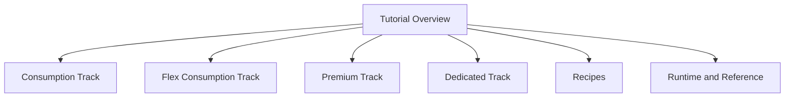

# Python Language Guide

Python is the **reference implementation** in this hub and currently contains the most complete end-to-end content set.

If you are new to Azure Functions, this track is the fastest way to understand hosting plans, deployment workflows, and production operations with concrete examples.

!!! tip "Architecture first"
    Before diving into Python-specific details, review [Platform](../../platform/index.md) for language-agnostic guidance on hosting, scaling, networking, reliability, and security.

## Why Python is the reference track

- Full tutorial coverage across **all four hosting plans**.
- Complete recipe set for common Azure integrations.
- Dedicated runtime/reference docs for operational concerns.
- Backed by a populated reference app in `apps/python/`.

## Start here

1. Choose your hosting plan in [Tutorial Overview & Plan Chooser](tutorial/index.md).
2. Follow one full tutorial track from local run through CI/CD.
3. Use recipes to add integrations (Storage, Cosmos DB, Key Vault, Event Grid, and more).
4. Keep runtime/reference docs open during production hardening.

## What's Covered

| Area | Document | Scope |
|------|----------|-------|
| Tutorial | [Overview & Plan Chooser](tutorial/index.md) | Select Consumption, Flex Consumption, Premium, or Dedicated |
| Tutorial track | [Consumption (Y1)](tutorial/consumption/01-local-run.md) | 7-step flow for classic serverless |
| Tutorial track | [Flex Consumption (FC1)](tutorial/flex-consumption/01-local-run.md) | 7-step flow for modern default serverless |
| Tutorial track | [Premium (EP)](tutorial/premium/01-local-run.md) | 7-step flow for always-warm/VNet scenarios |
| Tutorial track | [Dedicated (App Service)](tutorial/dedicated/01-local-run.md) | 7-step flow for fixed-capacity hosting |
| Recipes | [Recipes Index](recipes/index.md) | 11 practical implementation recipes |
| Runtime model | [v2 Programming Model](v2-programming-model.md) | Decorators, function app structure, binding patterns |
| Runtime internals | [Python Runtime](python-runtime.md) | Python worker behavior and version/runtime specifics |
| CLI | [CLI Cheatsheet](cli-cheatsheet.md) | `az` and `func` operational commands |
| Host settings | [host.json Reference](host-json.md) | Concurrency, retry, logging, and extension settings |
| Configuration | [Environment Variables](environment-variables.md) | Key app and platform environment settings |
| Limits | [Platform Limits](platform-limits.md) | Timeouts, payloads, scaling, and service constraints |
| Diagnostics | [Troubleshooting](troubleshooting.md) | Common failures and troubleshooting flow |

## Tutorial structure at a glance

The tutorial library provides **4 plans × 7 tutorials = 28 tutorials**.

Each plan follows the same sequence:

1. Run locally
2. First deploy
3. Configuration
4. Logging and monitoring
5. Infrastructure as code
6. CI/CD
7. Extending with triggers

This consistent sequence helps teams compare plan behavior without relearning the workflow.

## Recipes coverage

The Python recipes section contains production-oriented patterns for:

- HTTP API design and authentication
- Storage integrations (Blob, Queue)
- Data integrations (Cosmos DB)
- Security patterns (Managed Identity, Key Vault)
- Event and workflow patterns (Timer, Event Grid, Durable Functions)
- Edge/network concerns (custom domains and certificates)

See [Recipes Index](recipes/index.md) for full links and category grouping.

## Reference application

The Python guide is backed by a working reference app:

- [`apps/python/`](https://github.com/yeongseon/azure-functions-practical-guide/tree/main/apps/python)

Use it to validate tutorial steps, copy implementation patterns, and test hosting-plan-specific behavior.

## Microsoft Learn alignment

This guide aligns to the official Python developer documentation.

!!! note "Runtime and feature truth source"
    If you find any mismatch between this hub and official service behavior, treat Microsoft Learn as authoritative and open a docs issue in this repository.

## Cross-language context

If your team supports multiple stacks, compare Python with:

- [Node.js guide](../nodejs/index.md)
- [.NET guide](../dotnet/index.md)
- [Java guide](../java/index.md)

Use [Language Guides Overview](../index.md) for a side-by-side worker/programming model matrix.

## See Also

- [Language Guides Overview](../index.md)
- [Platform: Architecture](../../platform/architecture.md)
- [Platform: Hosting](../../platform/hosting.md)
- [Operations: Deployment](../../operations/deployment.md)
- [Operations: Monitoring](../../operations/monitoring.md)

## Sources

- [Python reference application (`apps/python/`)](https://github.com/yeongseon/azure-functions-practical-guide/tree/main/apps/python)
- [Azure Functions Python developer guide (Microsoft Learn)](https://learn.microsoft.com/azure/azure-functions/functions-reference-python)
- [Azure Functions hosting options](https://learn.microsoft.com/azure/azure-functions/functions-scale)
- [Flex Consumption plan](https://learn.microsoft.com/azure/azure-functions/flex-consumption-plan)
