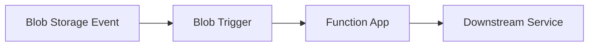

# Blob Storage

This recipe covers integrating Azure Blob Storage with Azure Functions Python v2 — using output bindings to upload blobs, input bindings to read blobs, and the SDK approach for more complex scenarios like listing, streaming, and managing containers.

## Architecture



Solid arrows show runtime data/event flow. Dashed arrows show identity and authentication.

## Prerequisites

Blob Storage bindings are included in the default extension bundle. Ensure your `host.json` has:

```json
{
  "version": "2.0",
  "extensionBundle": {
    "id": "Microsoft.Azure.Functions.ExtensionBundle",
    "version": "[4.*, 5.0.0)"
  }
}
```

You need a Storage Account with a blob container:

```bash
# Create a storage account (if not using the one provisioned with your function app)
az storage account create \
  --name yourstorage \
  --resource-group your-rg \
  --sku Standard_LRS

# Create a blob container
az storage container create \
  --name uploads \
  --account-name yourstorage
```

On classic Consumption or Premium plans, the `AzureWebJobsStorage` connection string (already set for Azure Functions) can be reused, or you can configure a separate connection. On Flex Consumption, host storage uses identity-based settings (e.g. `AzureWebJobsStorage__accountName`); bindings referencing `connection="AzureWebJobsStorage"` resolve through those identity-based settings automatically.

## Output Binding: Upload Blob from HTTP Request

Use the Blob output binding to write content to Blob Storage when an HTTP request arrives:

```python
import azure.functions as func
import json
import uuid

bp = func.Blueprint()

@bp.route(route="files/upload", methods=["POST"])
@bp.blob_output(
    arg_name="outputBlob",
    path="uploads/{rand-guid}.json",
    connection="AzureWebJobsStorage"
)

> **Note:** The `connection` parameter names a setting prefix, not a literal connection string. On Flex Consumption, `AzureWebJobsStorage` resolves through identity-based settings such as `AzureWebJobsStorage__accountName`.
def upload_file(req: func.HttpRequest, outputBlob: func.Out[str]) -> func.HttpResponse:
    """Upload JSON data to Blob Storage via HTTP POST."""
    try:
        body = req.get_json()
    except ValueError:
        return func.HttpResponse(
            json.dumps({"error": "Invalid JSON body"}),
            mimetype="application/json",
            status_code=400
        )

    # Write the body to blob storage
    blob_content = json.dumps(body, indent=2)
    outputBlob.set(blob_content)

    return func.HttpResponse(
        json.dumps({"status": "uploaded", "message": "File stored in Blob Storage"}),
        mimetype="application/json",
        status_code=201
    )
```

The `{rand-guid}` binding expression generates a unique blob name for each invocation. You can also use a route parameter:

```python
@bp.route(route="files/{filename}", methods=["PUT"])
@bp.blob_output(
    arg_name="outputBlob",
    path="uploads/{filename}",
    connection="AzureWebJobsStorage"
)
def upload_named_file(req: func.HttpRequest, outputBlob: func.Out[bytes]) -> func.HttpResponse:
    """Upload a file with a specific name."""
    content = req.get_body()
    outputBlob.set(content)

    filename = req.route_params.get("filename")
    return func.HttpResponse(
        json.dumps({"status": "uploaded", "filename": filename}),
        mimetype="application/json",
        status_code=201
    )
```

## Input Binding: Read Blob from HTTP Request

Use the Blob input binding to read a blob when an HTTP request arrives:

```python
@bp.route(route="files/{filename}", methods=["GET"])
@bp.blob_input(
    arg_name="inputBlob",
    path="uploads/{filename}",
    connection="AzureWebJobsStorage"
)
def download_file(req: func.HttpRequest, inputBlob: func.InputStream) -> func.HttpResponse:
    """Download a file from Blob Storage by name."""
    if inputBlob is None:
        return func.HttpResponse(
            json.dumps({"error": "File not found"}),
            mimetype="application/json",
            status_code=404
        )

    content = inputBlob.read()
    return func.HttpResponse(
        content,
        mimetype="application/octet-stream",
        status_code=200,
        headers={"Content-Disposition": f"attachment; filename={inputBlob.name}"}
    )
```

> **Note:** The `{filename}` route parameter is automatically resolved in the binding path expression.

## Blob Trigger

The Blob trigger fires when a new or updated blob is detected in a container. It is ideal for file processing pipelines — image resizing, CSV ingestion, file validation, and data transformation.

### Blueprint

```python
# blueprints/blob_processor.py
import azure.functions as func
import logging

bp = func.Blueprint()
logger = logging.getLogger(__name__)


@bp.blob_trigger(
    arg_name="input_blob",
    path="uploads/{name}",
    connection="AzureWebJobsStorage",
)
@bp.blob_output(
    arg_name="output_blob",
    path="processed/{name}",
    connection="AzureWebJobsStorage",
)
def process_blob(input_blob: func.InputStream, output_blob: func.Out[bytes]) -> None:
    """Triggered when a blob is uploaded to 'uploads'; writes result to 'processed'."""
    logger.info(
        "Processing blob: name=%s, size=%d bytes",
        input_blob.name,
        input_blob.length,
    )
    content = input_blob.read()
    output_blob.set(content.upper())
    blob_name = input_blob.name.removeprefix("uploads/")
    logger.info("Written to processed/%s", blob_name)
```

Register the blueprint in `function_app.py`:

```python
from blueprints.blob_processor import bp as blob_processor_bp
app.register_blueprint(blob_processor_bp)
```

### Test Locally with Azurite

Blob triggers require Azurite (the local Azure Storage emulator). Ensure Azurite is running before starting the functions host.

**1. Start Azurite**

```bash
azurite --silent --location /tmp/azurite --debug /tmp/azurite/debug.log
```

**2. Create the required containers**

```bash
az storage container create \
  --name uploads \
  --connection-string "UseDevelopmentStorage=true"

az storage container create \
  --name processed \
  --connection-string "UseDevelopmentStorage=true"
```

**3. Start the Functions host**

```bash
cd app
func host start
```

**4. Upload a test blob**

```bash
echo "hello world" > /tmp/test.txt

az storage blob upload \
  --container-name uploads \
  --name test.txt \
  --file /tmp/test.txt \
  --connection-string "UseDevelopmentStorage=true"
```

The trigger is detected after a short polling delay (typically a few seconds locally). You should see in the terminal:

```
Processing blob: name=uploads/test.txt, size=12 bytes
Written to processed/test.txt
```

**5. Verify the output blob**

```bash
az storage blob download \
  --container-name processed \
  --name test.txt \
  --file /tmp/result.txt \
  --connection-string "UseDevelopmentStorage=true"

cat /tmp/result.txt   # Expected: HELLO WORLD
```

> **Polling vs. Event Grid:** The default blob trigger uses a polling mechanism, which can have delays of up to several minutes in production depending on storage activity. For low-latency, event-driven processing use the [Event Grid-based blob trigger (Microsoft Learn)](https://learn.microsoft.com/azure/azure-functions/functions-event-grid-blob-trigger) instead.
>
> **Flex Consumption:** The default polling blob trigger is **not supported** on the Flex Consumption plan. Flex Consumption requires the Event Grid-based blob trigger. See [Supported triggers on Flex Consumption (Microsoft Learn)](https://learn.microsoft.com/azure/azure-functions/flex-consumption-plan#trigger-support) for details.

## SDK Approach: azure-storage-blob

For HTTP-triggered scenarios that need more control — listing blobs, deleting blobs, setting metadata, generating SAS tokens — use the `azure-storage-blob` SDK directly.

Add to `requirements.txt`:

```
azure-storage-blob>=12.19.0
azure-identity>=1.15.0
```

### List Blobs

```python
import azure.functions as func
import json
import os
from azure.storage.blob import BlobServiceClient
from azure.identity import DefaultAzureCredential

bp = func.Blueprint()

def get_blob_service_client() -> BlobServiceClient:
    account_name = os.environ.get("STORAGE_ACCOUNT_NAME", "yourstorage")
    credential = DefaultAzureCredential()
    return BlobServiceClient(
        account_url=f"https://{account_name}.blob.core.windows.net",
        credential=credential
    )


@bp.route(route="files", methods=["GET"])
def list_files(req: func.HttpRequest) -> func.HttpResponse:
    """List all files in the uploads container."""
    client = get_blob_service_client()
    container = client.get_container_client("uploads")

    blobs = []
    for blob in container.list_blobs():
        blobs.append({
            "name": blob.name,
            "size": blob.size,
            "last_modified": blob.last_modified.isoformat() if blob.last_modified else None,
            "content_type": blob.content_settings.content_type
        })

    return func.HttpResponse(
        json.dumps({"files": blobs, "count": len(blobs)}),
        mimetype="application/json",
        status_code=200
    )
```

### Delete a Blob

```python
@bp.route(route="files/{filename}", methods=["DELETE"])
def delete_file(req: func.HttpRequest) -> func.HttpResponse:
    """Delete a file from Blob Storage."""
    filename = req.route_params.get("filename")
    client = get_blob_service_client()
    blob_client = client.get_blob_client("uploads", filename)

    try:
        blob_client.delete_blob()
        return func.HttpResponse(status_code=204)
    except Exception:
        return func.HttpResponse(
            json.dumps({"error": f"File '{filename}' not found"}),
            mimetype="application/json",
            status_code=404
        )
```

## Managed Identity for Passwordless Access

Use Managed Identity instead of connection strings to access Blob Storage:

1. Enable identity and assign a role:
   ```bash
   az functionapp identity assign --name your-func --resource-group your-rg

   az role assignment create \
      --assignee "<object-id>" \
      --role "Storage Blob Data Contributor" \
      --scope "/subscriptions/<subscription-id>/resourceGroups/your-rg/providers/Microsoft.Storage/storageAccounts/yourstorage"
   ```

2. For bindings, use identity-based connection:
   ```bash
   az functionapp config appsettings set \
     --name your-func \
     --resource-group your-rg \
     --settings "AzureWebJobsStorage__accountName=yourstorage"
   ```

See the [Managed Identity recipe](managed-identity.md) for a full walkthrough.

## See Also
- [Managed Identity Recipe](managed-identity.md)
- [HTTP API Patterns](http-api.md)

## References
- [Azure Functions Blob Storage Bindings (Microsoft Learn)](https://learn.microsoft.com/azure/azure-functions/functions-bindings-storage-blob)
- [Managed Identity Tutorial (Microsoft Learn)](https://learn.microsoft.com/azure/azure-functions/functions-identity-based-connections-tutorial)
