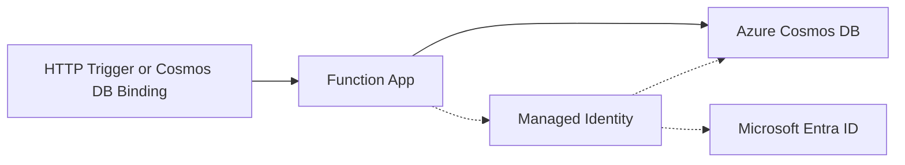

# Cosmos DB Integration

This recipe covers integrating Azure Cosmos DB with Azure Functions Python v2 using output bindings, input bindings, and the SDK approach. The examples use HTTP triggers combined with Cosmos DB bindings, a common pattern for serverless APIs.

## Architecture



Solid arrows show runtime data/event flow. Dashed arrows show identity and authentication.

## Prerequisites

Cosmos DB bindings are included in the default Azure Functions extension bundle. Ensure your `host.json` includes the extension bundle:

```json
{
  "version": "2.0",
  "extensionBundle": {
    "id": "Microsoft.Azure.Functions.ExtensionBundle",
    "version": "[4.*, 5.0.0)"
  }
}
```

You also need a Cosmos DB account with a database and container:

```bash
# Create a Cosmos DB account
az cosmosdb create \
  --name your-cosmos-db \
  --resource-group your-rg \
  --kind GlobalDocumentDB

# Create a database
az cosmosdb sql database create \
  --account-name your-cosmos-db \
  --resource-group your-rg \
  --name appdb

# Create a container
az cosmosdb sql container create \
  --account-name your-cosmos-db \
  --resource-group your-rg \
  --database-name appdb \
  --name items \
  --partition-key-path "/category"
```

### Connection String App Setting

Add the Cosmos DB connection string to your app settings:

```bash
az functionapp config appsettings set \
  --name your-func \
  --resource-group your-rg \
  --settings "CosmosDBConnection=$(az cosmosdb keys list --name your-cosmos-db --resource-group your-rg --type connection-strings --query 'connectionStrings[0].connectionString' --output tsv)"
```

For local development, add it to `local.settings.json`:

```json
{
  "IsEncrypted": false,
  "Values": {
    "CosmosDBConnection": "AccountEndpoint=https://your-cosmos-db.documents.azure.com:443/;AccountKey=..."
  }
}
```

## Output Binding: Write Documents from HTTP Requests

Use the Cosmos DB output binding to write documents directly from an HTTP trigger:

```python
import azure.functions as func
import json
import uuid
from datetime import datetime, timezone

bp = func.Blueprint()

@bp.route(route="items", methods=["POST"])
@bp.cosmos_db_output(
    arg_name="outputDocument",
    database_name="appdb",
    container_name="items",
    connection="CosmosDBConnection"
)
def create_item(req: func.HttpRequest, outputDocument: func.Out[func.Document]) -> func.HttpResponse:
    """Create a new item in Cosmos DB via HTTP POST."""
    try:
        body = req.get_json()
    except ValueError:
        return func.HttpResponse(
            json.dumps({"error": "Invalid JSON body"}),
            mimetype="application/json",
            status_code=400
        )

    # Build the document
    item = {
        "id": str(uuid.uuid4()),
        "name": body.get("name", ""),
        "category": body.get("category", "general"),
        "description": body.get("description", ""),
        "created_at": datetime.now(timezone.utc).isoformat()
    }

    # Write to Cosmos DB via output binding
    outputDocument.set(func.Document.from_dict(item))

    return func.HttpResponse(
        json.dumps(item),
        mimetype="application/json",
        status_code=201
    )
```

The output binding handles the Cosmos DB client creation, connection management, and document insertion automatically.

## Input Binding: Read Documents by ID

Use the Cosmos DB input binding to read a specific document by its ID:

```python
@bp.route(route="items/{category}/{item_id}", methods=["GET"])
@bp.cosmos_db_input(
    arg_name="documents",
    database_name="appdb",
    container_name="items",
    connection="CosmosDBConnection",
    id="{item_id}",
    partition_key="{category}"
)
def get_item(req: func.HttpRequest, documents: func.DocumentList) -> func.HttpResponse:
    """Retrieve an item from Cosmos DB by ID and category (partition key)."""
    if not documents:
        return func.HttpResponse(
            json.dumps({"error": "Item not found"}),
            mimetype="application/json",
            status_code=404
        )

    item = documents[0].to_dict()
    return func.HttpResponse(
        json.dumps(item),
        mimetype="application/json",
        status_code=200
    )
```

> **Note:** The `{item_id}` and `{category}` in the input binding parameters reference route parameters. Azure Functions automatically resolves them at runtime. The `partition_key` must match the container's partition key path (`/category`) defined during creation.

## Input Binding: Query with SQL

You can also use the input binding with a SQL query to retrieve multiple documents:

```python
@bp.route(route="items", methods=["GET"])
@bp.cosmos_db_input(
    arg_name="documents",
    database_name="appdb",
    container_name="items",
    connection="CosmosDBConnection",
    sql_query="SELECT TOP 100 * FROM c ORDER BY c.created_at DESC"
)
def list_items(req: func.HttpRequest, documents: func.DocumentList) -> func.HttpResponse:
    """List recent items from Cosmos DB."""
    items = [doc.to_dict() for doc in documents]
    return func.HttpResponse(
        json.dumps({"items": items, "count": len(items)}),
        mimetype="application/json",
        status_code=200
    )
```

## SDK Approach: Azure Cosmos DB Python SDK

For complex queries, transactions, or scenarios not covered by bindings, use the `azure-cosmos` SDK directly:

Add to `requirements.txt`:

```
azure-cosmos>=4.5.0
azure-identity>=1.15.0
```

```python
import azure.functions as func
import json
import os
from azure.cosmos import CosmosClient
from azure.identity import DefaultAzureCredential

bp = func.Blueprint()

# Initialize the Cosmos client (reuse across invocations)
_cosmos_client = None

def get_cosmos_container():
    global _cosmos_client
    if _cosmos_client is None:
        endpoint = os.environ["COSMOS_ENDPOINT"]
        credential = DefaultAzureCredential()
        _cosmos_client = CosmosClient(endpoint, credential)
    database = _cosmos_client.get_database_client("appdb")
    return database.get_container_client("items")


@bp.route(route="items/search", methods=["GET"])
def search_items(req: func.HttpRequest) -> func.HttpResponse:
    """Search items with a parameterised query."""
    category = req.params.get("category", "general")
    container = get_cosmos_container()

    query = "SELECT * FROM c WHERE c.category = @category"
    parameters = [{"name": "@category", "value": category}]

    items = list(container.query_items(
        query=query,
        parameters=parameters,
        enable_cross_partition_query=True
    ))

    return func.HttpResponse(
        json.dumps({"items": items, "count": len(items)}),
        mimetype="application/json",
        status_code=200
    )
```

## Managed Identity for Passwordless Access

Instead of connection strings, use Managed Identity to access Cosmos DB without credentials:

1. Enable Managed Identity on the function app:
   ```bash
   az functionapp identity assign --name your-func --resource-group your-rg
   ```

2. Assign the `Cosmos DB Built-in Data Contributor` role:
   ```bash
   az cosmosdb sql role assignment create \
     --account-name your-cosmos-db \
     --resource-group your-rg \
     --role-definition-name "Cosmos DB Built-in Data Contributor" \
     --scope "/" \
     --principal-id "<principal-id-from-step-1>"
   ```

3. Use identity-based connection in app settings:
   ```bash
   az functionapp config appsettings set \
     --name your-func \
     --resource-group your-rg \
     --settings "CosmosDBConnection__accountEndpoint=https://your-cosmos-db.documents.azure.com:443/"
   ```

The binding now uses the Managed Identity automatically — no connection string needed.

## See Also
- [Managed Identity Recipe](managed-identity.md)
- [HTTP API Patterns](http-api.md)

## References
- [Azure Functions Cosmos DB Bindings (Microsoft Learn)](https://learn.microsoft.com/azure/azure-functions/functions-bindings-cosmosdb-v2)
- [Managed Identity Tutorial (Microsoft Learn)](https://learn.microsoft.com/azure/azure-functions/functions-identity-based-connections-tutorial)
