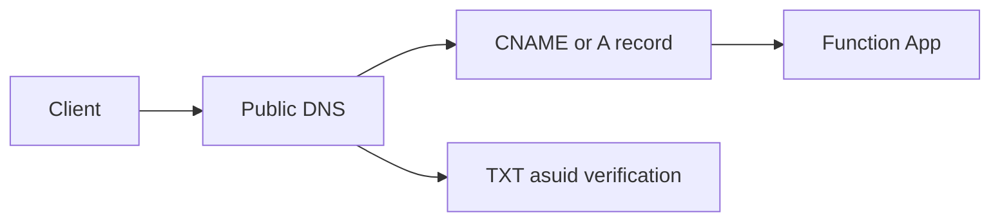
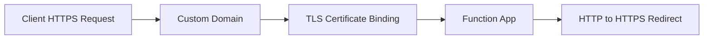

# Custom Domains and Certificates

Azure Function Apps support custom domains similarly to Azure App Service. On the Consumption and Flex Consumption plans, custom domain mapping supports CNAME records only.

## Architecture





## Prerequisites

- An Azure Function App deployed and running.
- DNS zone control for your domain (for TXT and CNAME/A record creation).
- Premium or Dedicated plan recommended for broader custom domain options.
- Azure CLI authenticated with permissions for the resource group.

> **Note:** Consumption and Flex Consumption plans support CNAME-based custom domains; root/apex domain scenarios typically require plan and DNS provider capabilities that support A/ALIAS-style mapping.

## Configure Custom Domain

1. Get the custom domain verification ID used for TXT validation:

```bash
az functionapp show \
  --name $APP_NAME \
  --resource-group $RG \
  --query customDomainVerificationId \
  --output tsv
```

2. Add DNS records at your DNS provider:
   - TXT record: `asuid.<subdomain>` with the verification ID from step 1
   - CNAME record for subdomain mapping (or A record where supported by plan and DNS scenario)

3. Add the hostname to the Function App:

```bash
az functionapp config hostname add \
  --name $APP_NAME \
  --resource-group $RG \
  --hostname api.contoso.com
```

## Create Managed Certificate

Create and bind an App Service managed certificate to the custom domain:

```bash
az functionapp config ssl create \
  --resource-group $RG \
  --name $APP_NAME \
  --hostname api.contoso.com

az functionapp config ssl bind \
  --resource-group $RG \
  --name $APP_NAME \
  --certificate-thumbprint <thumbprint> \
  --ssl-type SNI
```

## Enforce HTTPS

```bash
az functionapp update \
  --resource-group $RG \
  --name $APP_NAME \
  --set httpsOnly=true
```

## Plan Limitations

| Feature | Consumption | Flex Consumption | Premium | Dedicated |
|---------|-------------|------------------|---------|-----------|
| Custom domain | CNAME only | CNAME only | Full (A + CNAME) | Full |
| Managed certificate | Yes | No | Yes | Yes |
| IP-based SSL | No | No | Yes | Yes |

!!! note "Flex Consumption certificate limitations"
    Certificate features such as loading certificates via `WEBSITE_LOAD_CERTIFICATES`, managed certificates, App Service certificates, and `endToEndEncryptionEnabled` are not currently supported in Flex Consumption.

## Verification

- Confirm hostname binding:

```bash
az functionapp config hostname list \
  --name $APP_NAME \
  --resource-group $RG
```

- Confirm HTTPS-only is enabled:

```bash
az functionapp show \
  --name $APP_NAME \
  --resource-group $RG \
  --query httpsOnly
```

- Validate TLS in browser or with curl:

```bash
curl -I https://api.contoso.com
```

## Troubleshooting

| Symptom | Cause | Fix |
|---------|-------|-----|
| Domain verification fails | Missing or incorrect `asuid` TXT record | Recheck TXT record name and value; wait for DNS propagation |
| Hostname cannot be added | DNS record does not point to Function App | Validate CNAME/A mapping and retry |
| TLS certificate not issued | Domain not fully validated | Confirm hostname binding and DNS resolution first |
| HTTP still accessible | HTTPS-only not enabled | Run `az functionapp update --set httpsOnly=true` |

## See Also

- [Recipes Index](index.md)
- [Python Language Guide](../index.md)
- [Platform: Networking](../../../platform/networking.md)
- [Platform: Security](../../../platform/security.md)

## Sources
- [Map a custom domain to App Service (Microsoft Learn)](https://learn.microsoft.com/en-us/azure/app-service/app-service-web-tutorial-custom-domain)
- [Add and manage TLS/SSL certificates in App Service (Microsoft Learn)](https://learn.microsoft.com/azure/app-service/configure-ssl-certificate)
