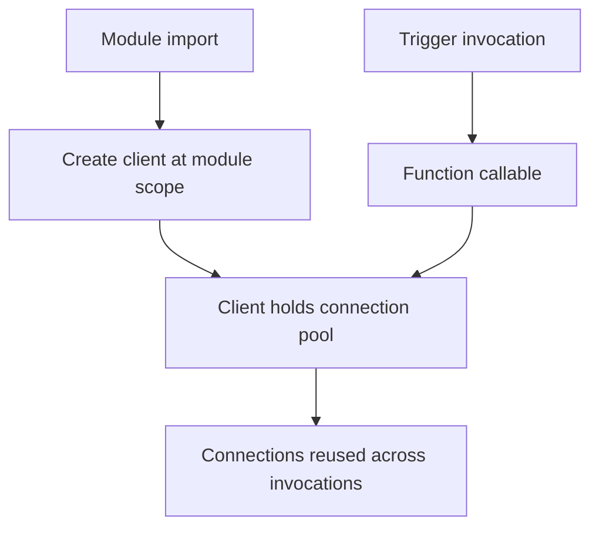

---
content_sources:
  references:
    - type: mslearn-adapted
      url: https://learn.microsoft.com/en-us/azure/azure-functions/functions-reference-python
  diagrams:
    - id: architecture
      type: flowchart
      source: self-generated
      justification: Flow view of architecture, synthesized from Microsoft Learn documentation cited on this page.
      based_on:
        - https://learn.microsoft.com/en-us/azure/azure-functions/functions-reference-python
        - https://learn.microsoft.com/en-us/azure/azure-functions/manage-connections
---
# Dependency Injection

The Python v2 programming model does not provide a dependency injection (DI) container. Functions are plain Python callables decorated with triggers, so there is no constructor to inject into. The idiomatic pattern is to create heavyweight clients once at module scope and reuse them across invocations. Because a single worker process serves many invocations, module-level globals give you the same connection-reuse benefit that a singleton-scoped DI registration would provide in other runtimes.

## Architecture

<!-- diagram-id: architecture -->


## Why Module-Level Clients

The worker imports your `function_app.py` once and then calls your functions repeatedly. Creating an Azure SDK client inside the function body reconstructs the connection pool and re-authenticates on every request, which increases latency and can exhaust outbound connections under load. Creating the client at module scope initializes it once per worker.

```python
import azure.functions as func
from azure.identity import DefaultAzureCredential
from azure.storage.blob import BlobServiceClient
import os

# Created once when the worker imports this module.
_credential = DefaultAzureCredential()
_blob_service = BlobServiceClient(
    account_url=os.environ["STORAGE__blobServiceUri"],
    credential=_credential,
)

app = func.FunctionApp()


@app.route(route="upload", auth_level=func.AuthLevel.FUNCTION)
def upload(req: func.HttpRequest) -> func.HttpResponse:
    container = _blob_service.get_container_client("uploads")
    container.upload_blob(name=req.headers["x-id"], data=req.get_body())
    return func.HttpResponse(status_code=202)
```

## Lazy Initialization

If the client is expensive and not every function needs it, initialize it lazily on first use. Guard construction so concurrent async invocations do not each build a client.

```python
_lock = threading.Lock()
_client = None


def get_client() -> BlobServiceClient:
    global _client
    if _client is None:
        with _lock:
            if _client is None:
                _client = BlobServiceClient(
                    account_url=os.environ["STORAGE__blobServiceUri"],
                    credential=DefaultAzureCredential(),
                )
    return _client
```

## Passing Dependencies to Business Logic

Keep business logic in plain functions or classes that accept their dependencies as arguments. This keeps the logic testable — a unit test constructs the class with a fake client — while the trigger function performs the wiring.

```python
class OrderService:
    def __init__(self, blob_service: BlobServiceClient) -> None:
        self._blob = blob_service

    def submit(self, order_id: str, payload: bytes) -> None:
        self._blob.get_container_client("orders").upload_blob(order_id, payload)


_orders = OrderService(_blob_service)


@app.route(route="orders/{id}", auth_level=func.AuthLevel.FUNCTION)
def submit_order(req: func.HttpRequest) -> func.HttpResponse:
    _orders.submit(req.route_params["id"], req.get_body())
    return func.HttpResponse(status_code=202)
```

!!! tip "Reuse clients, not per-request state"
    Module-level clients are shared by every concurrent invocation on the worker. Store only thread-safe, stateless clients at module scope; keep per-request data inside the function body.

## See Also

- [Managed Identity](managed-identity.md)
- [Blob Storage Integration](blob-storage.md)

## Sources

- [Azure Functions Python developer guide (Microsoft Learn)](https://learn.microsoft.com/en-us/azure/azure-functions/functions-reference-python)
- [Manage connections in Azure Functions (Microsoft Learn)](https://learn.microsoft.com/en-us/azure/azure-functions/manage-connections)
