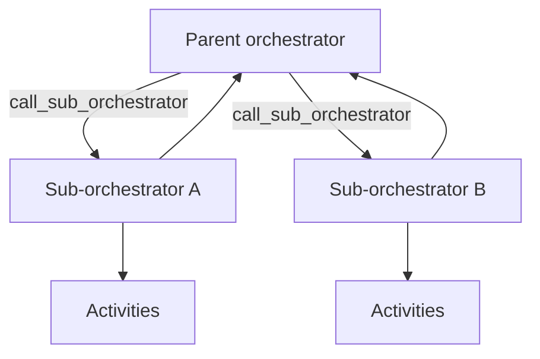

---
content_sources:
  references:
    - type: mslearn-adapted
      url: https://learn.microsoft.com/en-us/azure/azure-functions/durable/durable-functions-sub-orchestrations
    - type: mslearn-adapted
      url: https://learn.microsoft.com/en-us/azure/azure-functions/durable/durable-functions-eternal-orchestrations
    - type: mslearn-adapted
      url: https://learn.microsoft.com/en-us/azure/azure-functions/durable/durable-functions-versioning
  diagrams:
    - id: architecture
      type: flowchart
      source: self-generated
      justification: Flow view of sub-orchestration composition, synthesized from Microsoft Learn documentation cited on this page.
      based_on:
        - https://learn.microsoft.com/en-us/azure/azure-functions/durable/durable-functions-sub-orchestrations
        - https://learn.microsoft.com/en-us/azure/azure-functions/durable/durable-functions-eternal-orchestrations
---
# Durable Functions: Advanced Patterns

This recipe covers advanced Durable Functions patterns for Python beyond the basic chaining and fan-out/fan-in flows: sub-orchestrations, eternal orchestrations, activity retries, and safe versioning. For the fundamentals, see [Durable Orchestration](durable-orchestration.md).

## Architecture

<!-- diagram-id: architecture -->


## Sub-Orchestrations

Break a large workflow into reusable orchestrators. A parent calls a sub-orchestrator with `call_sub_orchestrator`, and can fan out over several the same way it fans out over activities.

```python
@bp.orchestration_trigger(context_name="context")
def parent_orchestrator(context: df.DurableOrchestrationContext):
    regions = context.get_input()["regions"]

    # Fan out over sub-orchestrations, one per region.
    tasks = [
        context.call_sub_orchestrator("process_region", region)
        for region in regions
    ]
    results = yield context.task_all(tasks)
    return {"regions_processed": len(results), "results": results}


@bp.orchestration_trigger(context_name="context")
def process_region(context: df.DurableOrchestrationContext):
    region = context.get_input()
    validated = yield context.call_activity("validate_region", region)
    loaded = yield context.call_activity("load_region", validated)
    return loaded
```

## Eternal Orchestrations

For a workflow that runs indefinitely (aggregators, periodic jobs), do **not** use an unbounded loop — the history would grow forever. Call `continue_as_new` to restart the orchestration with fresh state and a clean history.

```python
from datetime import timedelta

@bp.orchestration_trigger(context_name="context")
def periodic_cleanup(context: df.DurableOrchestrationContext):
    state = context.get_input() or {"runs": 0}

    yield context.call_activity("run_cleanup", state)
    state["runs"] += 1

    # Durable sleep, then restart with new state and empty history.
    next_run = context.current_utc_datetime + timedelta(hours=1)
    yield context.create_timer(next_run)
    context.continue_as_new(state)
```

## Activity Retries

Wrap flaky activities with a retry policy instead of hand-coding retry loops. The orchestration replays cleanly because retries are recorded in history.

```python
retry_options = df.RetryOptions(
    first_retry_interval_in_milliseconds=5000,
    max_number_of_attempts=3,
)

@bp.orchestration_trigger(context_name="context")
def resilient_orchestrator(context: df.DurableOrchestrationContext):
    order = context.get_input()
    result = yield context.call_activity_with_retry(
        "charge_customer", retry_options, order
    )
    return result
```

| Element | Explanation |
|---|---|
| `call_sub_orchestrator` | Invokes another orchestrator as a child; compose and fan out like activities. |
| `continue_as_new` | Restarts the orchestration with new input and a trimmed history for eternal loops. |
| `RetryOptions` | Declarative retry policy applied via `call_activity_with_retry`. |

## Versioning

Orchestrations replay from history, so changing an orchestrator's code while instances are in flight can break replay (non-determinism). Safe strategies:

- **Deploy side by side**: give the changed orchestrator a new name and route new instances to it, letting existing instances drain on the old version.
- **Do not reorder or remove** existing activity calls in a deployed orchestrator.
- **Terminate and restart** in-flight instances if a breaking change is unavoidable.

!!! warning "Determinism still applies"
    Advanced patterns do not relax the determinism rule. Never call `datetime.now()`, generate random values, or do direct I/O inside an orchestrator — use activities and `context.current_utc_datetime`.

## See Also

- [Durable Orchestration](durable-orchestration.md)
- [Durable Entities](durable-entities.md)
- [Platform: Durable Functions](../../../platform/durable-functions.md)

## Sources

- [Sub-orchestrations (Microsoft Learn)](https://learn.microsoft.com/en-us/azure/azure-functions/durable/durable-functions-sub-orchestrations)
- [Eternal orchestrations (Microsoft Learn)](https://learn.microsoft.com/en-us/azure/azure-functions/durable/durable-functions-eternal-orchestrations)
- [Versioning (Microsoft Learn)](https://learn.microsoft.com/en-us/azure/azure-functions/durable/durable-functions-versioning)
