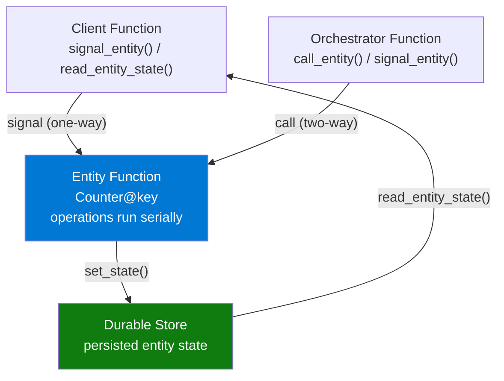
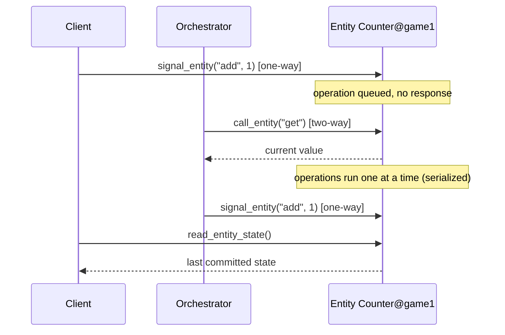

---
content_sources:

  references:
    - type: mslearn-adapted
      url: https://learn.microsoft.com/en-us/azure/azure-functions/durable/durable-functions-entities
    - type: mslearn-adapted
      url: https://learn.microsoft.com/en-us/azure/azure-functions/functions-reference-python
  diagrams:
    - id: entity-lifecycle
      type: flowchart
      source: self-generated
      justification: Flow view of the durable entity lifecycle, synthesized from Microsoft Learn documentation cited on this page.
      based_on:
        - https://learn.microsoft.com/en-us/azure/azure-functions/durable/durable-functions-entities
        - https://learn.microsoft.com/en-us/azure/azure-functions/functions-reference-python
    - id: entity-messaging
      type: sequenceDiagram
      source: self-generated
      justification: Interaction sequence for signaling versus calling an entity, synthesized from Microsoft Learn documentation cited on this page.
      based_on:
        - https://learn.microsoft.com/en-us/azure/azure-functions/durable/durable-functions-entities
        - https://learn.microsoft.com/en-us/azure/azure-functions/functions-reference-python
---
# Durable Entities

> **Note:** This recipe covers Durable Entities (the stateful entity model) with Azure Functions Python v2 using the blueprint model. Entity functions require Durable Functions 2.0 or later.

## Overview

Durable Entities (entity functions) manage small pieces of explicit state — think of them as tiny, addressable, single-threaded objects that live in durable storage. Unlike orchestrator functions, which represent state implicitly through control flow, an entity function reads and writes its state explicitly through operations.

Entities are ideal for:

- **Aggregation** — accumulate values from many sources (counters, running totals, event tallies).
- **Fan-in of high-volume signals** — thousands of producers updating a small shared state without lock contention on a database row.
- **Actor-style state** — one addressable object per user, device, cart, or game session.

| Concept | Description |
|---------|-------------|
| **Entity function** | Defines the operations that read and update a piece of state. Uses the `entity_trigger`. |
| **Entity ID** | A pair of strings — the **entity name** (the entity type, e.g. `Counter`) plus the **entity key** (the unique instance, e.g. a user ID). Written as `@Counter@user-42`. |
| **Operation** | A named action the entity supports (for example `add`, `reset`, `get`), with optional input. |
| **Serialized access** | A single entity processes its operations **one at a time**, so you never need locks to protect the state. |

<!-- diagram-id: entity-lifecycle -->


## Prerequisites

Add the Durable Functions package to `requirements.txt`:

```
azure-functions-durable>=1.2.0
```

Ensure your `host.json` has the extension bundle:

```json
{
  "version": "2.0",
  "extensionBundle": {
    "id": "Microsoft.Azure.Functions.ExtensionBundle",
    "version": "[4.*, 5.0.0)"
  }
}
```

Like orchestrations, entities persist their state in Azure Storage (`AzureWebJobsStorage`). On Flex Consumption, configure host storage with identity-based settings (for example `AzureWebJobsStorage__accountName`) rather than a connection string.

## Define an Entity Function

The entity function receives a `DurableEntityContext`. Read the current state (with a default factory), branch on the operation name, mutate the value, and persist it with `set_state`. Use `set_result` to return a value to a two-way caller.

```python
import azure.functions as func
import azure.durable_functions as df
import json

bp = df.Blueprint()


@bp.entity_trigger(context_name="context")
def Counter(context: df.DurableEntityContext):
    """A durable counter entity supporting add / reset / get operations."""
    current_value = context.get_state(lambda: 0)
    operation = context.operation_name

    if operation == "add":
        current_value += context.get_input()
    elif operation == "reset":
        current_value = 0
    elif operation == "get":
        context.set_result(current_value)

    context.set_state(current_value)
```

Key points:

- `context.get_state(lambda: 0)` returns the persisted state, or `0` the first time the entity is used.
- `context.operation_name` is the operation string chosen by the caller.
- `context.get_input()` reads the operation's optional input.
- `context.set_result(value)` returns a value to callers that used two-way `call_entity` (ignored by one-way signals).
- `context.set_state(value)` persists the new state. The runtime always writes state to storage after the operation completes.

## Signal an Entity from a Client Function

**Signaling** is one-way (fire-and-forget): the client sends an operation and does not wait for a result. Client functions can signal entities and read their state, but cannot call them for a return value.

```python
@bp.route(route="entities/counter/{key}/add", methods=["POST"])
@bp.durable_client_input(client_name="client")
async def add_to_counter(req: func.HttpRequest, client: df.DurableOrchestrationClient) -> func.HttpResponse:
    """Fire-and-forget: increment a named counter."""
    key = req.route_params.get("key")
    amount = int(req.params.get("amount", "1"))

    entity_id = df.EntityId("Counter", key)
    await client.signal_entity(entity_id, "add", amount)

    return func.HttpResponse(
        json.dumps({"entity": f"@Counter@{key}", "signaled": "add", "amount": amount}),
        mimetype="application/json",
        status_code=202,
    )
```

## Read Entity State from a Client Function

Reading returns the entity's **most recently persisted (committed)** state. It may be slightly stale relative to the entity's in-memory state, but it never reflects a half-completed operation.

```python
@bp.route(route="entities/counter/{key}", methods=["GET"])
@bp.durable_client_input(client_name="client")
async def get_counter(req: func.HttpRequest, client: df.DurableOrchestrationClient) -> func.HttpResponse:
    """Read the committed state of a named counter."""
    key = req.route_params.get("key")
    entity_id = df.EntityId("Counter", key)

    state = await client.read_entity_state(entity_id)

    return func.HttpResponse(
        json.dumps({
            "entity": f"@Counter@{key}",
            "exists": state.entity_exists,
            "value": state.entity_state if state.entity_exists else 0,
        }),
        mimetype="application/json",
        status_code=200,
    )
```

## Call and Signal an Entity from an Orchestrator

Orchestrators can both **call** an entity (two-way — wait for a result) and **signal** it (one-way). This lets you read shared state, make a decision, and then update it atomically per entity without database locking.

<!-- diagram-id: entity-messaging -->


```python
@bp.orchestration_trigger(context_name="context")
def reserve_seat(context: df.DurableOrchestrationContext):
    """Reserve a seat if the game is not sold out (capacity = 100)."""
    game_id = context.get_input()
    entity_id = df.EntityId("Counter", game_id)

    # Two-way call: read the current seat count and wait for the result.
    current = yield context.call_entity(entity_id, "get")

    if current >= 100:
        return {"reserved": False, "reason": "sold out", "seats_taken": current}

    # One-way signal: claim a seat (no need to wait for a response).
    context.signal_entity(entity_id, "add", 1)
    return {"reserved": True, "seat_number": current + 1}
```

!!! warning "Do not use entities for cross-entity transactions"
    Each entity is consistent on its own, but an operation that must update **two** entities atomically is not transactional across them. Model such invariants inside a single entity, or coordinate them from an orchestrator that tolerates partial progress and compensates on failure.

## Access Rules Summary

| Caller | Signal (one-way) | Call (two-way) | Read state |
|--------|:---:|:---:|:---:|
| **Client function** | Yes | No | Yes |
| **Orchestrator function** | Yes | Yes | No (call `get` instead) |
| **Entity function** | Yes | No | — |

## Try It Locally

```bash
# Increment two independent counters (each is its own entity instance)
curl --request POST "http://localhost:7071/api/entities/counter/game1/add?amount=3"
curl --request POST "http://localhost:7071/api/entities/counter/game2/add?amount=1"

# Read committed state for game1
curl "http://localhost:7071/api/entities/counter/game1"
```

## See Also

- [Durable Functions](durable-orchestration.md)
- [Platform: Durable Functions](../../../platform/durable-functions.md)
- [HTTP API Patterns](http-api.md)

## Sources

- [Durable entities (Microsoft Learn)](https://learn.microsoft.com/en-us/azure/azure-functions/durable/durable-functions-entities)
- [Python v2 Programming Model (Microsoft Learn)](https://learn.microsoft.com/en-us/azure/azure-functions/functions-reference-python)
