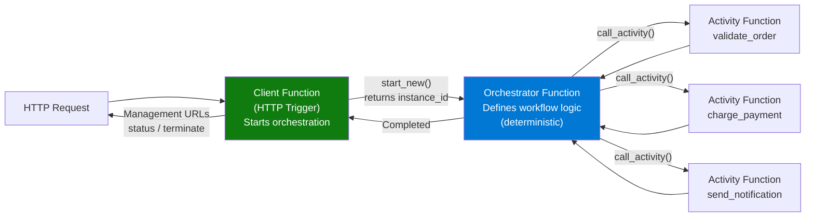
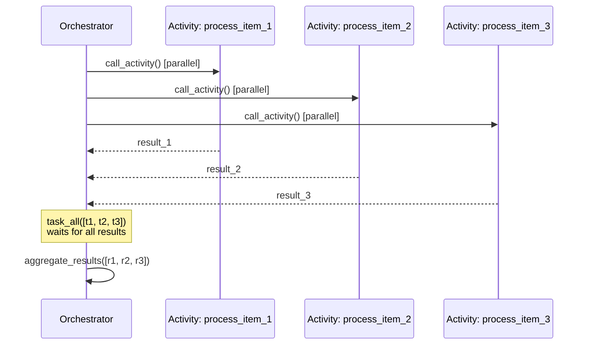

# Durable Functions

> **Note:** This recipe covers Durable Functions patterns with Azure Functions Python v2. HTTP triggers are used as the entry point to start orchestrations, making this a natural extension of HTTP-based function apps.

## Overview

Durable Functions enable stateful workflows in serverless Azure Functions. They are ideal for long-running operations, fan-out/fan-in patterns, human interaction workflows, and function chaining that would be impractical with standard stateless functions.

Durable Functions use three function types:

| Function Type | Purpose | Example |
|--------------|---------|---------|
| **Client** (Starter) | Starts an orchestration (often HTTP-triggered) | REST API receives a request, starts a workflow |
| **Orchestrator** | Defines the workflow logic, coordinates activities | Chain activity calls, fan-out/fan-in, wait for events |
| **Activity** | Performs the actual work (a single unit of work) | Send an email, process a file, call an API |



## Prerequisites

Add the Durable Functions package to `requirements.txt`:

```
azure-functions-durable>=1.2.0
```

Ensure your `host.json` has the extension bundle:

```json
{
  "version": "2.0",
  "extensionBundle": {
    "id": "Microsoft.Azure.Functions.ExtensionBundle",
    "version": "[4.*, 5.0.0)"
  }
}
```

Durable Functions also require Azure Storage (`AzureWebJobsStorage`) for storing orchestration state, history, and messages. On Flex Consumption, configure host storage with identity-based settings (e.g. `AzureWebJobsStorage__accountName`) rather than a connection string. Durable Functions are supported on Flex Consumption; for lower orchestration startup latency, use the `durable` always-ready instance group.

## HTTP Starter: Kick Off an Orchestration

The client function is an HTTP trigger that starts a new orchestration instance:

```python
import azure.functions as func
import azure.functions.durable_client as df
import json

bp = func.Blueprint()

@bp.route(route="orchestrations/{function_name}", methods=["POST"])
@bp.durable_client_input(client_name="client")
async def http_start(req: func.HttpRequest, client: df.DurableOrchestrationClient) -> func.HttpResponse:
    """HTTP endpoint that starts a durable orchestration."""
    function_name = req.route_params.get("function_name")

    # Optional: pass input from the HTTP request body
    try:
        payload = req.get_json()
    except ValueError:
        payload = None

    # Start the orchestration
    instance_id = await client.start_new(function_name, client_input=payload)

    # Return management URLs for checking status, terminating, etc.
    return client.create_check_status_response(req, instance_id)
```

When you call this endpoint, the response includes management URLs:

```bash
curl -X POST http://localhost:7071/api/orchestrations/order_processing \
  -H "Content-Type: application/json" \
  -d '{"order_id": "12345", "items": ["widget-a", "widget-b"]}'
```

Response:

```json
{
  "id": "abc123...",
  "statusQueryGetUri": "http://localhost:7071/runtime/webhooks/durabletask/instances/abc123...",
  "sendEventPostUri": "http://localhost:7071/runtime/webhooks/durabletask/instances/abc123.../raiseEvent/{eventName}",
  "terminatePostUri": "http://localhost:7071/runtime/webhooks/durabletask/instances/abc123.../terminate",
  "purgeHistoryDeleteUri": "http://localhost:7071/runtime/webhooks/durabletask/instances/abc123..."
}
```

## Orchestrator: Define the Workflow

The orchestrator function defines the sequence of operations. It must be **deterministic** — no random values, no current time, no direct I/O. All work happens through activity calls.

```python
@bp.orchestration_trigger(context_name="context")
def order_processing(context: df.DurableOrchestrationContext):
    """Orchestrate order processing: validate → charge → fulfill → notify."""
    order = context.get_input()

    # Step 1: Validate the order
    validation = yield context.call_activity("validate_order", order)
    if not validation["valid"]:
        return {"status": "rejected", "reason": validation["reason"]}

    # Step 2: Charge the customer
    charge_result = yield context.call_activity("charge_customer", {
        "order_id": order["order_id"],
        "amount": validation["total"]
    })

    # Step 3: Fulfill the order
    fulfillment = yield context.call_activity("fulfill_order", order)

    # Step 4: Notify the customer
    yield context.call_activity("send_notification", {
        "order_id": order["order_id"],
        "email": order.get("email"),
        "status": "completed"
    })

    return {
        "status": "completed",
        "order_id": order["order_id"],
        "charge_id": charge_result["charge_id"],
        "tracking_number": fulfillment["tracking_number"]
    }
```

## Activity Functions: Do the Work

Activity functions are the building blocks that perform actual work:

```python
@bp.activity_trigger(input_name="order")
def validate_order(order: dict) -> dict:
    """Validate the order and calculate total."""
    items = order.get("items", [])
    if not items:
        return {"valid": False, "reason": "No items in order"}

    # Simulate price lookup
    price_per_item = 29.99
    total = len(items) * price_per_item

    return {"valid": True, "total": total, "item_count": len(items)}


@bp.activity_trigger(input_name="charge_input")
def charge_customer(charge_input: dict) -> dict:
    """Charge the customer (simulated)."""
    import uuid
    return {
        "charge_id": str(uuid.uuid4()),
        "amount": charge_input["amount"],
        "status": "charged"
    }


@bp.activity_trigger(input_name="order")
def fulfill_order(order: dict) -> dict:
    """Fulfill the order (simulated)."""
    import uuid
    return {
        "tracking_number": f"TRK-{uuid.uuid4().hex[:8].upper()}",
        "status": "shipped"
    }


@bp.activity_trigger(input_name="notification")
def send_notification(notification: dict) -> dict:
    """Send a notification to the customer (simulated)."""
    import logging
    logging.info(f"Notification sent to {notification.get('email')} for order {notification['order_id']}")
    return {"sent": True}
```

## Fan-Out / Fan-In Pattern



Process multiple items in parallel, then aggregate results:

```python
@bp.orchestration_trigger(context_name="context")
def parallel_processing(context: df.DurableOrchestrationContext):
    """Process multiple items in parallel."""
    items = context.get_input().get("items", [])

    # Fan-out: start all activities in parallel
    parallel_tasks = [
        context.call_activity("process_item", item)
        for item in items
    ]

    # Fan-in: wait for all to complete
    results = yield context.task_all(parallel_tasks)

    # Aggregate
    successful = sum(1 for r in results if r["status"] == "success")
    return {
        "total": len(items),
        "successful": successful,
        "failed": len(items) - successful,
        "results": results
    }


@bp.activity_trigger(input_name="item")
def process_item(item: dict) -> dict:
    """Process a single item."""
    import logging
    logging.info(f"Processing item: {item}")
    return {"item": item, "status": "success"}
```

## Check Orchestration Status

Use the status query URL from the starter response, or query programmatically:

```python
@bp.route(route="orchestrations/{instance_id}/status", methods=["GET"])
@bp.durable_client_input(client_name="client")
async def get_status(req: func.HttpRequest, client: df.DurableOrchestrationClient) -> func.HttpResponse:
    """Check the status of an orchestration instance."""
    instance_id = req.route_params.get("instance_id")
    status = await client.get_status(instance_id)

    if status is None:
        return func.HttpResponse(
            json.dumps({"error": "Instance not found"}),
            mimetype="application/json",
            status_code=404
        )

    return func.HttpResponse(
        json.dumps({
            "instance_id": status.instance_id,
            "runtime_status": status.runtime_status.name,
            "output": status.output,
            "created_time": status.created_time.isoformat() if status.created_time else None,
            "last_updated_time": status.last_updated_time.isoformat() if status.last_updated_time else None
        }),
        mimetype="application/json",
        status_code=200
    )
```

## See Also
- [HTTP API Patterns](http-api.md)
- [Queue Recipe](queue.md)

## Sources
- [Durable Functions Overview (Microsoft Learn)](https://learn.microsoft.com/azure/azure-functions/durable/durable-functions-overview)
- [Python v2 Programming Model (Microsoft Learn)](https://learn.microsoft.com/azure/azure-functions/functions-reference-python)
