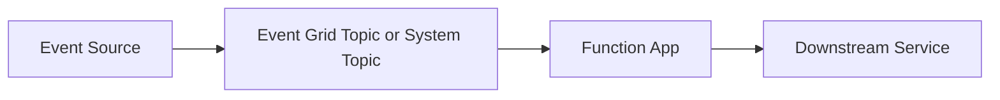

# Event Grid Trigger

> **Note:** This recipe covers Event Grid integration for future extensibility beyond HTTP triggers. The most common pattern shown here is an HTTP trigger that publishes events to Event Grid, and an Event Grid trigger that consumes them.

## Overview

Azure Event Grid is a fully managed event routing service that uses a publish-subscribe model. It is ideal for reactive, event-driven architectures where you need to fan-out notifications to multiple subscribers or decouple producers from consumers.

Common use cases with Azure Functions:

- **HTTP → Event Grid**: An HTTP API publishes domain events (order created, user registered) to Event Grid
- **Event Grid → Function**: A function subscribes to events from Azure services (blob created, resource changed) or custom topics
- **Cross-service communication**: Decouple microservices using events instead of direct HTTP calls

## Architecture



Solid arrows show runtime data/event flow. Dashed arrows show identity and authentication.

## Prerequisites

Event Grid bindings are included in the default extension bundle:

```json
{
  "version": "2.0",
  "extensionBundle": {
    "id": "Microsoft.Azure.Functions.ExtensionBundle",
    "version": "[4.*, 5.0.0)"
  }
}
```

Create an Event Grid topic for custom events:

```bash
# Create an Event Grid topic
az eventgrid topic create \
  --name your-topic \
  --resource-group your-rg \
  --location eastus

# Get the topic endpoint and key
az eventgrid topic show \
  --name your-topic \
  --resource-group your-rg \
  --query "endpoint" --output tsv

az eventgrid topic key list \
  --name your-topic \
  --resource-group your-rg \
  --query "key1" --output tsv
```

## Event Grid Output: Publish Events from HTTP Trigger

Use the Event Grid output binding to publish events when an HTTP request is received:

```python
import azure.functions as func
import json
import uuid
from datetime import datetime, timezone

bp = func.Blueprint()

@bp.route(route="orders", methods=["POST"])
@bp.event_grid_output(
    arg_name="outputEvent",
    topic_endpoint_uri="EVENT_GRID_TOPIC_ENDPOINT",
    topic_key_setting="EVENT_GRID_TOPIC_KEY"
)
def create_order(req: func.HttpRequest, outputEvent: func.Out[func.EventGridOutputEvent]) -> func.HttpResponse:
    """Create an order and publish an OrderCreated event."""
    try:
        body = req.get_json()
    except ValueError:
        return func.HttpResponse(
            json.dumps({"error": "Invalid JSON body"}),
            mimetype="application/json",
            status_code=400
        )

    order_id = str(uuid.uuid4())

    # Publish the event to Event Grid
    event = func.EventGridOutputEvent(
        id=str(uuid.uuid4()),
        data={"order_id": order_id, "items": body.get("items", [])},
        subject=f"orders/{order_id}",
        event_type="Order.Created",
        data_version="1.0"
    )
    outputEvent.set(event)

    return func.HttpResponse(
        json.dumps({"order_id": order_id, "status": "created", "event_published": True}),
        mimetype="application/json",
        status_code=201
    )
```

Configure the app settings:

```bash
az functionapp config appsettings set \
  --name your-func \
  --resource-group your-rg \
  --settings \
    "EVENT_GRID_TOPIC_ENDPOINT=https://your-topic.eastus-1.eventgrid.azure.net/api/events" \
    "EVENT_GRID_TOPIC_KEY=<your-topic-key>"
```

## Event Grid Trigger: Consume Events

The Event Grid trigger fires when an event arrives at a subscription. Create a function that processes events from your custom topic or from Azure service events:

```python
import azure.functions as func
import json
import logging

bp = func.Blueprint()

@bp.event_grid_trigger(arg_name="event")
def handle_order_event(event: func.EventGridEvent) -> None:
    """Process Order events from Event Grid."""
    logging.info(f"Event Grid trigger fired:")
    logging.info(f"  Event ID: {event.id}")
    logging.info(f"  Event Type: {event.event_type}")
    logging.info(f"  Subject: {event.subject}")
    logging.info(f"  Event Time: {event.event_time}")

    data = event.get_json()
    order_id = data.get("order_id")

    if event.event_type == "Order.Created":
        logging.info(f"Processing new order: {order_id}")
        logging.info(f"Items: {data.get('items', [])}")
        # Process the order...

    elif event.event_type == "Order.Cancelled":
        logging.info(f"Handling order cancellation: {order_id}")
        # Handle cancellation...

    else:
        logging.warning(f"Unknown event type: {event.event_type}")
```

### Create an Event Subscription

Subscribe your function to the Event Grid topic:

```bash
# Get the function's Event Grid webhook URL
FUNCTION_URL="https://your-func.azurewebsites.net/runtime/webhooks/eventgrid?functionName=handle_order_event&code=<host-key>"

# Create the subscription
az eventgrid event-subscription create \
  --name order-events-sub \
  --source-resource-id "/subscriptions/<subscription-id>/resourceGroups/your-rg/providers/Microsoft.EventGrid/topics/your-topic" \
  --endpoint "$FUNCTION_URL" \
  --endpoint-type webhook
```

## SDK Approach: EventGridPublisherClient

For more control over event publishing (batching, custom schemas, CloudEvents format), use the `azure-eventgrid` SDK:

Add to `requirements.txt`:

```
azure-eventgrid>=4.15.0
azure-identity>=1.15.0
```

```python
import azure.functions as func
import json
import os
from azure.eventgrid import EventGridPublisherClient, EventGridEvent
from azure.core.credentials import AzureKeyCredential

bp = func.Blueprint()

_eg_client = None

def get_eventgrid_client() -> EventGridPublisherClient:
    global _eg_client
    if _eg_client is None:
        endpoint = os.environ["EVENT_GRID_TOPIC_ENDPOINT"]
        key = os.environ["EVENT_GRID_TOPIC_KEY"]
        _eg_client = EventGridPublisherClient(endpoint, AzureKeyCredential(key))
    return _eg_client


@bp.route(route="events/publish", methods=["POST"])
def publish_event(req: func.HttpRequest) -> func.HttpResponse:
    """Publish a custom event to Event Grid using the SDK."""
    try:
        body = req.get_json()
    except ValueError:
        return func.HttpResponse(
            json.dumps({"error": "Invalid JSON body"}),
            mimetype="application/json",
            status_code=400
        )

    client = get_eventgrid_client()
    event = EventGridEvent(
        data=body,
        subject=body.get("subject", "custom/event"),
        event_type=body.get("event_type", "Custom.Event"),
        data_version="1.0"
    )

    client.send([event])

    return func.HttpResponse(
        json.dumps({"status": "published"}),
        mimetype="application/json",
        status_code=202
    )
```

## Subscribing to Azure Service Events

Event Grid natively integrates with many Azure services. For example, receive events when a blob is created in a Storage Account:

```bash
az eventgrid event-subscription create \
  --name blob-created-sub \
  --source-resource-id "/subscriptions/<subscription-id>/resourceGroups/your-rg/providers/Microsoft.Storage/storageAccounts/yourstorage" \
  --included-event-types "Microsoft.Storage.BlobCreated" \
  --endpoint "https://your-func.azurewebsites.net/runtime/webhooks/eventgrid?functionName=handle_blob_event&code=<host-key>" \
  --endpoint-type webhook
```

```python
@bp.event_grid_trigger(arg_name="event")
def handle_blob_event(event: func.EventGridEvent) -> None:
    """Process blob creation events."""
    data = event.get_json()
    logging.info(f"Blob created: {data.get('url')}")
    logging.info(f"Content type: {data.get('contentType')}")
    logging.info(f"Content length: {data.get('contentLength')}")
```

## See Also
- [HTTP API Patterns](http-api.md)
- [Queue Recipe](queue.md)

## References
- [Azure Functions Event Grid Bindings (Microsoft Learn)](https://learn.microsoft.com/azure/azure-functions/functions-bindings-event-grid)
- [Azure Functions Triggers and Bindings (Microsoft Learn)](https://learn.microsoft.com/azure/azure-functions/functions-triggers-bindings)
