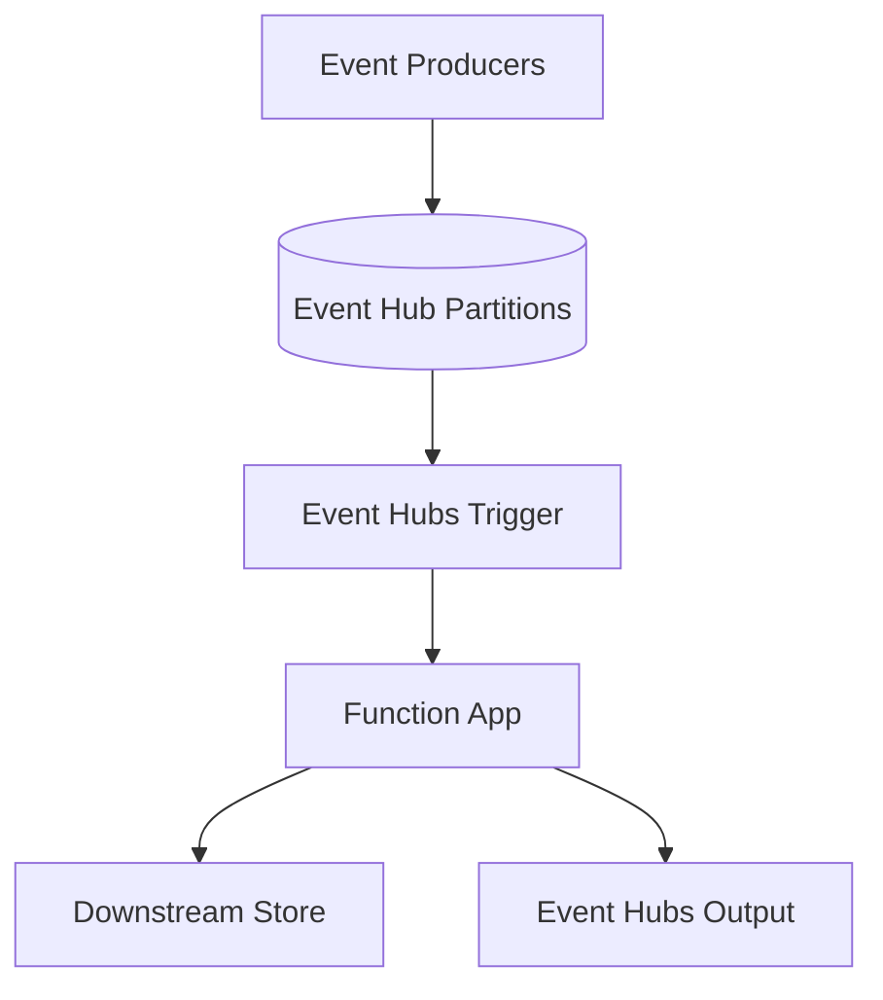

---
content_sources:
  references:
    - type: mslearn-adapted
      url: https://learn.microsoft.com/en-us/azure/azure-functions/functions-bindings-event-hubs
  diagrams:
    - id: architecture
      type: flowchart
      source: self-generated
      justification: Flow view of architecture, synthesized from Microsoft Learn documentation cited on this page.
      based_on:
        - https://learn.microsoft.com/en-us/azure/azure-functions/functions-bindings-event-hubs
        - https://learn.microsoft.com/en-us/azure/azure-functions/functions-bindings-event-hubs-trigger
---
# Event Hubs

This recipe covers integrating Azure Event Hubs with Azure Functions Python v2 — consuming a high-throughput event stream with the Event Hubs trigger (single event and batch), reading event metadata, and publishing events with the output binding. Event Hubs is the standard choice for telemetry ingestion, clickstream, and log-aggregation workloads.

## Architecture

<!-- diagram-id: architecture -->


## Prerequisites

Event Hubs bindings are included in the default extension bundle. Ensure your `host.json` references it:

```json
{
  "version": "2.0",
  "extensionBundle": {
    "id": "Microsoft.Azure.Functions.ExtensionBundle",
    "version": "[4.*, 5.0.0)"
  }
}
```

Provide the connection in app settings. A connection-string setting or an identity-based connection is supported. Identity-based connections use a setting prefix with `__fullyQualifiedNamespace`:

```bash
az functionapp config appsettings set \
  --name $APP_NAME \
  --resource-group $RG \
  --settings "EventHubConnection__fullyQualifiedNamespace=$NAMESPACE.servicebus.windows.net"
```

| CLI element | Explanation |
|---|---|
| Command(s) | `az functionapp config appsettings set` |
| Key flags | `--name`, `--resource-group`, `--settings` |
| Variables | `$APP_NAME`, `$RG`, `$NAMESPACE` |
| Expected result | Azure CLI returns the updated app settings as JSON; confirm the setting is present before continuing. |

When using an identity-based connection, grant the function app's managed identity the **Azure Event Hubs Data Receiver** (and **Data Sender** for output) role on the namespace.

## Event Hubs Trigger: Process a Single Event

The trigger fires as events arrive on the hub. Each function instance owns a set of partitions and checkpoints progress automatically.

```python
import azure.functions as func
import logging
import json

bp = func.Blueprint()

@bp.event_hub_message_trigger(
    arg_name="event",
    event_hub_name="telemetry",
    connection="EventHubConnection",
    consumer_group="$Default",
)
def process_event(event: func.EventHubEvent) -> None:
    """Process a single event from the hub."""
    body = event.get_body().decode("utf-8")
    data = json.loads(body)

    logging.info("Event received: partition_key=%s sequence=%s offset=%s",
                 event.partition_key, event.sequence_number, event.offset)
    logging.info("Enqueued at: %s", event.enqueued_time)
    logging.info("Payload: %s", data)
```

## Event Hubs Trigger: Batch Processing (Recommended for Throughput)

Setting `cardinality="many"` delivers a batch of events per invocation, which dramatically improves throughput for high-volume streams. Design the handler to be idempotent because delivery is at-least-once.

```python
from typing import List

@bp.event_hub_message_trigger(
    arg_name="events",
    event_hub_name="telemetry",
    connection="EventHubConnection",
    consumer_group="$Default",
    cardinality="many",
)
def process_batch(events: List[func.EventHubEvent]) -> None:
    """Process a batch of events in a single invocation."""
    logging.info("Batch size: %d", len(events))
    for event in events:
        data = json.loads(event.get_body().decode("utf-8"))
        # Process each event; keep this idempotent.
        logging.info("Processing sequence=%s", event.sequence_number)
```

## Output Binding: Publish Events

Use the output binding to publish one or many events downstream.

```python
@bp.route(route="publish", methods=["POST"])
@bp.event_hub_output(
    arg_name="out_events",
    event_hub_name="downstream",
    connection="EventHubConnection",
)
def publish(req: func.HttpRequest, out_events: func.Out[str]) -> func.HttpResponse:
    """Publish an event to a downstream hub."""
    try:
        body = req.get_json()
    except ValueError:
        return func.HttpResponse(
            json.dumps({"error": "Invalid JSON body"}),
            mimetype="application/json",
            status_code=400,
        )

    out_events.set(json.dumps(body))
    return func.HttpResponse(
        json.dumps({"status": "published"}),
        mimetype="application/json",
        status_code=202,
    )
```

## Host Configuration and Checkpointing

Tune batch size and checkpoint frequency in `host.json`:

```json
{
  "version": "2.0",
  "extensions": {
    "eventHubs": {
      "maxEventBatchSize": 100,
      "batchCheckpointFrequency": 1,
      "prefetchCount": 300
    }
  }
}
```

| Setting | Default | Description |
|---------|---------|-------------|
| `maxEventBatchSize` | 100 | Maximum number of events delivered per batch invocation |
| `batchCheckpointFrequency` | 1 | Number of batches processed before a checkpoint is written |
| `prefetchCount` | 300 | Number of events the underlying client prefetches |

!!! note "Checkpointing"
    The Event Hubs extension checkpoints progress to the storage account referenced by `AzureWebJobsStorage`. A higher `batchCheckpointFrequency` reduces storage writes but increases the volume of events reprocessed after a restart.

## See Also

- [Queue Storage](queue.md)
- [Managed Identity Recipe](managed-identity.md)

## Sources

- [Azure Event Hubs bindings for Azure Functions (Microsoft Learn)](https://learn.microsoft.com/en-us/azure/azure-functions/functions-bindings-event-hubs)
- [Azure Event Hubs trigger for Azure Functions (Microsoft Learn)](https://learn.microsoft.com/en-us/azure/azure-functions/functions-bindings-event-hubs-trigger)
- [Azure Event Hubs output binding for Azure Functions (Microsoft Learn)](https://learn.microsoft.com/en-us/azure/azure-functions/functions-bindings-event-hubs-output)
</content>
