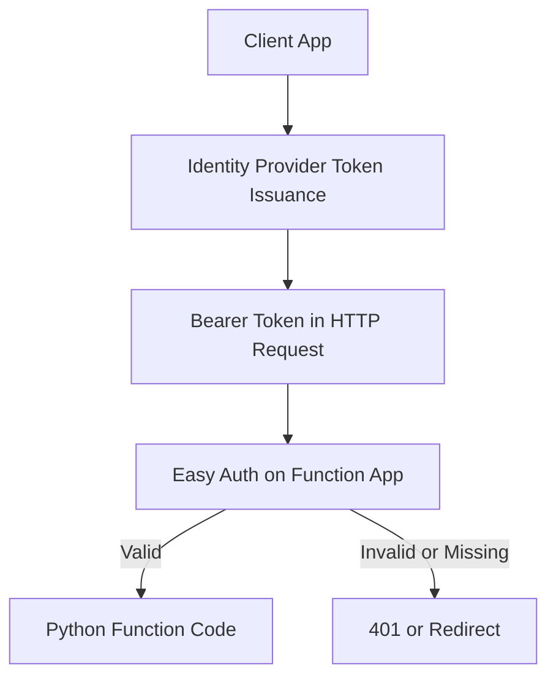

---
content_sources:
  - type: mslearn-adapted
    url: https://learn.microsoft.com/azure/azure-functions/security-concepts
  - type: mslearn-adapted
    url: https://learn.microsoft.com/azure/app-service/overview-authentication-authorization
---

# HTTP Authentication

This recipe covers authentication and authorization for Azure Functions HTTP triggers — authorization levels, function keys, Easy Auth for identity provider integration, and manual JWT validation in Python.

## Authentication Flow

<!-- diagram-id: authentication-flow -->


## Authorization Levels

Every HTTP-triggered function has an authorization level that controls access. The v2 programming model supports three levels:

| Level | Constant | Key Required | Typical Use |
|-------|----------|-------------|-------------|
| Anonymous | `func.AuthLevel.ANONYMOUS` | None | Public APIs, health checks |
| Function | `func.AuthLevel.FUNCTION` | Function key or host key | Internal APIs, service-to-service |
| Admin | `func.AuthLevel.ADMIN` | Master host key only | Admin operations |

### Setting Auth Level Globally

Set the default authorization level on the `FunctionApp` constructor. All registered HTTP functions inherit this level unless overridden:

```python
import azure.functions as func
from blueprints.health import bp as health_bp
from blueprints.api import bp as api_bp

app = func.FunctionApp(http_auth_level=func.AuthLevel.FUNCTION)
app.register_functions(health_bp)
app.register_functions(api_bp)
```

With this configuration, every HTTP endpoint requires a function key by default.

### Setting Auth Level Per Route

Override the global level on individual routes using the `auth_level` parameter:

```python
import azure.functions as func
import json

bp = func.Blueprint()

@bp.route(route="health", methods=["GET"], auth_level=func.AuthLevel.ANONYMOUS)
def health(req: func.HttpRequest) -> func.HttpResponse:
    """Public health check — no key required."""
    return func.HttpResponse(
        json.dumps({"status": "healthy"}),
        mimetype="application/json",
        status_code=200
    )

@bp.route(route="admin/config", methods=["POST"], auth_level=func.AuthLevel.ADMIN)
def admin_config(req: func.HttpRequest) -> func.HttpResponse:
    """Admin-only endpoint — requires master key."""
    body = req.get_json()
    return func.HttpResponse(
        json.dumps({"updated": True}),
        mimetype="application/json",
        status_code=200
    )
```

## Function Keys

When a function uses `FUNCTION` or `ADMIN` auth level, callers must include a key. There are two ways to pass the key:

### Query Parameter

```bash
curl "https://your-func.azurewebsites.net/api/items?code=YOUR_FUNCTION_KEY"
```

### Request Header

```bash
curl --header "x-functions-key: YOUR_FUNCTION_KEY" \
  https://your-func.azurewebsites.net/api/items
```

### Key Types

| Key Type | Scope | How to Retrieve |
|----------|-------|----------------|
| **Function key** | Single function | `az functionapp function keys list --name your-func --resource-group your-rg --function-name my_func` |
| **Host key** | All functions in the app | `az functionapp keys list --name your-func --resource-group your-rg` |
| **Master key** (`_master`) | All functions + admin API | `az functionapp keys list --name your-func --resource-group your-rg` |

> **Security:** Function keys provide basic access control but are shared secrets. For production workloads with user authentication, use Easy Auth or JWT validation instead.

### Rotating Keys

Regenerate a function key:

```bash
az functionapp function keys set \
  --name your-func \
  --resource-group your-rg \
  --function-name my_func \
  --key-name default \
  --key-value "new-key-value-here"
```

## Easy Auth (Built-In Authentication)

Easy Auth adds authentication at the platform level — before your function code executes. It supports multiple identity providers without any changes to your Python code.

### Supported Providers

| Provider | Typical Scenario |
|----------|-----------------|
| Microsoft Entra ID (Azure AD) | Enterprise / internal apps |
| GitHub | Developer tools |
| Google | Consumer apps |
| Facebook | Consumer apps |
| Any OpenID Connect | Custom identity providers |

### Enable Easy Auth for Azure AD

```bash
az webapp auth update \
    --resource-group <resource-group> \
    --name <function-app-name> \
    --enabled true \
    --action LoginWithAzureActiveDirectory \
    --aad-client-id <client-id> \
    --aad-token-issuer-url "https://login.microsoftonline.com/<tenant-id>/v2.0"
```

> **Note:** Azure Functions uses the same App Service Authentication (Easy Auth) as Web Apps. The `az webapp auth` commands apply to function apps as well.

### Accessing User Identity in Code

When Easy Auth is enabled, the platform injects identity information into request headers:

```python
import json
import azure.functions as func

bp = func.Blueprint()

@bp.route(route="profile", methods=["GET"], auth_level=func.AuthLevel.ANONYMOUS)
def profile(req: func.HttpRequest) -> func.HttpResponse:
    """Returns the authenticated user's profile.
    Auth is handled by Easy Auth at the platform level."""
    user_id = req.headers.get("X-MS-CLIENT-PRINCIPAL-ID", "")
    user_name = req.headers.get("X-MS-CLIENT-PRINCIPAL-NAME", "")
    identity_provider = req.headers.get("X-MS-CLIENT-PRINCIPAL-IDP", "")

    if not user_id:
        return func.HttpResponse(
            json.dumps({"error": "Not authenticated"}),
            mimetype="application/json",
            status_code=401
        )

    return func.HttpResponse(
        json.dumps({
            "user_id": user_id,
            "user_name": user_name,
            "identity_provider": identity_provider
        }),
        mimetype="application/json",
        status_code=200
    )
```

> **Note:** With Easy Auth set to `RedirectToLoginPage` or `Return401`, unauthenticated requests never reach your function code. The auth level can be `ANONYMOUS` because Easy Auth handles authentication at the platform layer.

## Manual JWT Validation

For scenarios where Easy Auth is not suitable (e.g., custom token issuers, API-to-API auth with bearer tokens), validate JWTs manually using the `PyJWT` library.

### Install Dependencies

Add to `requirements.txt`:

```
PyJWT[crypto]>=2.8.0
cryptography>=41.0.0
```

### JWT Validation Example

```python
import azure.functions as func
import json
import jwt
import logging
from functools import wraps

bp = func.Blueprint()

# Configuration — in production, load from environment variables
TENANT_ID = "your-tenant-id"
CLIENT_ID = "your-client-id"
AUTHORITY = f"https://login.microsoftonline.com/{TENANT_ID}/v2.0"
JWKS_URL = f"https://login.microsoftonline.com/{TENANT_ID}/discovery/v2.0/keys"

# Cache the JWKS client
_jwks_client = jwt.PyJWKClient(JWKS_URL)


def validate_token(req: func.HttpRequest) -> dict | None:
    """Extract and validate the Bearer token from the Authorization header."""
    auth_header = req.headers.get("Authorization", "")
    if not auth_header.startswith("Bearer "):
        return None

    token = auth_header[7:]  # Strip "Bearer " prefix

    try:
        signing_key = _jwks_client.get_signing_key_from_jwt(token)
        decoded = jwt.decode(
            token,
            signing_key.key,
            algorithms=["RS256"],
            audience=CLIENT_ID,
            issuer=AUTHORITY,
        )
        return decoded
    except jwt.InvalidTokenError as e:
        logging.warning(f"Token validation failed: {e}")
        return None


@bp.route(route="protected/data", methods=["GET"], auth_level=func.AuthLevel.ANONYMOUS)
def protected_data(req: func.HttpRequest) -> func.HttpResponse:
    """Protected endpoint that requires a valid JWT."""
    claims = validate_token(req)

    if not claims:
        return func.HttpResponse(
            json.dumps({"error": "Unauthorized", "message": "Valid Bearer token required"}),
            mimetype="application/json",
            status_code=401
        )

    return func.HttpResponse(
        json.dumps({
            "message": "Access granted",
            "user": claims.get("preferred_username", "unknown"),
            "roles": claims.get("roles", [])
        }),
        mimetype="application/json",
        status_code=200
    )
```

### Testing with a Token

```bash
# Obtain a token (example using az cli)
TOKEN=$(az account get-access-token --resource "api://your-client-id" --query accessToken --output tsv)

# Call the protected endpoint
curl --header "Authorization: Bearer $TOKEN" \
  https://your-func.azurewebsites.net/api/protected/data
```

## Choosing an Auth Strategy

| Scenario | Recommended Approach |
|----------|---------------------|
| Public health check | `AuthLevel.ANONYMOUS` |
| Service-to-service (simple) | `AuthLevel.FUNCTION` with function keys |
| User-facing web app | Easy Auth with Azure AD |
| API-to-API with Azure AD | Manual JWT validation or Easy Auth |
| Third-party identity provider | Easy Auth (OpenID Connect) or manual JWT |

## See Also
- [HTTP API Patterns](http-api.md)
- [Platform Security Design](../../../platform/security.md) — authentication architecture, Easy Auth, key management design
- [Security Operations](../../../operations/security.md) — key rotation, RBAC audit, CORS, TLS enforcement

## Sources
- [Azure Functions Security Concepts (Microsoft Learn)](https://learn.microsoft.com/azure/azure-functions/security-concepts)
- [Easy Auth Overview (Microsoft Learn)](https://learn.microsoft.com/azure/app-service/overview-authentication-authorization)
