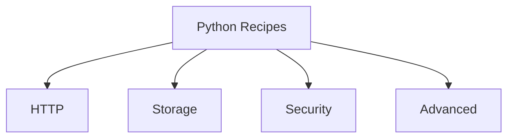

---
content_sources:

  references:
    - type: mslearn-adapted
      url: https://learn.microsoft.com/en-us/azure/azure-functions/functions-reference-python
    - type: mslearn-adapted
      url: https://learn.microsoft.com/en-us/azure/azure-functions/functions-triggers-bindings
    - type: mslearn-adapted
      url: https://learn.microsoft.com/en-us/azure/azure-functions/functions-best-practices
  diagrams:
    - id: python-recipes
      type: graph
      source: self-generated
      justification: Flow view of python recipes, synthesized from Microsoft Learn documentation cited on this page.
      based_on:
        - https://learn.microsoft.com/en-us/azure/azure-functions/functions-reference-python
        - https://learn.microsoft.com/en-us/azure/azure-functions/functions-triggers-bindings
        - https://learn.microsoft.com/en-us/azure/azure-functions/functions-best-practices
---
# Python Recipes

The Recipes section provides implementation-focused patterns for common Azure Functions integrations in Python.

Use these documents when you already understand the platform basics and need practical, reusable building blocks.

<!-- diagram-id: python-recipes -->

!!! tip "Pair recipes with platform guidance"
    For architecture and plan behavior that applies across all languages, see [Platform](../../../platform/index.md).

## Recipe categories

### HTTP

| Recipe | Description |
|--------|-------------|
| [HTTP API Patterns](http-api.md) | Route design, request/response patterns, and API-friendly function composition. |
| [HTTP Authentication](http-auth.md) | Function auth levels, app-level auth, and token validation integration patterns. |
| [OpenAPI and Swagger](openapi.md) | Documenting HTTP APIs via API Management import or a hand-authored spec plus Swagger UI. |

### Storage

| Recipe | Description |
|--------|-------------|
| [Cosmos DB](cosmosdb.md) | Input/output patterns for Cosmos DB-backed APIs and event processing workloads. |
| [Blob Storage](blob-storage.md) | Blob trigger and blob binding patterns, including production-oriented processing flow. |
| [Queue Storage](queue.md) | Queue trigger consumer patterns, retries, and output binding usage. |
| [Table Storage](table-storage.md) | Table (NoSQL key-value) input/output binding patterns for entity storage and lookups. |

### Security

| Recipe | Description |
|--------|-------------|
| [Key Vault](key-vault.md) | Secret and configuration retrieval patterns using Key Vault integration. |
| [Managed Identity](managed-identity.md) | Passwordless authentication from Functions to Azure services via Entra identities. |
| [Custom Domains & Certificates](custom-domain-certificates.md) | TLS and custom hostname setup considerations for HTTP-facing workloads. |

### Advanced

| Recipe | Description |
|--------|-------------|
| [Timer Trigger](timer.md) | Scheduled jobs, cron semantics, and idempotent batch execution patterns. |
| [Durable Functions](durable-orchestration.md) | Orchestration, fan-out/fan-in, and stateful workflow coordination. |
| [Durable Entities](durable-entities.md) | Stateful entity (actor-style) model for aggregation and per-key state coordination. |
| [Durable Advanced](durable-advanced.md) | Sub-orchestrations, eternal orchestrations, activity retries, and versioning. |
| [Event Grid](event-grid.md) | Event-driven designs and event routing patterns for reactive systems. |
| [Event Hubs](event-hub.md) | High-throughput event stream consumption with batch trigger, metadata, and output binding. |
| [Service Bus](service-bus.md) | Enterprise messaging with queue/topic triggers, dead-lettering, sessions, and output binding. |
| [SignalR Service](signalr.md) | Real-time messaging to connected clients via the negotiate endpoint and output binding. |
| [Dependency Injection](dependency-injection.md) | Sharing clients across invocations via module-level singletons (no built-in DI container). |
| [Retry Policies](retry.md) | Runtime retry policies (fixed delay, exponential backoff) for Timer, Event Hubs, and Cosmos DB triggers. |
| [Middleware](middleware.md) | Cross-cutting behavior via wrapper decorators (no built-in middleware pipeline). |
| [Unit Testing](testing.md) | Host-free unit testing of handlers with pytest and mocked bindings. |

## How to consume recipes effectively

1. Start from your trigger pattern (HTTP, timer, queue, blob, Event Grid).
2. Apply security baseline patterns first (Managed Identity and Key Vault).
3. Validate hosting-plan constraints in [Platform: Hosting](../../../platform/hosting.md).
4. Add monitoring/alerts using [Operations](../../../operations/index.md) guidance.

## See Also

- [Python Language Guide](../index.md)
- [Python Tutorial](../tutorial/index.md)
- [Platform: Triggers and Bindings](../../../platform/triggers-and-bindings.md)
- [Troubleshooting](../troubleshooting.md)

## Sources

- [Python developer guide](https://learn.microsoft.com/en-us/azure/azure-functions/functions-reference-python)
- [Azure Functions trigger and binding concepts](https://learn.microsoft.com/en-us/azure/azure-functions/functions-triggers-bindings)
- [Azure Functions best practices](https://learn.microsoft.com/en-us/azure/azure-functions/functions-best-practices)
