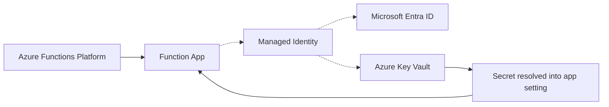

# Key Vault Integration

This recipe covers integrating Azure Key Vault with Azure Functions to securely manage secrets, certificates, and keys. You will learn the Key Vault references approach (zero code changes) and the SDK approach (for dynamic secret access at runtime).

## Architecture



Solid arrows show runtime data/event flow. Dashed arrows show identity and authentication.

## Key Vault References (Recommended)

Key Vault references let you pull secrets from Azure Key Vault into app settings without writing any code. The Azure Functions runtime resolves the reference at startup and injects the secret value as an environment variable.

### How It Works

1. You store a secret in Key Vault.
2. You set an app setting value to a special Key Vault reference syntax.
3. The Functions runtime fetches the secret from Key Vault at startup.
4. Your code reads the app setting as a normal environment variable.

Your Python code never sees a Key Vault reference — it sees the resolved secret value, just like any other app setting.

### Step-by-Step Setup

#### Step 1: Enable Managed Identity

Your function app needs an identity to authenticate to Key Vault:

```bash
az functionapp identity assign \
  --name your-func \
  --resource-group your-rg
```

Save the `principalId` from the output — you will need it in Step 3.

#### Step 2: Create a Key Vault and Add a Secret

```bash
# Create Key Vault
az keyvault create \
  --name your-kv \
  --resource-group your-rg \
  --location eastus

# Add a secret
az keyvault secret set \
  --vault-name your-kv \
  --name "ExternalApiKey" \
  --value "sk-abc123def456"

# Add another secret
az keyvault secret set \
  --vault-name your-kv \
  --name "DatabasePassword" \
  --value "super-secret-password"
```

#### Step 3: Grant Access to the Function App

The function app's Managed Identity needs permission to read secrets:

```bash
# Using access policies
az keyvault set-policy \
  --name your-kv \
  --resource-group your-rg \
  --object-id <object-id> \
  --secret-permissions get list

# Or using RBAC (recommended for new deployments)
az role assignment create \
  --assignee <object-id> \
  --role "Key Vault Secrets User" \
  --scope "/subscriptions/<subscription-id>/resourceGroups/your-rg/providers/Microsoft.KeyVault/vaults/your-kv"
```

#### Step 4: Reference the Secret in App Settings

Set the app setting value using the Key Vault reference syntax:

```bash
# Using SecretUri (includes version for pinning)
az functionapp config appsettings set \
  --name your-func \
  --resource-group your-rg \
  --settings "EXTERNAL_API_KEY=@Microsoft.KeyVault(SecretUri=https://your-kv.vault.azure.net/secrets/ExternalApiKey/)"

# Using VaultName/SecretName shorthand (always resolves latest version)
az functionapp config appsettings set \
  --name your-func \
  --resource-group your-rg \
  --settings "DATABASE_PASSWORD=@Microsoft.KeyVault(VaultName=your-kv;SecretName=DatabasePassword)"
```

#### Step 5: Use in Code

Your code reads the secret like any other environment variable:

```python
import azure.functions as func
import json
import os

bp = func.Blueprint()

@bp.route(route="config-check", methods=["GET"])
def config_check(req: func.HttpRequest) -> func.HttpResponse:
    """Verify Key Vault references are resolved (do NOT expose actual values)."""
    api_key = os.environ.get("EXTERNAL_API_KEY", "")
    db_password = os.environ.get("DATABASE_PASSWORD", "")

    return func.HttpResponse(
        json.dumps({
            "external_api_key_set": bool(api_key),
            "database_password_set": bool(db_password),
            "api_key_prefix": api_key[:4] + "..." if len(api_key) > 4 else "***"
        }),
        mimetype="application/json",
        status_code=200
    )
```

> **Warning:** Never log or return full secret values. The example above only checks whether the secret is set and shows a masked prefix.

### Verify Key Vault Reference Resolution

Check that references are being resolved:

```bash
az functionapp config appsettings list \
  --name your-func \
  --resource-group your-rg \
  --query "[?contains(value, '@Microsoft.KeyVault')]"
```

In the Azure Portal, navigate to your Function App → **Configuration**. Each Key Vault reference shows a green checkmark (✓) when resolved successfully, or a red X (✗) if there is an access issue.

### Troubleshooting Key Vault References

| Symptom | Cause | Fix |
|---------|-------|-----|
| App setting shows the raw `@Microsoft.KeyVault(...)` string | Identity lacks access to Key Vault | Grant `Get` permission on secrets |
| `SecretNotFound` error | Secret name does not exist | Verify secret name in Key Vault |
| `ForbiddenByPolicy` | Key Vault firewall blocks access | Allow the function app's outbound IPs or enable service endpoints |
| Reference works in Portal but not in code | App not restarted after setting change | Restart the function app |

## SDK Approach: Dynamic Secret Access

For scenarios where you need to read secrets dynamically at runtime (not just at startup), use the `azure-keyvault-secrets` SDK with `DefaultAzureCredential`.

Add to `requirements.txt`:

```
azure-keyvault-secrets>=4.7.0
azure-identity>=1.15.0
```

```python
import azure.functions as func
import json
import os
from azure.keyvault.secrets import SecretClient
from azure.identity import DefaultAzureCredential

bp = func.Blueprint()

# Initialize client once at module level (reused across invocations)
_secret_client = None

def get_secret_client() -> SecretClient:
    global _secret_client
    if _secret_client is None:
        vault_url = os.environ.get("KEY_VAULT_URL", "https://your-kv.vault.azure.net/")
        credential = DefaultAzureCredential()
        _secret_client = SecretClient(vault_url=vault_url, credential=credential)
    return _secret_client


@bp.route(route="secrets/{secret_name}", methods=["GET"], auth_level=func.AuthLevel.ADMIN)
def get_secret_metadata(req: func.HttpRequest) -> func.HttpResponse:
    """Retrieve secret metadata (not the value) from Key Vault."""
    secret_name = req.route_params.get("secret_name")
    client = get_secret_client()

    try:
        secret = client.get_secret(secret_name)
        return func.HttpResponse(
            json.dumps({
                "name": secret.name,
                "enabled": secret.properties.enabled,
                "created_on": secret.properties.created_on.isoformat() if secret.properties.created_on else None,
                "expires_on": secret.properties.expires_on.isoformat() if secret.properties.expires_on else None,
                "content_type": secret.properties.content_type
            }),
            mimetype="application/json",
            status_code=200
        )
    except Exception as e:
        return func.HttpResponse(
            json.dumps({"error": f"Secret not found: {secret_name}"}),
            mimetype="application/json",
            status_code=404
        )
```

> **Note:** The SDK approach incurs an HTTP call to Key Vault on every invocation (unless you cache). For static secrets, Key Vault references are more efficient because the secret is resolved once at startup.

## Bicep: Key Vault Reference in Infrastructure

Configure Key Vault references in your Bicep template:

```bicep
resource functionApp 'Microsoft.Web/sites@2023-01-01' = {
  name: functionAppName
  // ...
  properties: {
    siteConfig: {
      appSettings: [
        {
          name: 'EXTERNAL_API_KEY'
          value: '@Microsoft.KeyVault(VaultName=${keyVaultName};SecretName=ExternalApiKey)'
        }
      ]
    }
  }
}
```

## See Also
- [Managed Identity Recipe](managed-identity.md)
- [Platform Security Design](../../../platform/security.md) — authentication architecture, Easy Auth, key management design
- [Security Operations](../../../operations/security.md) — key rotation, RBAC audit, CORS, TLS enforcement

## Sources
- [Key Vault References in App Service (Microsoft Learn)](https://learn.microsoft.com/azure/app-service/app-service-key-vault-references)
- [Managed Identity Tutorial (Microsoft Learn)](https://learn.microsoft.com/azure/azure-functions/functions-identity-based-connections-tutorial)
