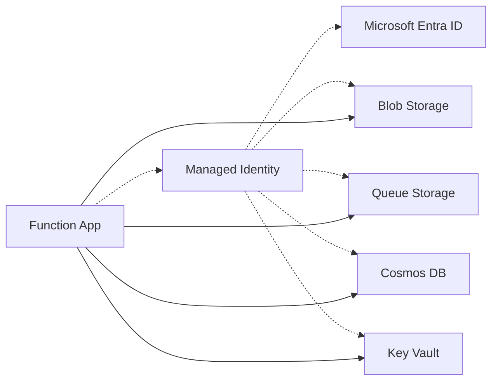

---
content_sources:
  - type: mslearn-adapted
    url: https://learn.microsoft.com/azure/azure-functions/functions-identity-based-connections-tutorial
---

# Managed Identity

Managed Identity lets your Azure Functions app authenticate to other Azure services without storing credentials in code or configuration. This recipe covers enabling Managed Identity, assigning roles, and using `DefaultAzureCredential` for a seamless local-to-cloud development experience.

## Architecture

<!-- diagram-id: architecture -->


Solid arrows show runtime data/event flow. Dashed arrows show identity and authentication.

## What Is Managed Identity?

A Managed Identity is an Azure AD identity automatically managed by Azure. Your function app can use this identity to obtain tokens for Azure services (Storage, Cosmos DB, Key Vault, SQL, etc.) without managing secrets, certificates, or connection strings.

There are two types:

| Type | Lifecycle | Use Case |
|------|-----------|----------|
| **System-assigned** | Tied to the function app (deleted when app is deleted) | Single app, simple scenarios |
| **User-assigned** | Independent resource (survives app deletion) | Shared across multiple apps, blue-green deployments |

This guide uses system-assigned identity for simplicity.

## Step 1: Enable System-Assigned Identity

```bash
az functionapp identity assign \
  --name your-func \
  --resource-group your-rg
```

Output:

```json
{
  "principalId": "xxxxxxxx-xxxx-xxxx-xxxx-xxxxxxxxxxxx",
  "tenantId": "<tenant-id>",
  "type": "SystemAssigned"
}
```

Save the `principalId` — you need it for role assignments.

## Step 2: Assign Roles

Grant the identity access to specific Azure resources using role-based access control (RBAC). Only assign the minimum permissions needed.

### Common Role Assignments

| Resource | Role | Permission |
|----------|------|------------|
| Storage Account (blobs) | `Storage Blob Data Contributor` | Read, write, delete blobs |
| Storage Account (queues) | `Storage Queue Data Contributor` | Read, write, delete queue messages |
| Storage Account (tables) | `Storage Table Data Contributor` | Read, write, delete table entities |
| Key Vault | `Key Vault Secrets User` | Read secrets |
| Cosmos DB | `Cosmos DB Built-in Data Contributor` | Read, write documents |
| Service Bus | `Azure Service Bus Data Sender` | Send messages |

```bash
# Storage Blob Data Contributor
az role assignment create \
  --assignee "<object-id>" \
  --role "Storage Blob Data Contributor" \
  --scope "/subscriptions/<subscription-id>/resourceGroups/your-rg/providers/Microsoft.Storage/storageAccounts/yourstorage"

# Key Vault Secrets User
az role assignment create \
  --assignee "<object-id>" \
  --role "Key Vault Secrets User" \
  --scope "/subscriptions/<subscription-id>/resourceGroups/your-rg/providers/Microsoft.KeyVault/vaults/your-kv"
```

> **Tip:** Scope role assignments to the specific resource (storage account, Key Vault) rather than the resource group or subscription. This follows the principle of least privilege.

## Step 3: Replace Connection Strings with Identity-Based Connections

For Azure Functions bindings, replace the traditional connection string with identity-based settings. The runtime detects the `__accountName` or `__serviceUri` suffix pattern and uses Managed Identity automatically.

### AzureWebJobsStorage (Internal Host Storage)

```bash
# Remove the connection string
az functionapp config appsettings delete \
  --name your-func \
  --resource-group your-rg \
  --setting-names AzureWebJobsStorage

# Set identity-based connection
az functionapp config appsettings set \
  --name your-func \
  --resource-group your-rg \
  --settings "AzureWebJobsStorage__accountName=yourstorage"
```

### Custom Binding Connections

For bindings that use a custom connection name (e.g., `CosmosDBConnection`), use the `__accountEndpoint` suffix:

```bash
az functionapp config appsettings set \
  --name your-func \
  --resource-group your-rg \
  --settings "CosmosDBConnection__accountEndpoint=https://your-cosmos-db.documents.azure.com:443/"
```

## Step 4: Use DefaultAzureCredential in Code

The `DefaultAzureCredential` class from the Azure Identity library provides a unified authentication experience. It tries multiple credential sources in order:

1. **Environment variables** — service principal credentials (CI/CD)
2. **Managed Identity** — when running in Azure
3. **Azure CLI** — `az login` credentials (local development)
4. **VS Code** — Azure extension credentials

This means the same code works locally (using your `az login` session) and in Azure (using Managed Identity).

Add to `requirements.txt`:

```
azure-identity>=1.15.0
azure-storage-blob>=12.19.0
```

### Example: Access Blob Storage with Managed Identity

```python
import azure.functions as func
import json
import os
from azure.storage.blob import BlobServiceClient
from azure.identity import DefaultAzureCredential

bp = func.Blueprint()

# Initialize once at module level
_blob_client = None

def get_blob_service_client() -> BlobServiceClient:
    global _blob_client
    if _blob_client is None:
        account_name = os.environ.get("STORAGE_ACCOUNT_NAME", "yourstorage")
        credential = DefaultAzureCredential()
        _blob_client = BlobServiceClient(
            account_url=f"https://{account_name}.blob.core.windows.net",
            credential=credential
        )
    return _blob_client


@bp.route(route="blobs", methods=["GET"])
def list_blobs(req: func.HttpRequest) -> func.HttpResponse:
    """List blobs using Managed Identity — no connection string needed."""
    client = get_blob_service_client()
    container = client.get_container_client("uploads")

    blobs = [{"name": b.name, "size": b.size} for b in container.list_blobs()]

    return func.HttpResponse(
        json.dumps({"blobs": blobs}),
        mimetype="application/json",
        status_code=200
    )
```

### Example: Access Key Vault with Managed Identity

```python
from azure.keyvault.secrets import SecretClient
from azure.identity import DefaultAzureCredential

def get_secret(secret_name: str) -> str:
    vault_url = os.environ.get("KEY_VAULT_URL", "https://your-kv.vault.azure.net/")
    credential = DefaultAzureCredential()
    client = SecretClient(vault_url=vault_url, credential=credential)
    return client.get_secret(secret_name).value
```

## Local Development with Managed Identity

`DefaultAzureCredential` works locally by using your Azure CLI login:

```bash
# Login to Azure CLI
az login

# Set your subscription
az account set --subscription "<subscription-id>"

# Your code now uses your az login credentials automatically
func host start
```

Ensure your personal Azure AD account has the same role assignments as the Managed Identity (e.g., `Storage Blob Data Contributor`).

## Bicep: Managed Identity in Infrastructure

Enable Managed Identity and assign roles in your Bicep template:

```bicep
resource functionApp 'Microsoft.Web/sites@2023-01-01' = {
  name: functionAppName
  location: location
  identity: {
    type: 'SystemAssigned'
  }
  // ...
}

resource storageRoleAssignment 'Microsoft.Authorization/roleAssignments@2022-04-01' = {
  name: guid(storageAccount.id, functionApp.id, 'Storage Blob Data Contributor')
  scope: storageAccount
  properties: {
    roleDefinitionId: subscriptionResourceId(
      'Microsoft.Authorization/roleDefinitions',
      'ba92f5b4-2d11-453d-a403-e96b0029c9fe'  // Storage Blob Data Contributor
    )
    principalId: functionApp.identity.principalId
    principalType: 'ServicePrincipal'
  }
}
```

## See Also
- [Key Vault Integration Recipe](key-vault.md)
- [Platform Security Design](../../../platform/security.md) — authentication architecture, Easy Auth, key management design
- [Security Operations](../../../operations/security.md) — key rotation, RBAC audit, CORS, TLS enforcement
- [Blob Storage Recipe](blob-storage.md)

## Sources
- [Managed Identity Tutorial (Microsoft Learn)](https://learn.microsoft.com/azure/azure-functions/functions-identity-based-connections-tutorial)
