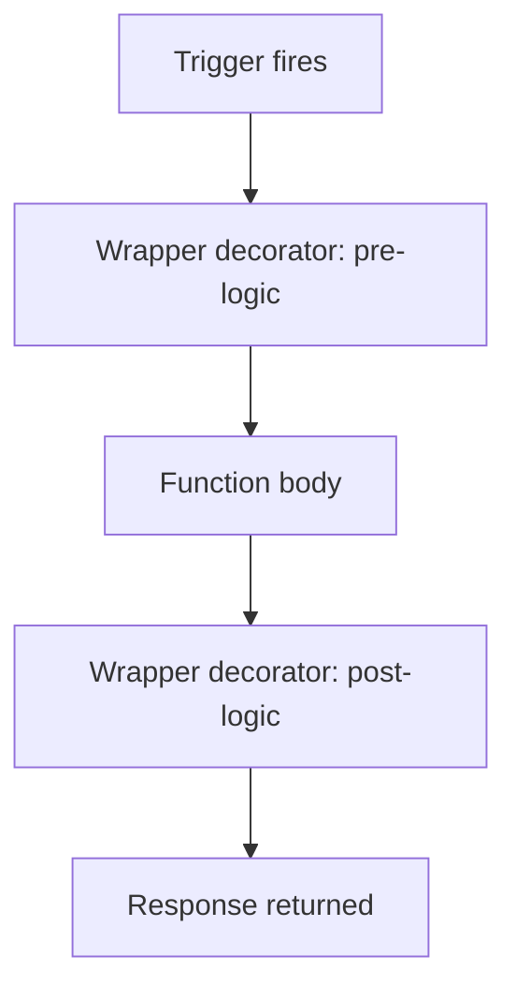

---
content_sources:
  references:
    - type: mslearn-adapted
      url: https://learn.microsoft.com/en-us/azure/azure-functions/functions-reference-python
  diagrams:
    - id: architecture
      type: flowchart
      source: self-generated
      justification: Flow view of architecture, synthesized from Microsoft Learn documentation cited on this page.
      based_on:
        - https://learn.microsoft.com/en-us/azure/azure-functions/functions-reference-python
---
# Middleware

The Python v2 programming model has **no built-in middleware pipeline**. Unlike the .NET isolated worker or the Node.js v4 hook system, there is no runtime-provided way to wrap every function invocation. The idiomatic alternative is a plain Python decorator that you apply above the function's trigger decorator, giving you the same cross-cutting behavior — logging, timing, error handling — with standard language features.

## Prerequisites

- A Python v2 Function App using `azure.functions` with `app = func.FunctionApp()`.

## Architecture

<!-- diagram-id: architecture -->


## Wrap With a Decorator

Define a decorator that wraps the handler. Apply it **below** the trigger decorator so the runtime still sees the correct binding signature.

```python
import functools
import logging
import time
import azure.functions as func

app = func.FunctionApp()

def instrument(handler):
    @functools.wraps(handler)
    def wrapper(req: func.HttpRequest) -> func.HttpResponse:
        start = time.perf_counter()
        logging.info("Starting %s", handler.__name__)
        try:
            response = handler(req)
            return response
        except Exception:
            logging.exception("Unhandled error in %s", handler.__name__)
            raise
        finally:
            elapsed = (time.perf_counter() - start) * 1000
            logging.info("Finished %s in %.1fms", handler.__name__, elapsed)
    return wrapper

@app.route(route="orders")
@instrument
def create_order(req: func.HttpRequest) -> func.HttpResponse:
    return func.HttpResponse("created", status_code=201)
```

## Sharing One Decorator Across Functions

Because the decorator is an ordinary function, apply the same `@instrument` to every function that needs the behavior. For blueprint-based apps, define the decorator in a shared module and import it wherever functions are declared.

| Element | Explanation |
|---|---|
| `functools.wraps` | Preserves the wrapped function's name and metadata for logging and introspection. |
| Decorator order | The trigger decorator (`@app.route`) must be **above** the custom wrapper so bindings resolve correctly. |
| `try/except/finally` | Gives pre-logic, error handling, and guaranteed post-logic in one place. |

!!! note "No runtime pipeline"
    Decorators run inside the worker as plain Python — they cannot intercept binding resolution or platform-level retries. For retry behavior, see [Retry Policies](retry.md).

## See Also

- [Dependency Injection](dependency-injection.md)
- [Retry Policies](retry.md)

## Sources

- [Azure Functions Python developer guide (Microsoft Learn)](https://learn.microsoft.com/en-us/azure/azure-functions/functions-reference-python)
