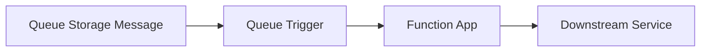

# Queue Storage

This recipe covers integrating Azure Queue Storage with Azure Functions Python v2 — using output bindings to enqueue messages from HTTP requests, and queue triggers for processing messages asynchronously. The HTTP-to-queue pattern is one of the most common serverless integration patterns for decoupling request handling from background processing.

## Architecture



Solid arrows show runtime data/event flow. Dashed arrows show identity and authentication.

## Prerequisites

Queue Storage bindings are included in the default extension bundle. Ensure your `host.json` has:

```json
{
  "version": "2.0",
  "extensionBundle": {
    "id": "Microsoft.Azure.Functions.ExtensionBundle",
    "version": "[4.*, 5.0.0)"
  }
}
```

The Storage Account provisioned with your function app (`AzureWebJobsStorage`) includes Queue Storage. No additional resources are needed.

For local development, start Azurite to emulate Queue Storage:

```bash
azurite --silent --location /tmp/azurite
```

## Output Binding: Enqueue Messages from HTTP Requests

The most common pattern is accepting an HTTP request and enqueuing a message for background processing. The caller gets an immediate `202 Accepted` response while the work happens asynchronously.

```python
import azure.functions as func
import json

bp = func.Blueprint()

@bp.route(route="enqueue", methods=["POST"])
@bp.queue_output(arg_name="msg", queue_name="myqueue", connection="AzureWebJobsStorage")
def enqueue(req: func.HttpRequest, msg: func.Out[str]) -> func.HttpResponse:
    """Accept a request and enqueue it for background processing."""
    try:
        body = req.get_json()
    except ValueError:
        return func.HttpResponse(
            json.dumps({"error": "Invalid JSON body"}),
            mimetype="application/json",
            status_code=400
        )

    # Enqueue the message
    msg.set(json.dumps(body))

    return func.HttpResponse(
        json.dumps({"status": "accepted", "message": "Request enqueued for processing"}),
        mimetype="application/json",
        status_code=202
    )
```

Test it locally:

```bash
curl -X POST http://localhost:7071/api/enqueue \
  -H "Content-Type: application/json" \
  -d '{"task": "send-email", "to": "user@example.com"}'

# Response: {"status": "accepted", "message": "Request enqueued for processing"}
```

### Enqueue Multiple Messages

To enqueue multiple messages from a single HTTP request, return a list:

```python
@bp.route(route="enqueue-batch", methods=["POST"])
@bp.queue_output(arg_name="msgs", queue_name="myqueue", connection="AzureWebJobsStorage")
def enqueue_batch(req: func.HttpRequest, msgs: func.Out[typing.List[str]]) -> func.HttpResponse:
    """Enqueue multiple messages from a single HTTP request."""
    import typing

    try:
        body = req.get_json()
    except ValueError:
        return func.HttpResponse(
            json.dumps({"error": "Invalid JSON body"}),
            mimetype="application/json",
            status_code=400
        )

    items = body.get("items", [])
    messages = [json.dumps(item) for item in items]
    msgs.set(messages)

    return func.HttpResponse(
        json.dumps({"status": "accepted", "enqueued": len(messages)}),
        mimetype="application/json",
        status_code=202
    )
```

## Queue Trigger: Process Messages

The queue trigger fires when a new message arrives in the queue. This is the consumer side of the HTTP-to-queue pattern.

> **Note:** This guide focuses on HTTP triggers. The queue trigger is shown for completeness and future extensibility.

```python
import logging

@bp.queue_trigger(arg_name="msg", queue_name="myqueue", connection="AzureWebJobsStorage")
def process_queue(msg: func.QueueMessage) -> None:
    """Process a message from the queue."""
    body = msg.get_body().decode("utf-8")
    data = json.loads(body)

    logging.info(f"Processing queue message: id={msg.id}")
    logging.info(f"Message content: {data}")
    logging.info(f"Dequeue count: {msg.dequeue_count}")
    logging.info(f"Inserted: {msg.insertion_time}")

    # Do the actual work here
    task = data.get("task")
    if task == "send-email":
        logging.info(f"Sending email to {data.get('to')}")
        # ... send email logic ...
    else:
        logging.warning(f"Unknown task type: {task}")
```

### Queue Trigger Configuration

Control the queue trigger's concurrency and polling behaviour in `host.json`:

```json
{
  "version": "2.0",
  "extensions": {
    "queues": {
      "maxPollingInterval": "00:00:02",
      "visibilityTimeout": "00:00:30",
      "batchSize": 16,
      "maxDequeueCount": 5,
      "newBatchThreshold": 8
    }
  }
}
```

| Setting | Default | Description |
|---------|---------|-------------|
| `maxPollingInterval` | 1 second | Maximum interval between polls when queue is empty |
| `visibilityTimeout` | 30 seconds | How long a message is invisible after being picked up |
| `batchSize` | 16 | Number of messages retrieved per poll |
| `maxDequeueCount` | 5 | Times a message is retried before moving to poison queue |
| `newBatchThreshold` | `batchSize / 2` | When remaining messages drop below this, fetch a new batch |

### Poison Messages

If a message fails processing after `maxDequeueCount` attempts, it is automatically moved to a poison queue named `myqueue-poison`. Monitor this queue for messages that need manual intervention:

```bash
# Check poison queue message count
az storage message peek \
  --queue-name myqueue-poison \
  --account-name yourstorage \
  --num-messages 32
```

## Queue Output with Custom Message Properties

Set message visibility delay and time-to-live programmatically:

```python
@bp.route(route="schedule", methods=["POST"])
@bp.queue_output(arg_name="msg", queue_name="delayed-queue", connection="AzureWebJobsStorage")
def schedule_task(req: func.HttpRequest, msg: func.Out[str]) -> func.HttpResponse:
    """Enqueue a message for delayed processing."""
    try:
        body = req.get_json()
    except ValueError:
        return func.HttpResponse(
            json.dumps({"error": "Invalid JSON body"}),
            mimetype="application/json",
            status_code=400
        )

    # The binding enqueues with default visibility
    # For custom delays, use the SDK approach below
    msg.set(json.dumps(body))

    return func.HttpResponse(
        json.dumps({"status": "scheduled"}),
        mimetype="application/json",
        status_code=202
    )
```

### SDK Approach for Advanced Scenarios

For visibility delays or custom time-to-live, use the `azure-storage-queue` SDK:

```python
import os
from azure.storage.queue import QueueClient
from azure.identity import DefaultAzureCredential

@bp.route(route="schedule-delayed", methods=["POST"])
def schedule_delayed(req: func.HttpRequest) -> func.HttpResponse:
    """Enqueue a message with a 60-second visibility delay."""
    try:
        body = req.get_json()
    except ValueError:
        return func.HttpResponse(
            json.dumps({"error": "Invalid JSON body"}),
            mimetype="application/json",
            status_code=400
        )

    account_name = os.environ.get("STORAGE_ACCOUNT_NAME", "yourstorage")
    credential = DefaultAzureCredential()
    queue_client = QueueClient(
        account_url=f"https://{account_name}.queue.core.windows.net",
        queue_name="delayed-queue",
        credential=credential
    )

    # Enqueue with 60-second visibility timeout
    queue_client.send_message(
        json.dumps(body),
        visibility_timeout=60,
        time_to_live=3600
    )

    return func.HttpResponse(
        json.dumps({"status": "scheduled", "delay_seconds": 60}),
        mimetype="application/json",
        status_code=202
    )
```

## See Also
- [HTTP API Patterns](http-api.md)
- [Managed Identity Recipe](managed-identity.md)

## Sources
- [Azure Functions Queue Storage Bindings (Microsoft Learn)](https://learn.microsoft.com/azure/azure-functions/functions-bindings-storage-queue)
