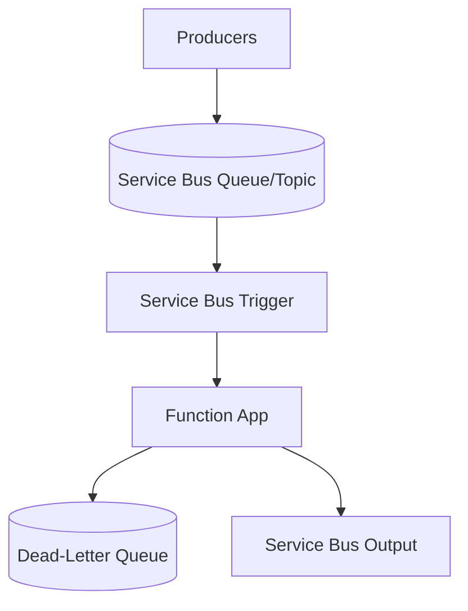

---
content_sources:
  references:
    - type: mslearn-adapted
      url: https://learn.microsoft.com/en-us/azure/azure-functions/functions-bindings-service-bus
  diagrams:
    - id: architecture
      type: flowchart
      source: self-generated
      justification: Flow view of architecture, synthesized from Microsoft Learn documentation cited on this page.
      based_on:
        - https://learn.microsoft.com/en-us/azure/azure-functions/functions-bindings-service-bus
        - https://learn.microsoft.com/en-us/azure/azure-functions/functions-bindings-service-bus-trigger
---
# Service Bus

This recipe covers integrating Azure Service Bus with Azure Functions Python v2 — consuming queue and topic/subscription messages with the trigger, handling sessions and dead-lettering, and publishing messages with the output binding. Service Bus is the standard choice for enterprise messaging that needs ordering, sessions, transactions, or duplicate detection.

## Architecture

<!-- diagram-id: architecture -->


## Prerequisites

Service Bus bindings are included in the default extension bundle. Provide the connection in app settings. A connection-string setting or an identity-based connection is supported. Identity-based connections use a setting prefix with `__fullyQualifiedNamespace`:

```bash
az functionapp config appsettings set \
  --name $APP_NAME \
  --resource-group $RG \
  --settings "ServiceBusConnection__fullyQualifiedNamespace=$NAMESPACE.servicebus.windows.net"
```

| CLI element | Explanation |
|---|---|
| Command(s) | `az functionapp config appsettings set` |
| Key flags | `--name`, `--resource-group`, `--settings` |
| Variables | `$APP_NAME`, `$RG`, `$NAMESPACE` |
| Expected result | Azure CLI returns the updated app settings as JSON; confirm the setting is present before continuing. |

When using an identity-based connection, grant the function app's managed identity the **Azure Service Bus Data Receiver** (and **Data Sender** for output) role on the namespace.

## Queue Trigger

The trigger fires as messages arrive. Message settlement (complete, abandon, dead-letter) is handled automatically based on whether the function succeeds or raises.

```python
import azure.functions as func
import logging
import json

bp = func.Blueprint()

@bp.service_bus_queue_trigger(
    arg_name="msg",
    queue_name="orders",
    connection="ServiceBusConnection",
)
def process_order(msg: func.ServiceBusMessage) -> None:
    """Process a single Service Bus queue message."""
    body = msg.get_body().decode("utf-8")
    data = json.loads(body)

    logging.info("Message ID: %s, delivery count: %s",
                 msg.message_id, msg.delivery_count)
    logging.info("Payload: %s", data)
    # Raising an exception abandons the message; after maxDeliveryCount
    # it is moved to the dead-letter queue automatically.
```

## Topic/Subscription Trigger

```python
@bp.service_bus_topic_trigger(
    arg_name="msg",
    topic_name="events",
    subscription_name="billing",
    connection="ServiceBusConnection",
)
def process_event(msg: func.ServiceBusMessage) -> None:
    """Process a message from a topic subscription."""
    logging.info("Subscription message: %s", msg.get_body().decode("utf-8"))
```

## Output Binding: Publish Messages

```python
@bp.route(route="enqueue", methods=["POST"])
@bp.service_bus_queue_output(
    arg_name="out_msg",
    queue_name="orders",
    connection="ServiceBusConnection",
)
def enqueue(req: func.HttpRequest, out_msg: func.Out[str]) -> func.HttpResponse:
    """Publish a message to a Service Bus queue."""
    try:
        body = req.get_json()
    except ValueError:
        return func.HttpResponse(
            json.dumps({"error": "Invalid JSON body"}),
            mimetype="application/json",
            status_code=400,
        )

    out_msg.set(json.dumps(body))
    return func.HttpResponse(
        json.dumps({"status": "enqueued"}),
        mimetype="application/json",
        status_code=202,
    )
```

## Host Configuration

Tune concurrency and prefetch in `host.json`:

```json
{
  "version": "2.0",
  "extensions": {
    "serviceBus": {
      "maxConcurrentCalls": 16,
      "prefetchCount": 0,
      "maxAutoLockRenewalDuration": "00:05:00",
      "sessionHandlerOptions": {
        "maxConcurrentSessions": 8
      }
    }
  }
}
```

| Setting | Description |
|---------|-------------|
| `maxConcurrentCalls` | Maximum concurrent message handlers per instance (non-session) |
| `prefetchCount` | Number of messages the client prefetches to reduce latency |
| `maxAutoLockRenewalDuration` | How long the runtime keeps renewing the message lock during processing |
| `maxConcurrentSessions` | Maximum concurrent sessions processed per instance |

!!! note "Sessions and ordering"
    Enable `isSessionsEnabled=True` on the trigger to process session-enabled queues/subscriptions, which guarantees ordered, single-consumer processing per session ID.

## See Also

- [Queue Storage](queue.md)
- [Event Hubs](event-hub.md)

## Sources

- [Azure Service Bus bindings for Azure Functions (Microsoft Learn)](https://learn.microsoft.com/en-us/azure/azure-functions/functions-bindings-service-bus)
- [Azure Service Bus trigger for Azure Functions (Microsoft Learn)](https://learn.microsoft.com/en-us/azure/azure-functions/functions-bindings-service-bus-trigger)
- [Azure Service Bus output binding for Azure Functions (Microsoft Learn)](https://learn.microsoft.com/en-us/azure/azure-functions/functions-bindings-service-bus-output)
