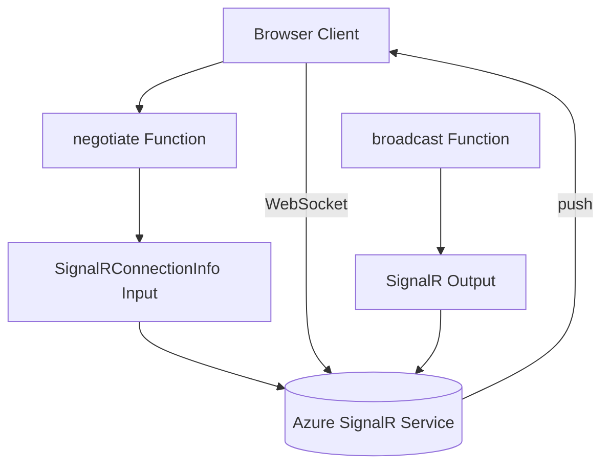

---
content_sources:
  references:
    - type: mslearn-adapted
      url: https://learn.microsoft.com/en-us/azure/azure-functions/functions-bindings-signalr-service
  diagrams:
    - id: architecture
      type: flowchart
      source: self-generated
      justification: Flow view of architecture, synthesized from Microsoft Learn documentation cited on this page.
      based_on:
        - https://learn.microsoft.com/en-us/azure/azure-functions/functions-bindings-signalr-service
        - https://learn.microsoft.com/en-us/azure/azure-functions/functions-bindings-signalr-service-input
---
# SignalR Service

This recipe covers adding real-time messaging to Azure Functions Python v2 with Azure SignalR Service in serverless mode. It uses the `SignalRConnectionInfo` input binding to implement the required `negotiate` endpoint and the SignalR output binding to broadcast messages to connected clients. In the Python v2 model, SignalR bindings are expressed as generic bindings.

## Architecture

<!-- diagram-id: architecture -->


## Prerequisites

SignalR Service bindings are included in the default extension bundle. Ensure your `host.json` references it:

```json
{
  "version": "2.0",
  "extensionBundle": {
    "id": "Microsoft.Azure.Functions.ExtensionBundle",
    "version": "[4.*, 5.0.0)"
  }
}
```

Configure the connection in app settings. A connection string (stored as `AzureSignalRConnectionString`) or an identity-based connection is supported:

```bash
az functionapp config appsettings set \
  --name $APP_NAME \
  --resource-group $RG \
  --settings "AzureSignalRConnectionString__serviceUri=https://$SIGNALR_NAME.service.signalr.net"
```

| CLI element | Explanation |
|---|---|
| Command(s) | `az functionapp config appsettings set` |
| Key flags | `--name`, `--resource-group`, `--settings` |
| Variables | `$APP_NAME`, `$RG`, `$SIGNALR_NAME` |
| Expected result | Azure CLI returns the updated app settings as JSON; confirm the setting is present before continuing. |

The SignalR Service instance must be in **Serverless** mode. When using an identity-based connection, grant the function app's managed identity the **SignalR Service Owner** role on the resource.

## The negotiate Endpoint

Before a client connects, it calls a `negotiate` endpoint to obtain the service URL and a short-lived access token. The `SignalRConnectionInfo` input binding produces this payload. Do not cache or share the token between clients.

```python
import azure.functions as func
import json

bp = func.Blueprint()

@bp.route(route="negotiate", auth_level=func.AuthLevel.ANONYMOUS)
@bp.generic_input_binding(
    arg_name="connectionInfo",
    type="signalRConnectionInfo",
    hubName="serverless",
    connectionStringSetting="AzureSignalRConnectionString",
)
def negotiate(req: func.HttpRequest, connectionInfo) -> func.HttpResponse:
    """Return the SignalR service endpoint and access token to the client."""
    return func.HttpResponse(
        connectionInfo,
        mimetype="application/json",
    )
```

!!! warning "Secure the negotiate endpoint"
    The example uses `AuthLevel.ANONYMOUS` for clarity. In production, protect the endpoint with App Service Authentication and bind the authenticated user via `userId="{headers.x-ms-client-principal-id}"` so each token carries a user identity.

## Output Binding: Broadcast a Message

The SignalR output binding sends a message to all connected clients. The message object specifies a `target` (the client-side handler name) and `arguments`.

```python
@bp.route(route="messages", methods=["POST"])
@bp.generic_output_binding(
    arg_name="signalRMessages",
    type="signalR",
    hubName="serverless",
    connectionStringSetting="AzureSignalRConnectionString",
)
def broadcast(req: func.HttpRequest, signalRMessages: func.Out[str]) -> func.HttpResponse:
    """Broadcast a message to every connected client."""
    body = req.get_body().decode("utf-8")

    signalRMessages.set(json.dumps({
        "target": "newMessage",
        "arguments": [body],
    }))

    return func.HttpResponse(status_code=202)
```

## Sending to a Specific User or Group

Add `userId` or `groupName` to the message object to target a subset of clients instead of broadcasting:

```python
signalRMessages.set(json.dumps({
    "userId": "user1",
    "target": "newMessage",
    "arguments": [body],
}))
```

| Field | Purpose |
|-------|---------|
| `target` | Name of the client-side method invoked by SignalR |
| `arguments` | List of arguments passed to the client method |
| `userId` | Restrict delivery to a single user identifier |
| `groupName` | Restrict delivery to members of a named group |

## See Also

- [HTTP Authentication](http-auth.md)
- [Managed Identity Recipe](managed-identity.md)

## Sources

- [Azure Functions SignalR Service bindings (Microsoft Learn)](https://learn.microsoft.com/en-us/azure/azure-functions/functions-bindings-signalr-service)
- [SignalR Service input binding (Microsoft Learn)](https://learn.microsoft.com/en-us/azure/azure-functions/functions-bindings-signalr-service-input)
- [SignalR Service output binding (Microsoft Learn)](https://learn.microsoft.com/en-us/azure/azure-functions/functions-bindings-signalr-service-output)
