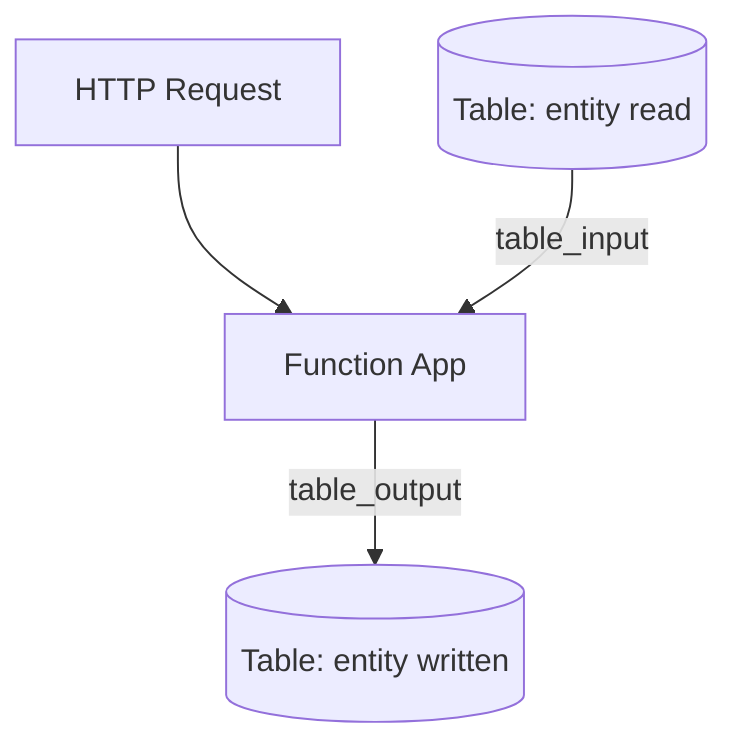

---
content_sources:
  references:
    - type: mslearn-adapted
      url: https://learn.microsoft.com/en-us/azure/azure-functions/functions-bindings-storage-table
  diagrams:
    - id: architecture
      type: flowchart
      source: self-generated
      justification: Flow view of architecture, synthesized from Microsoft Learn documentation cited on this page.
      based_on:
        - https://learn.microsoft.com/en-us/azure/azure-functions/functions-bindings-storage-table
        - https://learn.microsoft.com/en-us/azure/azure-functions/functions-bindings-storage-table-output
---
# Table Storage

This recipe covers reading and writing entities in Azure Table Storage from Azure Functions Python v2 using the table input and output bindings. Table Storage is a low-cost, schemaless key/value store keyed by partition and row.

## Architecture

<!-- diagram-id: architecture -->


## Prerequisites

Table bindings ship in the default extension bundle. Provide the connection in app settings. A connection string or an identity-based connection is supported. Identity-based connections use a `__tableServiceUri` suffix:

```bash
az functionapp config appsettings set \
  --name $APP_NAME \
  --resource-group $RG \
  --settings "TableConnection__tableServiceUri=https://$STORAGE_NAME.table.core.windows.net"
```

| CLI element | Explanation |
|---|---|
| Command(s) | `az functionapp config appsettings set` |
| Key flags | `--name`, `--resource-group`, `--settings` |
| Variables | `$APP_NAME`, `$RG`, `$STORAGE_NAME` |
| Expected result | Azure CLI returns the updated app settings as JSON; confirm the setting is present before continuing. |

For an identity-based connection, grant the managed identity **Storage Table Data Reader** (input) and **Storage Table Data Contributor** (output) on the storage account.

!!! note "Output binding creates new entities only"
    The table output binding only creates new entities. To update or delete an existing entity, use the `azure-data-tables` SDK directly with a `TableClient`.

## Output Binding: Write an Entity

Every entity requires a `PartitionKey` and a `RowKey`.

```python
import azure.functions as func
import uuid
import json

bp = func.Blueprint()

@bp.route(route="messages", methods=["POST"])
@bp.table_output(
    arg_name="entity",
    connection="TableConnection",
    table_name="messages",
)
def create_message(req: func.HttpRequest, entity: func.Out[str]) -> func.HttpResponse:
    """Persist a new message entity to Table Storage."""
    body = req.get_json()
    row_key = str(uuid.uuid4())

    data = {
        "PartitionKey": "message",
        "RowKey": row_key,
        "Text": body.get("text", ""),
    }
    entity.set(json.dumps(data))

    return func.HttpResponse(
        json.dumps({"rowKey": row_key}),
        mimetype="application/json",
        status_code=201,
    )
```

## Input Binding: Read an Entity

Bind by partition key and row key to read a single entity. The runtime injects the entity as a JSON string.

```python
@bp.route(route="messages/{partitionKey}/{rowKey}", methods=["GET"])
@bp.table_input(
    arg_name="entity",
    connection="TableConnection",
    table_name="messages",
    partition_key="{partitionKey}",
    row_key="{rowKey}",
)
def get_message(req: func.HttpRequest, entity: str) -> func.HttpResponse:
    """Read a single entity by partition and row key."""
    return func.HttpResponse(
        entity,
        mimetype="application/json",
        status_code=200,
    )
```

To read multiple entities, omit `row_key` and optionally supply a `filter` and `take` on the input binding.

## See Also

- [Blob Storage](blob-storage.md)
- [Queue Storage](queue.md)
- [Managed Identity Recipe](managed-identity.md)

## Sources

- [Azure Table storage bindings for Azure Functions (Microsoft Learn)](https://learn.microsoft.com/en-us/azure/azure-functions/functions-bindings-storage-table)
- [Azure Tables output binding for Azure Functions (Microsoft Learn)](https://learn.microsoft.com/en-us/azure/azure-functions/functions-bindings-storage-table-output)
- [Azure Tables input binding for Azure Functions (Microsoft Learn)](https://learn.microsoft.com/en-us/azure/azure-functions/functions-bindings-storage-table-input)
