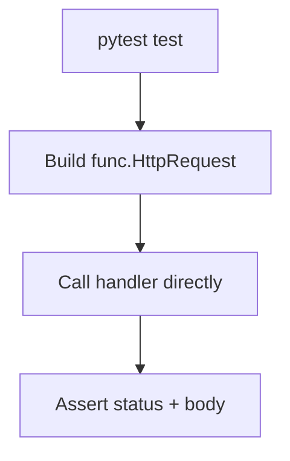

---
content_sources:
  references:
    - type: mslearn-adapted
      url: https://learn.microsoft.com/en-us/azure/azure-functions/functions-reference-python
  diagrams:
    - id: architecture
      type: flowchart
      source: self-generated
      justification: Flow view of architecture, synthesized from Microsoft Learn documentation cited on this page.
      based_on:
        - https://learn.microsoft.com/en-us/azure/azure-functions/functions-reference-python
---
# Unit Testing

Azure Functions handlers in the Python v2 model are ordinary Python callables, so you test them with `pytest` by constructing the trigger objects (for example `func.HttpRequest`) and asserting on the returned `func.HttpResponse`. No Functions host is required for unit tests.

## Prerequisites

- A Python v2 Function App using `azure.functions` with `app = func.FunctionApp()`.
- `pytest` installed in your virtual environment (`pip install pytest`).

## Architecture

<!-- diagram-id: architecture -->


## Testable Handler

Keep business logic in the handler (or a plain function it calls) so tests can invoke it without the runtime.

```python
import azure.functions as func

app = func.FunctionApp()

@app.route(route="greet")
def greet(req: func.HttpRequest) -> func.HttpResponse:
    name = req.params.get("name") or "world"
    return func.HttpResponse(f"hello {name}", status_code=200)
```

## Test the HTTP Trigger

Construct a `func.HttpRequest`, call the handler, and assert on the response.

```python
import azure.functions as func
from function_app import greet

def test_greet_with_name():
    req = func.HttpRequest(
        method="GET",
        url="/api/greet",
        params={"name": "ada"},
        body=None,
    )

    response = greet(req)

    assert response.status_code == 200
    assert response.get_body() == b"hello ada"

def test_greet_default():
    req = func.HttpRequest(method="GET", url="/api/greet", params={}, body=None)
    response = greet(req)
    assert response.get_body() == b"hello world"
```

## Mocking Bindings and Dependencies

For output bindings or external clients, inject a fake or patch the dependency with `unittest.mock`.

```python
from unittest.mock import patch

@patch("function_app.table_client")
def test_writes_entity(mock_client):
    # call the handler, then assert on the mock
    mock_client.create_entity.assert_called_once()
```

| Element | Explanation |
|---|---|
| `func.HttpRequest(...)` | Constructs the trigger input without a running host. |
| `response.get_body()` | Returns the response body as `bytes` for assertions. |
| `unittest.mock.patch` | Replaces module-level clients (see [Dependency Injection](dependency-injection.md)) with test doubles. |

!!! tip "Integration testing"
    To exercise the full host (bindings, `host.json`, routing), run `func start` locally and issue HTTP requests, or use the Azure Functions test tooling in CI. Unit tests above stay host-free for speed.

## See Also

- [Dependency Injection](dependency-injection.md)
- [HTTP API Patterns](http-api.md)

## Sources

- [Azure Functions Python developer guide (Microsoft Learn)](https://learn.microsoft.com/en-us/azure/azure-functions/functions-reference-python)
