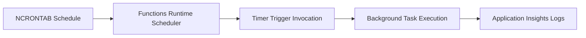

# Timer Trigger

> **Note:** This guide focuses primarily on HTTP triggers. The timer trigger is covered here for future extensibility and is commonly used alongside HTTP APIs for scheduled background tasks like data cleanup, report generation, and health pings.

## Overview

A timer trigger fires on a schedule defined by an NCRONTAB expression. Unlike HTTP triggers, timer triggers do not have an endpoint URL — they run automatically based on the schedule.



## Timer Trigger v2 Syntax

```python
import azure.functions as func
import logging
from datetime import datetime, timezone

bp = func.Blueprint()

@bp.timer_trigger(schedule="0 */5 * * * *", arg_name="timer", run_on_startup=False)
def scheduled_task(timer: func.TimerRequest) -> None:
    """Runs every 5 minutes."""
    utc_now = datetime.now(timezone.utc).isoformat()
    logging.info(f"Timer trigger fired at {utc_now}")

    if timer.past_due:
        logging.warning("Timer is past due — this execution was delayed")

    # Do your scheduled work here
    logging.info("Scheduled task completed")
```

Register the blueprint in `function_app.py`:

```python
import azure.functions as func
from blueprints.scheduled import bp as scheduled_bp

app = func.FunctionApp()
app.register_blueprint(scheduled_bp)
```

## NCRONTAB Expression Syntax

Azure Functions uses a six-field NCRONTAB expression (includes seconds):

```
{second} {minute} {hour} {day} {month} {day-of-week}
```

| Field | Allowed Values | Special Characters |
|-------|---------------|-------------------|
| Second | 0–59 | `, - * /` |
| Minute | 0–59 | `, - * /` |
| Hour | 0–23 | `, - * /` |
| Day | 1–31 | `, - * /` |
| Month | 1–12 | `, - * /` |
| Day of Week | 0–6 (0 = Sunday) | `, - * /` |

### Common Schedule Examples

| Schedule | NCRONTAB Expression | Description |
|----------|-------------------|-------------|
| Every 5 minutes | `0 */5 * * * *` | At second 0 of every 5th minute |
| Every hour | `0 0 * * * *` | At the top of every hour |
| Every 4 hours | `0 0 */4 * * *` | At minute 0 of every 4th hour |
| Daily at midnight UTC | `0 0 0 * * *` | Once a day at 00:00 UTC |
| Daily at 2:30 AM UTC | `0 30 2 * * *` | Once a day at 02:30 UTC |
| Weekdays at 9 AM UTC | `0 0 9 * * 1-5` | Monday through Friday at 09:00 UTC |
| Every 30 seconds | `*/30 * * * * *` | Twice per minute |
| First of the month at midnight | `0 0 0 1 * *` | Monthly on the 1st |

> **Important:** Schedules are interpreted in UTC unless you configure `WEBSITE_TIME_ZONE`. Timezone-aware schedules are supported on Windows plans and Linux Premium/Dedicated plans. Linux Consumption and Linux Flex Consumption do not support `WEBSITE_TIME_ZONE` for timer triggers.

## Timer State and Past Due

The `timer.past_due` property indicates whether the current invocation is late. This can happen when:

- The function app was stopped or scaled to zero
- A previous execution took longer than the schedule interval
- The app was restarted during a scheduled window

```python
@bp.timer_trigger(schedule="0 0 * * * *", arg_name="timer", run_on_startup=False)
def hourly_report(timer: func.TimerRequest) -> None:
    """Generate an hourly report."""
    if timer.past_due:
        logging.warning("Hourly report is running late")

    # Generate report
    report = generate_report()
    logging.info(f"Report generated: {report['summary']}")
```

### run_on_startup

Set `run_on_startup=True` to execute the timer function immediately when the function app starts, in addition to the normal schedule:

```python
@bp.timer_trigger(schedule="0 0 0 * * *", arg_name="timer", run_on_startup=True)
def daily_cleanup(timer: func.TimerRequest) -> None:
    """Clean up expired data daily and on startup."""
    logging.info("Running cleanup task")
    # ... cleanup logic ...
```

> **Caution:** Avoid `run_on_startup=True` in production on the Consumption plan. Every cold start triggers the function, which can lead to unexpected executions during scale-out events.

## Practical Examples

### Keep-Warm Ping

Reduce cold-start likelihood on the Consumption plan by pinging your own health endpoint:

```python
import httpx
import os

@bp.timer_trigger(schedule="0 */4 * * * *", arg_name="timer", run_on_startup=False)
def keep_warm(timer: func.TimerRequest) -> None:
    """Ping the health endpoint every 4 minutes to reduce cold-start frequency."""
    base_url = os.environ.get("WEBSITE_HOSTNAME", "localhost:7071")
    scheme = "https" if "azurewebsites" in base_url else "http"
    url = f"{scheme}://{base_url}/api/health"

    try:
        resp = httpx.get(url, timeout=10.0)
        logging.info(f"Keep-warm ping: {resp.status_code}")
    except Exception as e:
        logging.error(f"Keep-warm ping failed: {e}")
```

### Data Cleanup

Remove expired records on a daily schedule:

```python
@bp.timer_trigger(schedule="0 0 2 * * *", arg_name="timer", run_on_startup=False)
def cleanup_expired(timer: func.TimerRequest) -> None:
    """Delete expired items daily at 2 AM UTC."""
    from azure.cosmos import CosmosClient
    from azure.identity import DefaultAzureCredential
    import os

    endpoint = os.environ["COSMOS_ENDPOINT"]
    client = CosmosClient(endpoint, DefaultAzureCredential())
    container = client.get_database_client("appdb").get_container_client("items")

    now = datetime.now(timezone.utc).isoformat()
    query = "SELECT * FROM c WHERE c.expires_at < @now"
    expired = list(container.query_items(
        query=query,
        parameters=[{"name": "@now", "value": now}],
        enable_cross_partition_query=True
    ))

    for item in expired:
        container.delete_item(item["id"], partition_key=item["category"])
        logging.info(f"Deleted expired item: {item['id']}")

    logging.info(f"Cleanup complete: {len(expired)} items removed")
```

## Timer Trigger Requirements

Timer triggers require Azure Storage (`AzureWebJobsStorage`) to maintain schedule state. The runtime stores a lease blob to ensure only one instance processes each timer event. This means:

- `AzureWebJobsStorage` must be configured (not optional for timer triggers)
- If using Azurite locally, it must be running

## See Also
- [HTTP API Patterns](http-api.md)
- [Scaling](../../../platform/scaling.md)

## Sources
- [Azure Functions Timer Trigger (Microsoft Learn)](https://learn.microsoft.com/azure/azure-functions/functions-bindings-timer)
