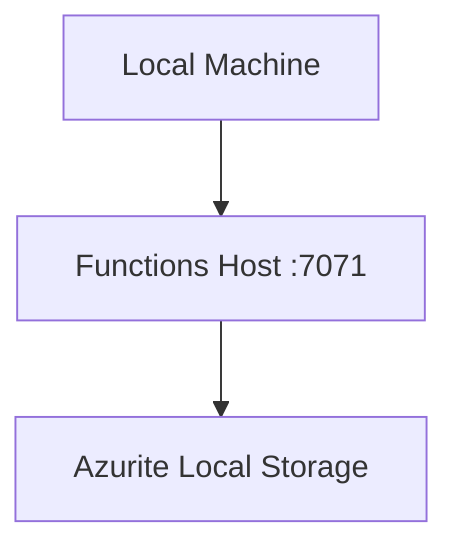
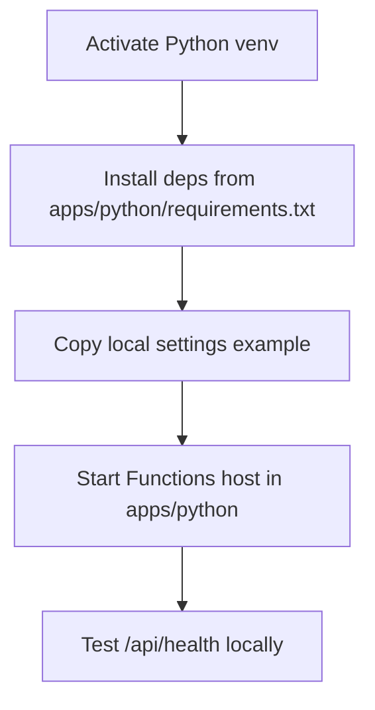

---
validation:
  az_cli:
    last_tested: 2026-04-09
    cli_version: "2.83.0"
    core_tools_version: "4.8.0"
    result: pass
  bicep:
    last_tested: null
    result: not_tested
content_sources:
  - type: mslearn-adapted
    url: https://learn.microsoft.com/azure/azure-functions/functions-run-local
  - type: mslearn-adapted
    url: https://learn.microsoft.com/azure/azure-functions/consumption-plan
  - type: mslearn-adapted
    url: https://learn.microsoft.com/azure/azure-functions/functions-reference-python
---

# 01 - Run Locally (Consumption)

Run the sample Azure Functions Python app on your machine before deploying to the Consumption (Y1) plan. This track uses Linux shell examples; the same workflow works on Windows with equivalent commands.

## Prerequisites

| Tool | Version | Purpose |
|------|---------|---------|
| Python | 3.11+ | Local runtime for the function code |
| Azure Functions Core Tools | v4 | Start the local host and publish later |
| Azure CLI | 2.61+ | Provision and configure Azure resources |
| Azurite (optional) | latest | Local Storage emulator for triggers and bindings |

!!! info "Consumption plan basics"
    Consumption (Y1) is serverless with scale-to-zero, up to 200 instances, 1.5 GB memory per instance, and a default 5-minute timeout (max 10 minutes).

## What You'll Build

You will run the Python Functions app locally from `apps/python`, load local settings, and verify the health endpoint responds from the local Functions host.

!!! info "Infrastructure Context"
    **Plan**: Consumption (Y1) — **Network**: Public internet only (no VNet support)

    This tutorial runs locally - no Azure resources are created.

    <!-- diagram-id: what-you-ll-build -->


<!-- diagram-id: what-you-ll-build-2 -->


## Steps

### Step 1 - Create and activate a virtual environment

```bash
python -m venv .venv
source .venv/bin/activate
python -m pip install --upgrade pip
python -m pip install --requirement apps/python/requirements.txt
```

### Step 2 - Create local settings

```bash
cp apps/python/local.settings.json.example apps/python/local.settings.json
```

Update `apps/python/local.settings.json` with these baseline values:

```json
{
  "IsEncrypted": false,
  "Values": {
    "FUNCTIONS_WORKER_RUNTIME": "python",
    "AzureWebJobsStorage": "UseDevelopmentStorage=true"
  }
}
```

`AzureWebJobsStorage` can be a connection string (common for Consumption) or identity-based settings in Azure; both are supported.

### Step 3 - Start Azurite (optional but recommended)

```bash
azurite --silent --location /tmp/azurite --debug /tmp/azurite/debug.log
```

### Step 4 - Start the Functions host

```bash
cd apps/python && func start
```

### Step 5 - Call an endpoint from another terminal

```bash
curl --request GET "http://localhost:7071/api/health"
```

## Verification

Host start output:

```text
Azure Functions Core Tools
Core Tools Version:       4.x.x
Function Runtime Version: 4.x.x.x

Functions:

    health: [GET] http://localhost:7071/api/health
    info: [GET] http://localhost:7071/api/info
```

HTTP response example:

```json
{"status":"healthy","timestamp":"2026-04-03T09:00:00Z","version":"1.0.0"}
```

## Next Steps

You now have local parity and can deploy to Azure Consumption (Y1).

> **Next:** [02 - First Deploy](02-first-deploy.md)

## See Also

- [Tutorial Overview & Plan Chooser](../index.md)
- [Python Language Guide](../../index.md)
- [Platform: Hosting Plans](../../../../platform/hosting.md)
- [Operations: Deployment](../../../../operations/deployment.md)
- [Recipes Index](../../recipes/index.md)

## Sources

- [Run Functions locally with Core Tools](https://learn.microsoft.com/azure/azure-functions/functions-run-local)
- [Azure Functions Consumption plan](https://learn.microsoft.com/azure/azure-functions/consumption-plan)
- [Python developer guide for Azure Functions](https://learn.microsoft.com/azure/azure-functions/functions-reference-python)
