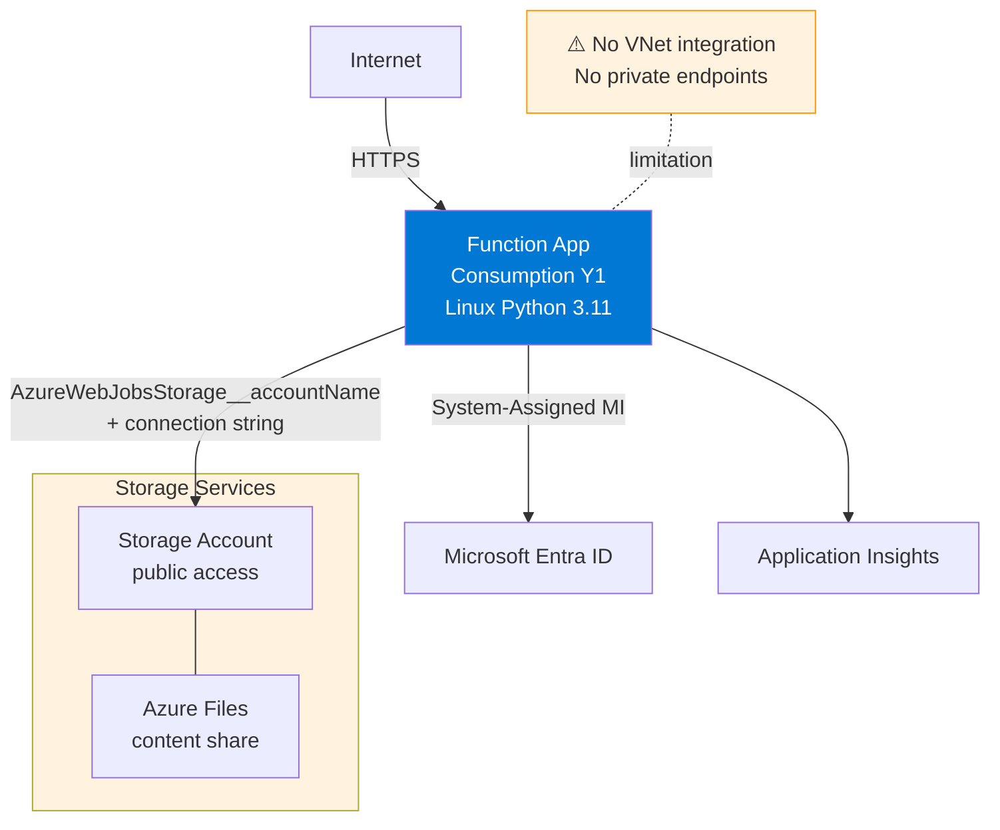
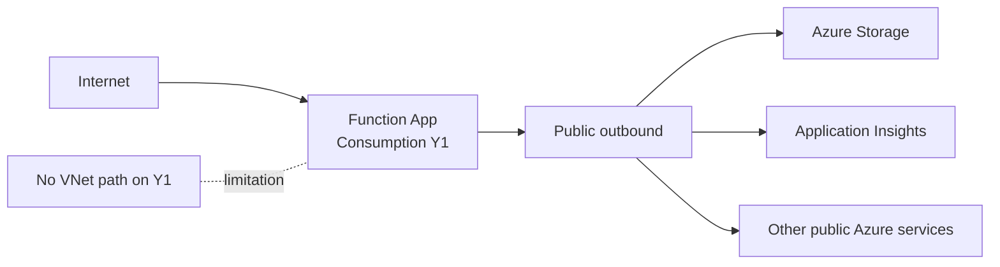

---
hide:
  - toc
validation:
  az_cli:
    last_tested: 2026-04-12
    cli_version: "2.70.0"
    core_tools_version: "4.6.0"
    result: fail
  bicep:
    last_tested: null
    result: not_tested
content_sources:
  - type: mslearn-adapted
    url: https://learn.microsoft.com/azure/azure-functions/create-first-function-cli-python
  - type: mslearn-adapted
    url: https://learn.microsoft.com/azure/azure-functions/functions-deployment-technologies
  - type: mslearn-adapted
    url: https://learn.microsoft.com/azure/azure-functions/functions-deployment-slots
---

# 02 - First Deploy (Consumption)

Deploy the app to Azure Functions Consumption (Y1) using long-form CLI commands only. This tutorial uses Linux examples and notes Windows support where relevant.

## Prerequisites

| Tool | Version | Purpose |
|------|---------|---------|
| Azure CLI | 2.61+ | Create Azure resources |
| Azure Functions Core Tools | v4 | Package and publish function code |
| Python | 3.11+ | Match local development runtime |
| Azure subscription | Active | Target for deployment |

## What You'll Build

You will provision a Linux Consumption (Y1) Function App, publish the Python code from `apps/python`, and validate the public health endpoint.

!!! info "Infrastructure Context"
    **Plan**: Consumption (Y1) | **Network**: Public internet only | **VNet**: ❌ Not supported

    Consumption has no VNet integration or private endpoint support. All traffic flows over the public internet. Storage uses connection string authentication.

    <!-- diagram-id: what-you-ll-build -->


## Steps

### Step 1 - Set variables and sign in

```bash
export RG="rg-func-consumption-demo"
export APP_NAME="func-consumption-demo-001"
export STORAGE_NAME="stconsumptiondemo001"
export LOCATION="koreacentral"

az login
az account set --subscription "<subscription-id>"
```

| Command/Parameter | Purpose |
|-------------------|---------|
| `export RG="rg-func-consumption-demo"` | Defines the resource group name for the deployment. |
| `export APP_NAME="func-consumption-demo-001"` | Sets the unique name for the Azure Function App. |
| `export STORAGE_NAME="stconsumptiondemo001"` | Defines the storage account name for the function app. |
| `export LOCATION="koreacentral"` | Specifies the Azure region for resource placement. |
| `az login` | Authenticates the Azure CLI session with your account. |
| `az account set --subscription "<subscription-id>"` | Sets the target subscription for all subsequent commands. |
| `--subscription "<subscription-id>"` | Specifies the active subscription ID. |

### Step 2 - Create resource group and storage account

```bash
az group create --name "$RG" --location "$LOCATION"

az storage account create \
  --name "$STORAGE_NAME" \
  --resource-group "$RG" \
  --location "$LOCATION" \
  --sku Standard_LRS \
  --kind StorageV2
```

| Command/Parameter | Purpose |
|-------------------|---------|
| `az group create` | Provisions a new resource group. |
| `--name "$RG"` | Sets the resource group name from the variable. |
| `--location "$LOCATION"` | Places the resource group in the selected region. |
| `az storage account create` | Creates a new storage account required for the function app. |
| `--sku Standard_LRS` | Selects Standard Locally Redundant Storage for cost efficiency. |
| `--kind StorageV2` | Specifies the storage account type as General Purpose v2. |

### Step 3 - Create the Function App on Consumption (Y1)

Use the Consumption shortcut (`--consumption-plan-location`) so you do not create an explicit App Service plan resource.

```bash
az functionapp create \
  --name "$APP_NAME" \
  --resource-group "$RG" \
  --storage-account "$STORAGE_NAME" \
  --consumption-plan-location "$LOCATION" \
  --functions-version 4 \
  --runtime python \
  --runtime-version 3.11 \
  --os-type Linux
```

| Command/Parameter | Purpose |
|-------------------|---------|
| `az functionapp create` | Provisions the function app on the serverless Consumption plan. |
| `--consumption-plan-location "$LOCATION"` | Automatically creates a Consumption (Y1) plan in the specified region. |
| `--functions-version 4` | Selects version 4.x of the Azure Functions runtime. |
| `--runtime python` | Sets the application runtime to Python. |
| `--runtime-version 3.11` | Specifies the Python version. |
| `--os-type Linux` | Deploys the function app on a Linux host. |

Windows is also supported on Consumption; this track keeps Linux commands for consistency.

!!! warning "Enterprise policy: Shared key access"
    Some enterprise subscriptions enforce Azure Policy that sets `allowSharedKeyAccess: false` on all storage accounts. Consumption (Y1) requires `WEBSITE_CONTENTAZUREFILECONNECTIONSTRING` with a connection string that uses shared key access to create the content file share during provisioning. If your subscription has this policy, the Function App creation will fail with a 403 error. Solutions:

    - Request a policy exemption from your Azure administrator
    - Use Flex Consumption (FC1) which supports identity-based blob storage without shared keys
    - Use Dedicated (B1) which uses `WEBSITE_RUN_FROM_PACKAGE` without a content file share

### Step 4 - Publish function code

```bash
cd apps/python
func azure functionapp publish "$APP_NAME" --build remote --python
```

| Command/Parameter | Purpose |
|-------------------|---------|
| `cd apps/python` | Navigates to the Python function application source directory. |
| `func azure functionapp publish "$APP_NAME"` | Packages and uploads the local project to the Azure Function App. |
| `--build remote` | Instructs the platform to install dependencies on the server side for Linux. |
| `--python` | Specifies the application language for the build process. |

!!! warning "Use `--build remote` on Linux Consumption"
    On Linux Consumption, `func azure functionapp publish --python` (without `--build remote`) may fail with "Can't find app" or produce incomplete deployments. The `--build remote` flag instructs the platform to install Python dependencies on the server side, which is required for Linux hosts.

    After a `--build remote` deployment, verify that `WEBSITE_CONTENTAZUREFILECONNECTIONSTRING` and `WEBSITE_CONTENTSHARE` app settings are still present. Remote build may remove these settings, causing the function host to stop. If missing, restore them:

    ```bash
    STORAGE_CONN=$(az storage account show-connection-string \
      --name "$STORAGE_NAME" --resource-group "$RG" --output tsv)

    az functionapp config appsettings set \
      --name "$APP_NAME" --resource-group "$RG" \
      --settings \
        "WEBSITE_CONTENTAZUREFILECONNECTIONSTRING=$STORAGE_CONN" \
        "WEBSITE_CONTENTSHARE=$APP_NAME"
    ```

    | Command/Parameter | Purpose |
    |-------------------|---------|
    | `az storage account show-connection-string` | Retrieves the full connection string for the storage account. |
    | `az functionapp config appsettings set` | Configures key-value pairs in the function app environment. |
    | `--settings "..."` | Sets the specified application settings. |

Consumption deployments are ZIP-based (run-from-package) and stored on the platform file share/storage path.

### Step 5 - Verify deployment

```bash
curl --request GET "https://$APP_NAME.azurewebsites.net/api/health"
```

| Command/Parameter | Purpose |
|-------------------|---------|
| `curl --request GET` | Executes an HTTP GET request to the function app endpoint. |
| `"https://$APP_NAME.azurewebsites.net/api/health"` | Targets the health check function URL. |

Linux Consumption uses Zip Deploy, but Kudu advanced tools are not available on this hosting option.

<!-- diagram-id: step-5-verify-deployment -->


!!! info "Not available on Consumption"
    VNet integration requires Flex Consumption, Premium, or Dedicated plan.

!!! info "Not available on Consumption"
    Private endpoints require Flex Consumption, Premium, or Dedicated plan.

## Verification

### Expected output when policy allows shared key access

Resource creation output excerpt:

```json
{
  "id": "/subscriptions/<subscription-id>/resourceGroups/rg-func-consumption-demo/providers/Microsoft.Web/sites/func-consumption-demo-001",
  "kind": "functionapp,linux",
  "location": "koreacentral",
  "state": "Running"
}
```

Publish output excerpt:

```text
Getting site publishing info...
Creating archive for current directory...
Uploading 10.24 MB [########################################]
Deployment successful.
Functions in func-consumption-demo-001:
    health - [httpTrigger]
        Invoke url: https://func-consumption-demo-001.azurewebsites.net/api/health
```

Health response:

```json
{"status":"healthy","timestamp":"2026-04-03T09:20:00Z","version":"1.0.0"}
```

### Verification notes

!!! warning "Current validation failure (2026-04-12)"
    The Korea Central Consumption deployment provisioned successfully and `func azure functionapp publish --build remote --python` completed a remote build, but Core Tools removed `WEBSITE_CONTENTAZUREFILECONNECTIONSTRING` and `WEBSITE_CONTENTSHARE` during publish.

    After restoring both settings, trigger sync still failed with `Error calling sync triggers (BadRequest)` and the public endpoint kept returning `503 Function host is not running`.

    **Observed output:**

    ```text
    Removing WEBSITE_CONTENTAZUREFILECONNECTIONSTRING app setting.
    Removing WEBSITE_CONTENTSHARE app setting.
    ...
    Remote build succeeded!
    Error calling sync triggers (BadRequest).
    ```

    ```text
    HTTP/1.1 503 Service Unavailable
    Function host is not running.
    ```

!!! warning "Blocked by enterprise policy"
    In our Korea Central deployment, Y1 Consumption was blocked during provisioning. The subscription's Azure Policy enforced `allowSharedKeyAccess: false` on the storage account, which prevented the platform from creating the required content file share.

    **Observed error:**

    ```text
    ERROR: Creation of storage file share failed with: 'The remote server returned an error: (403) Forbidden.'.
    Please check if the storage account is accessible.
    ```

    **Workarounds:**

    - Request a policy exemption from your Azure administrator
    - Use Flex Consumption (FC1) which supports identity-based blob storage
    - Use Dedicated (B1) which uses `WEBSITE_RUN_FROM_PACKAGE` without a content file share

## Next Steps

Next, configure settings and behavior specific to Consumption using classic app settings.

> **Next:** [03 - Configuration](03-configuration.md)

## See Also

- [Tutorial Overview & Plan Chooser](../index.md)
- [Python Language Guide](../../index.md)
- [Platform: Hosting Plans](../../../../platform/hosting.md)
- [Operations: Deployment](../../../../operations/deployment.md)
- [Recipes Index](../../recipes/index.md)

## Sources

- [Create a function app in Azure using CLI](https://learn.microsoft.com/azure/azure-functions/create-first-function-cli-python)
- [Azure Functions deployment technologies](https://learn.microsoft.com/azure/azure-functions/functions-deployment-technologies)
- [Deployment slots in Azure Functions](https://learn.microsoft.com/azure/azure-functions/functions-deployment-slots)
