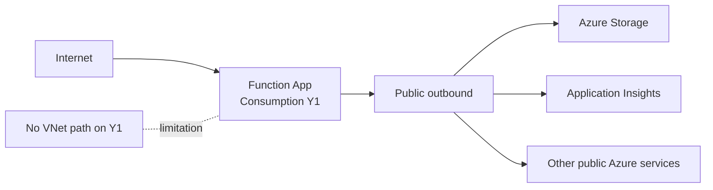

# 02 - First Deploy (Consumption)

Deploy the app to Azure Functions Consumption (Y1) using long-form CLI commands only. This tutorial uses Linux examples and notes Windows support where relevant.

## Prerequisites

| Tool | Version | Purpose |
|------|---------|---------|
| Azure CLI | 2.61+ | Create Azure resources |
| Azure Functions Core Tools | v4 | Package and publish function code |
| Python | 3.11+ | Match local development runtime |
| Azure subscription | Active | Target for deployment |

## What You'll Build

You will provision a Linux Consumption (Y1) Function App, publish the Python code from `apps/python`, and validate the public health endpoint.

## Steps

### Step 1 - Set variables and sign in

```bash
export RG="rg-func-consumption-demo"
export APP_NAME="func-consumption-demo-001"
export STORAGE_NAME="stconsumptiondemo001"
export LOCATION="koreacentral"

az login
az account set --subscription "<subscription-id>"
```

### Step 2 - Create resource group and storage account

```bash
az group create --name "$RG" --location "$LOCATION"

az storage account create \
  --name "$STORAGE_NAME" \
  --resource-group "$RG" \
  --location "$LOCATION" \
  --sku Standard_LRS \
  --kind StorageV2
```

### Step 3 - Create the Function App on Consumption (Y1)

Use the Consumption shortcut (`--consumption-plan-location`) so you do not create an explicit App Service plan resource.

```bash
az functionapp create \
  --name "$APP_NAME" \
  --resource-group "$RG" \
  --storage-account "$STORAGE_NAME" \
  --consumption-plan-location "$LOCATION" \
  --functions-version 4 \
  --runtime python \
  --runtime-version 3.11 \
  --os-type Linux
```

Windows is also supported on Consumption; this track keeps Linux commands for consistency.

!!! warning "Enterprise policy: Shared key access"
    Some enterprise subscriptions enforce Azure Policy that sets `allowSharedKeyAccess: false` on all storage accounts. Consumption (Y1) requires `WEBSITE_CONTENTAZUREFILECONNECTIONSTRING` with a connection string that uses shared key access to create the content file share during provisioning. If your subscription has this policy, the Function App creation will fail with a 403 error. Solutions:

    - Request a policy exemption from your Azure administrator
    - Use Flex Consumption (FC1) which supports identity-based blob storage without shared keys
    - Use Dedicated (B1) which uses `WEBSITE_RUN_FROM_PACKAGE` without a content file share

### Step 4 - Publish function code

```bash
cd apps/python
func azure functionapp publish "$APP_NAME" --python
```

Consumption deployments are ZIP-based (run-from-package) and stored on the platform file share/storage path.

### Step 5 - Verify deployment

```bash
curl --request GET "https://$APP_NAME.azurewebsites.net/api/health"
```

Linux Consumption uses Zip Deploy, but Kudu advanced tools are not available on this hosting option.



!!! info "Not available on Consumption"
    VNet integration requires Flex Consumption, Premium, or Dedicated plan.

!!! info "Not available on Consumption"
    Private endpoints require Flex Consumption, Premium, or Dedicated plan.

## Verification

### Expected output when policy allows shared key access

Resource creation output excerpt:

```json
{
  "id": "/subscriptions/<subscription-id>/resourceGroups/rg-func-consumption-demo/providers/Microsoft.Web/sites/func-consumption-demo-001",
  "kind": "functionapp,linux",
  "location": "koreacentral",
  "state": "Running"
}
```

Publish output excerpt:

```text
Getting site publishing info...
Creating archive for current directory...
Uploading 10.24 MB [########################################]
Deployment successful.
Functions in func-consumption-demo-001:
    health - [httpTrigger]
        Invoke url: https://func-consumption-demo-001.azurewebsites.net/api/health
```

Health response:

```json
{"status":"healthy","timestamp":"2026-04-03T09:20:00Z","version":"1.0.0"}
```

### Verification notes

!!! warning "Blocked by enterprise policy"
    In our Korea Central deployment, Y1 Consumption was blocked during provisioning. The subscription's Azure Policy enforced `allowSharedKeyAccess: false` on the storage account, which prevented the platform from creating the required content file share.

    **Observed error:**

    ```text
    ERROR: Creation of storage file share failed with: 'The remote server returned an error: (403) Forbidden.'.
    Please check if the storage account is accessible.
    ```

    **Workarounds:**

    - Request a policy exemption from your Azure administrator
    - Use Flex Consumption (FC1) which supports identity-based blob storage
    - Use Dedicated (B1) which uses `WEBSITE_RUN_FROM_PACKAGE` without a content file share

## Next Steps

Next, configure settings and behavior specific to Consumption using classic app settings.

> **Next:** [03 - Configuration](03-configuration.md)

## See Also

- [Tutorial Overview & Plan Chooser](../index.md)
- [Python Language Guide](../../index.md)
- [Platform: Hosting Plans](../../../../platform/hosting.md)
- [Operations: Deployment](../../../../operations/deployment.md)
- [Recipes Index](../../recipes/index.md)

## Sources

- [Create a function app in Azure using CLI](https://learn.microsoft.com/azure/azure-functions/create-first-function-cli-python)
- [Azure Functions deployment technologies](https://learn.microsoft.com/azure/azure-functions/functions-deployment-technologies)
- [Deployment slots in Azure Functions](https://learn.microsoft.com/azure/azure-functions/functions-deployment-slots)
