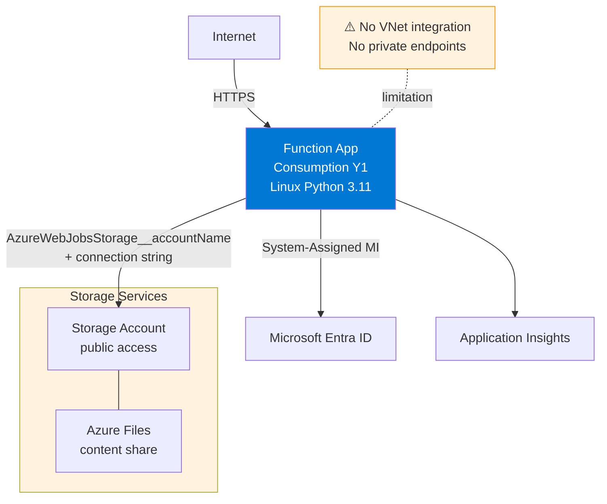
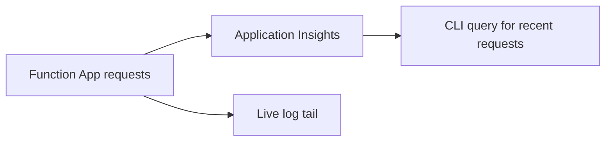

---
validation:
  az_cli:
    last_tested: 2026-04-09
    cli_version: "2.83.0"
    core_tools_version: "4.8.0"
    result: pass
  bicep:
    last_tested: null
    result: not_tested
content_sources:
  - type: mslearn-adapted
    url: https://learn.microsoft.com/azure/azure-functions/monitor-functions
  - type: mslearn-adapted
    url: https://learn.microsoft.com/cli/azure/monitor/app-insights/query
  - type: mslearn-adapted
    url: https://learn.microsoft.com/cli/azure/webapp/log
---

# 04 - Logging and Monitoring (Consumption)

Set up baseline observability for a Consumption (Y1) Function App with Application Insights and CLI log queries.

## Prerequisites

| Tool | Version | Purpose |
|------|---------|---------|
| Azure CLI | 2.61+ | Configure diagnostics and query logs |
| Deployed Function App | Y1 | Existing app from tutorial 02 |
| Application Insights | Workspace-based | Telemetry destination |

## What You'll Build

You will connect the Function App to Application Insights, generate sample traffic, and verify request telemetry and live logs for a Linux Consumption deployment.

!!! info "Infrastructure Context"
    **Plan**: Consumption (Y1) | **Network**: Public internet only | **VNet**: ❌ Not supported

    Consumption has no VNet integration or private endpoint support. All traffic flows over the public internet. Storage uses connection string authentication.

    <!-- diagram-id: what-you-ll-build -->


<!-- diagram-id: what-you-ll-build-2 -->


## Steps

### Step 1 - Set variables

```bash
export RG="rg-func-consumption-demo"
export APP_NAME="func-consumption-demo-001"
export STORAGE_NAME="stconsumptiondemo001"
export LOCATION="koreacentral"
```

### Step 2 - Create Application Insights

!!! tip "Auto-created Application Insights"
    When you create a Function App via `az functionapp create`, an Application Insights resource is often auto-created with the same name as the app. Check your resource group first with `az resource list --resource-group "$RG" --query "[?type=='Microsoft.Insights/components']" --output table`. If one already exists, skip this step and use its name in Step 3.

```bash
az monitor app-insights component create \
  --app "appi-func-consumption-demo" \
  --resource-group "$RG" \
  --location "$LOCATION" \
  --application-type web
```

### Step 3 - Link Function App to Application Insights

```bash
export APPINSIGHTS_CONNECTION_STRING=$(az monitor app-insights component show \
  --app "appi-func-consumption-demo" \
  --resource-group "$RG" \
  --query "connectionString" \
  --output tsv)

az functionapp config appsettings set \
  --name "$APP_NAME" \
  --resource-group "$RG" \
  --settings "APPLICATIONINSIGHTS_CONNECTION_STRING=$APPINSIGHTS_CONNECTION_STRING"
```

### Step 4 - Generate test traffic

```bash
curl --request GET "https://$APP_NAME.azurewebsites.net/api/health"
curl --request GET "https://$APP_NAME.azurewebsites.net/api/requests/log-levels"
curl --request GET "https://$APP_NAME.azurewebsites.net/api/exceptions/test-error"
```

### Step 5 - Query recent requests

```bash
az monitor app-insights query \
  --app "appi-func-consumption-demo" \
  --resource-group "$RG" \
  --analytics-query "requests | take 5 | project timestamp, name, resultCode, success" \
  --output table
```

!!! tip "Telemetry ingestion delay"
    Application Insights has a 2-5 minute ingestion delay. If Step 5 returns empty results immediately after Step 4, wait a few minutes and retry.

### Step 6 - Stream host logs from CLI

```bash
az webapp log tail \
  --name "$APP_NAME" \
  --resource-group "$RG"
```

!!! tip "Cold start and log streaming"
    On Consumption (Y1), the app may be cold (scaled to zero) when you start log streaming. Send a request to the health endpoint first to wake the app, then start the log tail. Press `Ctrl+C` to stop streaming.

Use log streaming and Application Insights for diagnostics on Linux Consumption.
## Verification

Application Insights query output excerpt:

```text
Timestamp                    Name                    ResultCode    Success
---------------------------  ----------------------  ------------  --------
2026-04-03T09:37:10.123456Z GET /api/health         200           True
2026-04-03T09:37:13.012345Z GET /api/requests/...   200           True
2026-04-03T09:37:16.456789Z GET /api/exceptions/... 200           True
```

Log tail excerpt:

```text
2026-04-03T09:37:10.100Z  Executing 'Functions.health' (Reason='This function was programmatically called...')
2026-04-03T09:37:10.123Z  Executed 'Functions.health' (Succeeded, Duration=23ms)
2026-04-03T09:37:16.430Z  Executed 'Functions.test_error' (Succeeded, Duration=44ms)
```

## Next Steps

Use Infrastructure as Code to make this setup repeatable.

> **Next:** [05 - Infrastructure as Code](05-infrastructure-as-code.md)

## See Also

- [Tutorial Overview & Plan Chooser](../index.md)
- [Python Language Guide](../../index.md)
- [Platform: Hosting Plans](../../../../platform/hosting.md)
- [Operations: Deployment](../../../../operations/deployment.md)
- [Recipes Index](../../recipes/index.md)

## Sources

- [Monitor Azure Functions](https://learn.microsoft.com/azure/azure-functions/monitor-functions)
- [Application Insights query with Azure CLI](https://learn.microsoft.com/cli/azure/monitor/app-insights/query)
- [Stream logs with Azure CLI](https://learn.microsoft.com/cli/azure/webapp/log)
