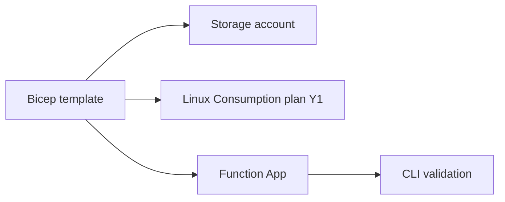

# 05 - Infrastructure as Code (Consumption)

Define and deploy a complete Consumption (Y1) environment with Bicep. This plan is simpler than Flex: no VNet integration requirement, no private endpoints, and no mandatory managed identity (recommended for app access patterns).

## Prerequisites

| Tool | Version | Purpose |
|------|---------|---------|
| Azure CLI | 2.61+ | Run Bicep deployments |
| Bicep | latest | Author ARM resources as code |
| Target path | `infra/consumption/main.bicep` | Consumption IaC template location |

## What You'll Build

You will deploy storage, a Linux Consumption plan, and a Python Function App via Bicep, then validate the deployed app metadata with Azure CLI.

!!! info "Infrastructure Context"
    **Plan**: Consumption (Y1) | **Network**: Public internet only | **VNet**: ❌ Not supported

    Consumption has no VNet integration or private endpoint support. All traffic flows over the public internet. Storage uses connection string authentication.

    ```mermaid
    flowchart TD
        INET[Internet] -->|HTTPS| FA[Function App\nConsumption Y1\nLinux Python 3.11]

        FA -->|System-Assigned MI| ENTRA[Microsoft Entra ID]
        FA -->|"AzureWebJobsStorage__accountName\n+ connection string"| ST[Storage Account\npublic access]
        FA --> AI[Application Insights]

        subgraph STORAGE[Storage Services]
            ST --- FS[Azure Files\ncontent share]
        end

        NO_VNET["⚠️ No VNet integration\nNo private endpoints"] -. limitation .- FA

        style FA fill:#0078d4,color:#fff
        style NO_VNET fill:#FFF3E0,stroke:#FF9800
        style STORAGE fill:#FFF3E0
    ```



## Steps

### Step 1 - Set variables

```bash
export RG="rg-func-consumption-demo"
export APP_NAME="func-consumption-demo-001"
export STORAGE_NAME="stconsumptiondemo001"
export LOCATION="eastus"
```

### Step 2 - Create the resource group

```bash
az group create --name "$RG" --location "$LOCATION"
```

### Step 3 - Author `infra/consumption/main.bicep`

Use a Consumption plan resource with Y1/Dynamic SKU and classic app settings on the Function App:

```bicep
param location string = resourceGroup().location
param appName string
param storageName string

resource storage 'Microsoft.Storage/storageAccounts@2023-01-01' = {
  name: storageName
  location: location
  sku: {
    name: 'Standard_LRS'
  }
  kind: 'StorageV2'
}

resource plan 'Microsoft.Web/serverfarms@2023-12-01' = {
  name: 'asp-${appName}'
  location: location
  kind: 'linux'
  sku: {
    name: 'Y1'
    tier: 'Dynamic'
  }
  properties: {
    reserved: true
  }
}

resource app 'Microsoft.Web/sites@2023-12-01' = {
  name: appName
  location: location
  kind: 'functionapp,linux'
  properties: {
    serverFarmId: plan.id
    siteConfig: {
      linuxFxVersion: 'Python|3.11'
      appSettings: [
        {
          name: 'FUNCTIONS_EXTENSION_VERSION'
          value: '~4'
        }
        {
          name: 'FUNCTIONS_WORKER_RUNTIME'
          value: 'python'
        }
        {
          name: 'AzureWebJobsStorage'
          value: 'DefaultEndpointsProtocol=https;AccountName=${storage.name};AccountKey=${listKeys(storage.id, storage.apiVersion).keys[0].value};EndpointSuffix=${environment().suffixes.storage}'
        }
        {
          name: 'WEBSITE_CONTENTAZUREFILECONNECTIONSTRING'
          value: 'DefaultEndpointsProtocol=https;AccountName=${storage.name};AccountKey=${listKeys(storage.id, storage.apiVersion).keys[0].value};EndpointSuffix=${environment().suffixes.storage}'
        }
        {
          name: 'WEBSITE_CONTENTSHARE'
          value: toLower('cs-${appName}')
        }
      ]
    }
    httpsOnly: true
  }
}
```

### Step 4 - Deploy the Bicep template

```bash
az deployment group create \
  --resource-group "$RG" \
  --template-file "infra/consumption/main.bicep" \
  --parameters appName="$APP_NAME" storageName="$STORAGE_NAME"
```

### Step 5 - Validate resulting host plan

```bash
az functionapp show \
  --name "$APP_NAME" \
  --resource-group "$RG" \
  --query "{kind:kind,state:state,defaultHostName:defaultHostName}" \
  --output json
```

!!! info "Not available on Consumption"
    VNet integration requires Flex Consumption, Premium, or Dedicated plan.

!!! info "Not available on Consumption"
    Private endpoints require Flex Consumption, Premium, or Dedicated plan.

## Verification

Deployment output excerpt:

```json
{
  "id": "/subscriptions/<subscription-id>/resourceGroups/rg-func-consumption-demo/providers/Microsoft.Resources/deployments/main",
  "name": "main",
  "properties": {
    "provisioningState": "Succeeded"
  }
}
```

Function app validation output:

```json
{
  "defaultHostName": "func-consumption-demo-001.azurewebsites.net",
  "kind": "functionapp,linux",
  "state": "Running"
}
```

## Next Steps

Automate deployments in CI/CD with GitHub Actions.

> **Next:** [06 - CI/CD](06-ci-cd.md)

## See Also

- [Tutorial Overview & Plan Chooser](../index.md)
- [Python Language Guide](../../index.md)
- [Platform: Hosting Plans](../../../../platform/hosting.md)
- [Operations: Deployment](../../../../operations/deployment.md)
- [Recipes Index](../../recipes/index.md)

## Sources

- [Bicep for Azure Functions](https://learn.microsoft.com/azure/azure-functions/functions-infrastructure-as-code)
- [Bicep language reference](https://learn.microsoft.com/azure/azure-resource-manager/bicep/)
- [Azure Functions Consumption plan](https://learn.microsoft.com/azure/azure-functions/consumption-plan)
