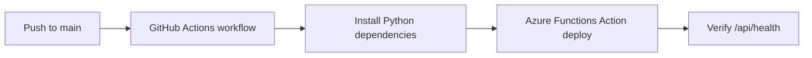

---
hide:
  - toc
validation:
  az_cli:
    last_tested: 2026-04-09
    cli_version: "2.83.0"
    core_tools_version: "4.8.0"
    result: pass
  bicep:
    last_tested: null
    result: not_tested
content_sources:
  - type: mslearn-adapted
    url: https://learn.microsoft.com/azure/azure-functions/functions-how-to-github-actions
  - type: mslearn-adapted
    url: https://learn.microsoft.com/azure/azure-functions/deployment-zip-push
  - type: mslearn-adapted
    url: https://learn.microsoft.com/azure/azure-functions/functions-how-to-github-actions#download-your-publish-profile
---

# 06 - CI/CD (Consumption)

Set up GitHub Actions deployment for Consumption (Y1) using `azure/functions-action@v1` and Linux-compatible Zip Deploy behavior.

## Prerequisites

| Tool | Version | Purpose |
|------|---------|---------|
| GitHub repository | Actions enabled | Host CI/CD workflow |
| Function App | Consumption (Y1) | Deployment target |
| Azure CLI | 2.61+ | Generate publish profile |

## What You'll Build

You will create a GitHub Actions workflow that installs Python dependencies and deploys the app from `apps/python` to a Linux Consumption Function App.

!!! info "Infrastructure Context"
    **Plan**: Consumption (Y1) | **Network**: Public internet only | **VNet**: ❌ Not supported

    Consumption has no VNet integration or private endpoint support. All traffic flows over the public internet. Storage uses connection string authentication.

    <!-- diagram-id: what-you-ll-build -->
    ```mermaid
    flowchart TD
        INET[Internet] -->|HTTPS| FA[Function App\nConsumption Y1\nLinux Python 3.11]

        FA -->|System-Assigned MI| ENTRA[Microsoft Entra ID]
        FA -->|"AzureWebJobsStorage__accountName\n+ connection string"| ST[Storage Account\npublic access]
        FA --> AI[Application Insights]

        subgraph STORAGE[Storage Services]
            ST --- FS[Azure Files\ncontent share]
        end

        NO_VNET["⚠️ No VNet integration\nNo private endpoints"] -. limitation .- FA

        style FA fill:#0078d4,color:#fff
        style NO_VNET fill:#FFF3E0,stroke:#FF9800
        style STORAGE fill:#FFF3E0
    ```

<!-- diagram-id: what-you-ll-build-2 -->


## Steps

### Step 1 - Set variables

```bash
export RG="rg-func-consumption-demo"
export APP_NAME="func-consumption-demo-001"
export STORAGE_NAME="stconsumptiondemo001"
export LOCATION="koreacentral"
```

### Step 2 - Download publish profile

```bash
az functionapp deployment list-publishing-profiles \
  --name "$APP_NAME" \
  --resource-group "$RG" \
  --xml
```

Copy the XML output into GitHub secret `AZURE_FUNCTIONAPP_PUBLISH_PROFILE`.

### Step 3 - Create workflow file

Create `.github/workflows/consumption-deploy.yml`:

```yaml
name: Deploy Function App (Consumption)

on:
  push:
    branches:
      - main

jobs:
  build-and-deploy:
    runs-on: ubuntu-latest
    steps:
      - name: Checkout
        uses: actions/checkout@v4

      - name: Set up Python
        uses: actions/setup-python@v5
        with:
          python-version: '3.11'

      - name: Install dependencies
        run: |
          python -m pip install --upgrade pip
          python -m pip install --requirement apps/python/requirements.txt

      - name: Deploy with Azure Functions Action
        uses: azure/functions-action@v1
        with:
          app-name: func-consumption-demo-001
          package: apps/python
          scm-do-build-during-deployment: true
          enable-oryx-build: true
          publish-profile: ${{ secrets.AZURE_FUNCTIONAPP_PUBLISH_PROFILE }}
```

### Step 4 - Commit and push

```bash
git add ".github/workflows/consumption-deploy.yml"
git commit --message "docs: add consumption CI/CD workflow"
git push --set-upstream origin main
```

### Step 5 - Verify deployment from Actions

```bash
curl --request GET "https://$APP_NAME.azurewebsites.net/api/health"
```

Linux Consumption supports Zip Deploy for this workflow, while Kudu advanced tools are not exposed.

## Verification

GitHub Actions log excerpt:

```text
Run azure/functions-action@v1
Successfully parsed publish profile
Using SCM credential for deployment
Uploading package to function app...
Deployment completed successfully.
```

Health response:

```json
{"status":"healthy","timestamp":"2026-04-03T10:10:00Z","version":"1.0.0"}
```

## Next Steps

Add non-HTTP triggers and verify scaling behavior for Consumption.

> **Next:** [07 - Extending Triggers](07-extending-triggers.md)

## See Also

- [Tutorial Overview & Plan Chooser](../index.md)
- [Python Language Guide](../../index.md)
- [Platform: Hosting Plans](../../../../platform/hosting.md)
- [Operations: Deployment](../../../../operations/deployment.md)
- [Recipes Index](../../recipes/index.md)

## Sources

- [Use GitHub Actions to deploy a function app](https://learn.microsoft.com/azure/azure-functions/functions-how-to-github-actions)
- [Deploy Azure Functions with Zip Deploy](https://learn.microsoft.com/azure/azure-functions/deployment-zip-push)
- [Manage app-level deployment credentials in Azure Functions](https://learn.microsoft.com/azure/azure-functions/functions-how-to-github-actions#download-your-publish-profile)
