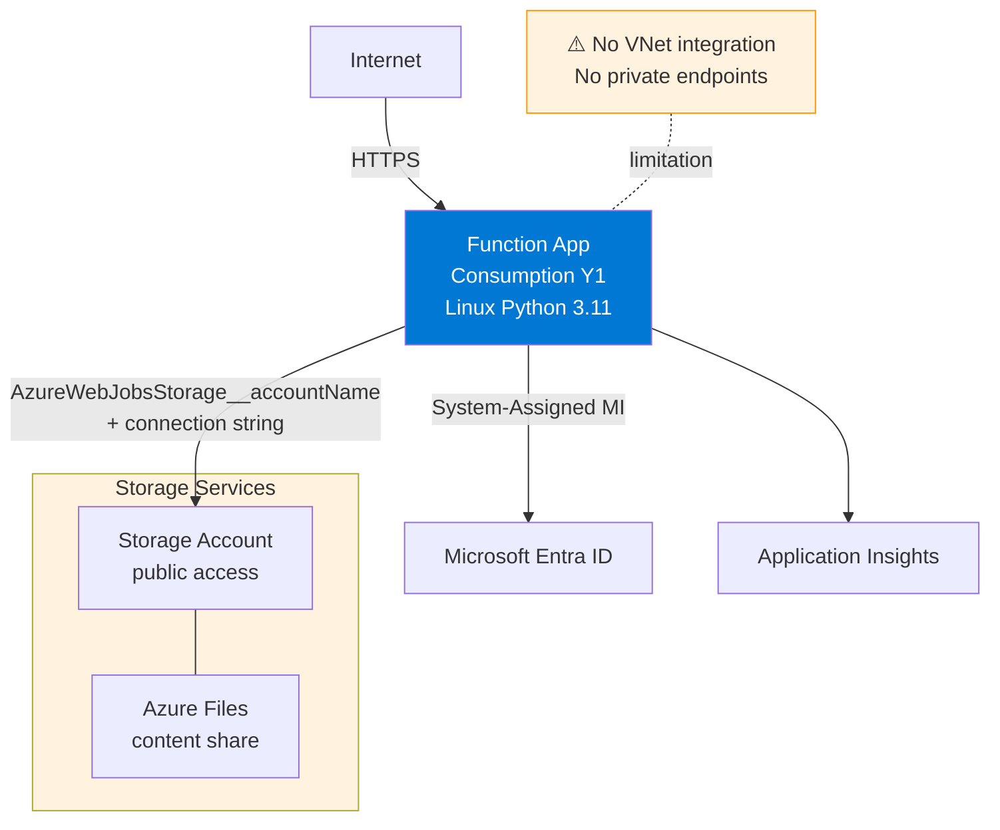
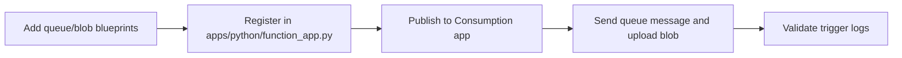

---
validation:
  az_cli:
    last_tested: 2026-04-09
    cli_version: "2.83.0"
    core_tools_version: "4.8.0"
    result: pass
  bicep:
    last_tested: null
    result: not_tested
content_sources:
  - type: mslearn-adapted
    url: https://learn.microsoft.com/azure/azure-functions/functions-triggers-bindings
  - type: mslearn-adapted
    url: https://learn.microsoft.com/azure/azure-functions/functions-bindings-storage-queue-trigger
  - type: mslearn-adapted
    url: https://learn.microsoft.com/azure/azure-functions/functions-bindings-storage-blob-trigger
---

# 07 - Extending Triggers (Consumption)

Extend your Consumption (Y1) app with queue and blob triggers. On this plan, scaling is app-level (not per-function), and the standard blob trigger polling model works well.

## Prerequisites

| Tool | Version | Purpose |
|------|---------|---------|
| Azure CLI | 2.61+ | Create storage queues/containers and test messages |
| Azure Functions Core Tools | v4 | Publish updated functions |
| Function App | Consumption (Y1) | Existing deployed app |

## What You'll Build

You will extend the existing blueprint-based Python app with queue and blob triggers, publish the update, and validate trigger execution from live logs.

!!! info "Infrastructure Context"
    **Plan**: Consumption (Y1) | **Network**: Public internet only | **VNet**: ❌ Not supported

    Consumption has no VNet integration or private endpoint support. All traffic flows over the public internet. Storage uses connection string authentication.

    <!-- diagram-id: what-you-ll-build -->


<!-- diagram-id: what-you-ll-build-2 -->


## Steps

### Step 1 - Set variables

```bash
export RG="rg-func-consumption-demo"
export APP_NAME="func-consumption-demo-001"
export STORAGE_NAME="stconsumptiondemo001"
export LOCATION="koreacentral"
```

### Step 2 - Add a queue trigger

```python
import logging
import azure.functions as func

bp = func.Blueprint()

@bp.function_name(name="queue_worker")
@bp.queue_trigger(arg_name="msg", queue_name="work-items", connection="AzureWebJobsStorage")
def queue_worker(msg: func.QueueMessage) -> None:
    payload = msg.get_body().decode("utf-8")
    logging.info("Queue item processed: %s", payload)
```

Save this in `apps/python/blueprints/queue_blob_worker.py`, then register it in `apps/python/function_app.py` with:

```python
from blueprints.queue_blob_worker import bp as queue_blob_worker_bp
app.register_blueprint(queue_blob_worker_bp)
```

### Step 3 - Add a blob trigger (standard polling)

```python
@bp.function_name(name="blob_worker")
@bp.blob_trigger(arg_name="blob", path="uploads/{name}", connection="AzureWebJobsStorage")
def blob_worker(blob: func.InputStream) -> None:
    logging.info("Blob processed: %s (%s bytes)", blob.name, blob.length)
```

Standard polling blob trigger is supported on Consumption. Event Grid-based blob trigger is an optional upgrade for event-driven routing scenarios.

### Step 4 - Publish changes

```bash
cd apps/python
func azure functionapp publish "$APP_NAME" --build remote --python
```

!!! warning "Use `--build remote` on Linux Consumption"
    The `--build remote` flag is required for Linux Consumption to ensure Python dependencies are installed on the server. Without it, the publish may fail or produce incomplete deployments.

### Step 5 - Send queue message and upload blob

```bash
az storage queue create \
  --name "work-items" \
  --account-name "$STORAGE_NAME" \
  --auth-mode login
az storage message put \
  --queue-name "work-items" \
  --content '{"id":"1001","action":"reindex"}' \
  --account-name "$STORAGE_NAME" \
  --auth-mode login

az storage container create \
  --name "uploads" \
  --account-name "$STORAGE_NAME" \
  --auth-mode login

az storage blob upload \
  --container-name "uploads" \
  --name "sample.txt" \
  --file "apps/python/host.json" \
  --account-name "$STORAGE_NAME" \
  --auth-mode login
```

### Step 6 - Confirm trigger activity

```bash
az webapp log tail \
  --name "$APP_NAME" \
  --resource-group "$RG"
```

Consumption scaling reminder:

- Scale-to-zero when idle.
- App-level scaling up to 100 instances on Linux Consumption.
- Queue and blob workloads scale together at app scope (not per-function scaling).
- Default timeout is 5 minutes, maximum 10 minutes.

!!! info "Not available on Consumption"
    VNet integration requires Flex Consumption, Premium, or Dedicated plan.

!!! info "Not available on Consumption"
    Private endpoints require Flex Consumption, Premium, or Dedicated plan.

## Verification

Publish output excerpt:

```text
Deployment successful.
Functions in func-consumption-demo-001:
    queue_worker - [queueTrigger]
    blob_worker - [blobTrigger]
```

Log stream excerpt:

```text
Executing 'Functions.queue_worker' (Reason='New queue message detected on work-items.', Id=xxxxxxxx-xxxx-xxxx-xxxx-xxxxxxxxxxxx)
Queue item processed: {"id":"1001","action":"reindex"}
Executed 'Functions.queue_worker' (Succeeded, Duration=42ms)

Executing 'Functions.blob_worker' (Reason='New blob detected(uploads/sample.txt)', Id=xxxxxxxx-xxxx-xxxx-xxxx-xxxxxxxxxxxx)
Blob processed: uploads/sample.txt (1234 bytes)
Executed 'Functions.blob_worker' (Succeeded, Duration=58ms)
```

## Next Steps

You completed the Consumption tutorial track. Continue with core runtime concepts.

> **Next:** [How Functions Works](../../../../platform/architecture.md)

## See Also

- [Tutorial Overview & Plan Chooser](../index.md)
- [Python Language Guide](../../index.md)
- [Platform: Hosting Plans](../../../../platform/hosting.md)
- [Operations: Deployment](../../../../operations/deployment.md)
- [Recipes Index](../../recipes/index.md)

## Sources

- [Azure Functions triggers and bindings](https://learn.microsoft.com/azure/azure-functions/functions-triggers-bindings)
- [Azure Queue Storage trigger for Azure Functions](https://learn.microsoft.com/azure/azure-functions/functions-bindings-storage-queue-trigger)
- [Azure Blob Storage trigger for Azure Functions](https://learn.microsoft.com/azure/azure-functions/functions-bindings-storage-blob-trigger)
