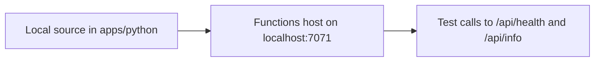

# 01 - Run Locally (Dedicated)

This tutorial runs the Function App locally and prepares the exact variables and conventions you will use on the Dedicated (App Service Plan) track. Dedicated is always running, billed at a fixed monthly plan price, and works well when you already have App Service capacity or want to co-host Functions with existing web apps.

## Prerequisites

- Azure subscription with permission to create Resource Groups, App Service Plans, Function Apps, and Storage Accounts
- Python 3.11+
- Azure CLI 2.57+
- Azure Functions Core Tools v4
- Git

## What You'll Build

You will run the Python Function App locally from `apps/python`, load local settings, and validate HTTP endpoints before cloud deployment.

!!! info "Infrastructure Context"
    **Plan**: Dedicated (B1 App Service Plan) — **Network**: Public internet (B1 tier)

    This tutorial runs locally — no Azure resources are created.

    ```mermaid
    flowchart LR
        DEV[Local Machine] --> HOST[Functions Host :7071]
        HOST --> AZURITE[Azurite Local Storage]
    ```



Set shared variables for the full Dedicated track:

```bash
export RG="rg-func-dedicated-dev"
export APP_NAME="func-dedi-<unique-suffix>"
export PLAN_NAME="asp-dedi-b1-dev"
export STORAGE_NAME="stdedidev<unique>"
export LOCATION="eastus"
```

Sign in and select your subscription:

```bash
az login
az account set --subscription "<subscription-id>"
```

## Steps

### Step 1 - Clone the project and install dependencies

```bash
git clone https://github.com/yeongseon/azure-functions-practical-guide.git
cd azure-functions-practical-guide
python -m venv .venv
source .venv/bin/activate
pip install --requirement apps/python/requirements.txt
```

### Step 2 - Create local settings

```bash
cp apps/python/local.settings.json.example apps/python/local.settings.json
```

Use a local storage emulator value for development:

```json
{
  "IsEncrypted": false,
  "Values": {
    "FUNCTIONS_WORKER_RUNTIME": "python",
    "AzureWebJobsStorage": "UseDevelopmentStorage=true"
  }
}
```

### Step 3 - Start the Functions host

```bash
cd apps/python && func start
```

### Step 4 - Validate local endpoints

In a second terminal:

```bash
curl --request GET "http://localhost:7071/api/health"
curl --request GET "http://localhost:7071/api/info"
```

## Verification

`cd apps/python && func start`:

```text
Azure Functions Core Tools
Core Tools Version:       4.x.x
Function Runtime Version: 4.x.x.x

Functions:

    health: [GET] http://localhost:7071/api/health
    info: [GET] http://localhost:7071/api/info
```

`curl --request GET "http://localhost:7071/api/health"`:

```json
{
  "status": "healthy",
  "timestamp": "2026-04-03T09:30:00Z",
  "version": "1.0.0"
}
```

`az account show --output json` (PII-masked example):

```json
{
  "environmentName": "AzureCloud",
  "homeTenantId": "<tenant-id>",
  "id": "<subscription-id>",
  "isDefault": true,
  "name": "<subscription-name>",
  "user": {
    "name": "<masked-user>",
    "type": "user"
  }
}
```

## Next Steps

You now have a working local baseline. Next you will provision a Basic (B1) Dedicated App Service Plan, deploy the app, and enable Always On.

> **Next:** [02 - First Deploy](02-first-deploy.md)

## See Also

- [Tutorial Overview & Plan Chooser](../index.md)
- [Python Language Guide](../../index.md)
- [Platform: Hosting Plans](../../../../platform/hosting.md)
- [Operations: Deployment](../../../../operations/deployment.md)
- [Recipes Index](../../recipes/index.md)

## Sources

- [Run functions locally (Microsoft Learn)](https://learn.microsoft.com/azure/azure-functions/functions-run-local)
- [Azure Functions Python developer guide (Microsoft Learn)](https://learn.microsoft.com/azure/azure-functions/functions-reference-python)
- [App Service plan overview (Microsoft Learn)](https://learn.microsoft.com/azure/app-service/overview-hosting-plans)
