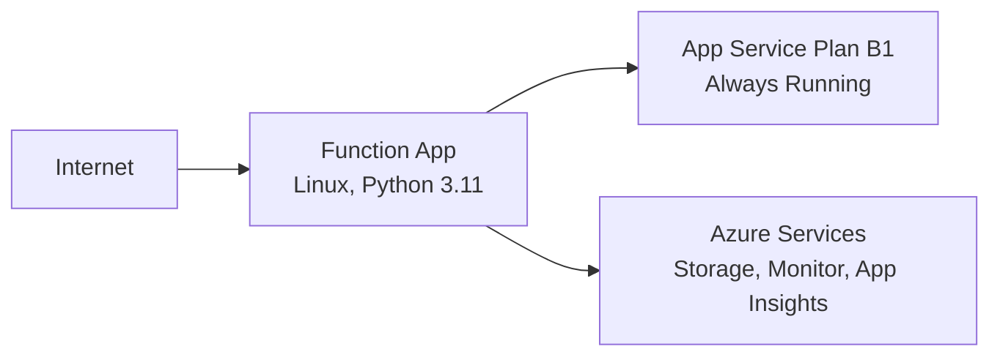

# 02 - First Deploy (Dedicated)

In this tutorial you deploy the Function App to a Dedicated App Service Plan using Basic B1. Dedicated plans are always running (no scale-to-zero), support Linux and Windows, and use fixed monthly pricing regardless of executions.

## Prerequisites

- Completed [01 - Run Locally](01-local-run.md)
- Variables exported in your shell:

```bash
export RG="rg-func-dedicated-dev"
export APP_NAME="func-dedi-<unique-suffix>"
export PLAN_NAME="asp-dedi-b1-dev"
export STORAGE_NAME="stdedidev<unique>"
export LOCATION="eastus"
```

## Steps

### Step 1 - Create resource group and storage account

```bash
az group create \
  --name $RG \
  --location $LOCATION

az storage account create \
  --name $STORAGE_NAME \
  --resource-group $RG \
  --location $LOCATION \
  --sku Standard_LRS \
  --kind StorageV2
```

### Step 2 - Create a Dedicated App Service Plan (B1)

```bash
az appservice plan create \
  --name $PLAN_NAME \
  --resource-group $RG \
  --location $LOCATION \
  --sku B1 \
  --is-linux
```

For production workloads, use `S1` or `P1v2` when you need higher scale limits, VNet integration, private endpoints, or deployment slots.

### Step 3 - Create the Function App on the plan

```bash
az functionapp create \
  --name $APP_NAME \
  --resource-group $RG \
  --plan $PLAN_NAME \
  --storage-account $STORAGE_NAME \
  --runtime python \
  --runtime-version 3.11 \
  --functions-version 4 \
  --os-type Linux
```

### Step 4 - Enable Always On (recommended)

```bash
az functionapp config set \
  --name $APP_NAME \
  --resource-group $RG \
  --always-on true
```

### Step 5 - Deploy code

```bash
func azure functionapp publish $APP_NAME --python
```

Dedicated uses App Service file share-based deployment storage and exposes Kudu/SCM endpoints for operational workflows.

### Step 6 - Verify deployment

```bash
az functionapp show \
  --name $APP_NAME \
  --resource-group $RG \
  --query "{state:state,defaultHostName:defaultHostName,kind:kind}" \
  --output json

curl --request GET "https://$APP_NAME.azurewebsites.net/api/health"
```



!!! info "Requires Standard tier or higher"
    VNet integration is not available on Basic (B1) tier. Upgrade to Standard (S1) or Premium (P1v2) for VNet support.

!!! info "Requires Standard tier or higher"
    Private endpoints are not available on Basic (B1) tier. Upgrade to Standard (S1) or Premium (P1v2).

## Expected Output

`az appservice plan create ... --sku B1`:

```json
{
  "id": "/subscriptions/<subscription-id>/resourceGroups/rg-func-dedicated-dev/providers/Microsoft.Web/serverfarms/asp-dedi-b1-dev",
  "kind": "linux",
  "name": "asp-dedi-b1-dev",
  "resourceGroup": "rg-func-dedicated-dev",
  "sku": {
    "name": "B1",
    "tier": "Basic"
  },
  "status": "Ready"
}
```

`az functionapp config set --always-on true`:

```json
{
  "alwaysOn": true,
  "linuxFxVersion": "Python|3.11",
  "numberOfWorkers": 1,
  "scmType": "None"
}
```

`curl --request GET "https://$APP_NAME.azurewebsites.net/api/health"`:

```json
{
  "status": "healthy",
  "timestamp": "2026-04-03T10:05:00Z",
  "version": "1.0.0"
}
```

## Next Steps

Your first Dedicated deployment is live. Next you will configure app settings, storage options, and runtime behavior with `siteConfig.appSettings` conventions.

> **Next:** [03 - Configuration](03-configuration.md)

## References

- [Create a Function App in an App Service plan (Microsoft Learn)](https://learn.microsoft.com/azure/azure-functions/functions-how-to-use-azure-function-app-settings)
- [App Service Always On (Microsoft Learn)](https://learn.microsoft.com/azure/app-service/configure-common)
- [Kudu service overview](https://github.com/projectkudu/kudu/wiki)
