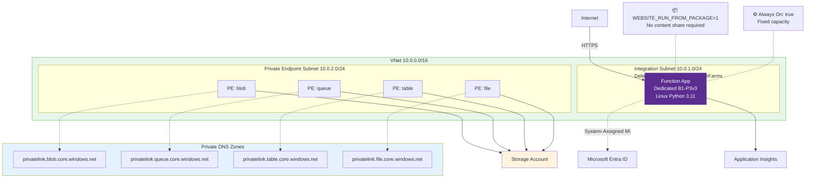
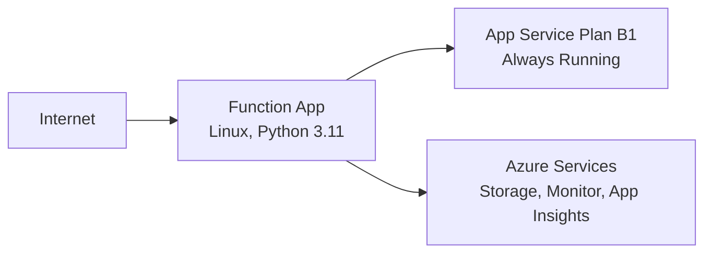

---
hide:
  - toc
validation:
  az_cli:
    last_tested: 2026-04-09
    cli_version: "2.83.0"
    core_tools_version: "4.8.0"
    result: pass
  bicep:
    last_tested: null
    result: not_tested
content_sources:
  - type: mslearn-adapted
    url: https://learn.microsoft.com/azure/azure-functions/functions-how-to-use-azure-function-app-settings
  - type: mslearn-adapted
    url: https://learn.microsoft.com/azure/app-service/configure-common
  - type: mslearn-adapted
    url: https://learn.microsoft.com/azure/app-service/networking/private-endpoint
---

# 02 - First Deploy (Dedicated)

In this tutorial you deploy the Function App to a Dedicated App Service Plan using Basic B1. Dedicated plans are always running (no scale-to-zero), support Linux and Windows, and use fixed monthly pricing regardless of executions.

## Prerequisites

- Completed [01 - Run Locally](01-local-run.md)
- Variables exported in your shell:

```bash
export RG="rg-func-dedicated-dev"
export APP_NAME="func-dedi-<unique-suffix>"
export PLAN_NAME="asp-dedi-b1-dev"
export STORAGE_NAME="stdedidev<unique>"
export LOCATION="koreacentral"
```

## What You'll Build

You will provision a Basic (B1) Linux App Service Plan, create a Python Function App on that plan, deploy from `apps/python`, and validate live endpoints.

!!! info "Infrastructure Context"
    **Plan**: Dedicated (B1) | **Network**: Public internet | **VNet**: ❌ (requires Standard+ tier)

    Basic B1 has no VNet integration or private endpoints. The app runs on a fixed App Service Plan (always on, no scale-to-zero). VNet support requires upgrading to Standard (S1) or Premium (P1v3) tier.

    <!-- diagram-id: what-you-ll-build -->


## Steps

### Step 1 - Create resource group and storage account

```bash
az group create \
  --name $RG \
  --location $LOCATION

az storage account create \
  --name $STORAGE_NAME \
  --resource-group $RG \
  --location $LOCATION \
  --sku Standard_LRS \
  --kind StorageV2
```

### Step 2 - Create a Dedicated App Service Plan (B1)

```bash
az appservice plan create \
  --name $PLAN_NAME \
  --resource-group $RG \
  --location $LOCATION \
  --sku B1 \
  --is-linux
```

For production workloads, use `S1` or `P1v2` when you need higher scale limits, VNet integration, or deployment slots.

### Step 3 - Create the Function App on the plan

```bash
az functionapp create \
  --name $APP_NAME \
  --resource-group $RG \
  --plan $PLAN_NAME \
  --storage-account $STORAGE_NAME \
  --runtime python \
  --runtime-version 3.11 \
  --functions-version 4 \
  --os-type Linux
```

### Step 4 - Enable Always On (recommended)

```bash
az functionapp config set \
  --name $APP_NAME \
  --resource-group $RG \
  --always-on true
```

### Step 5 - Deploy code

```bash
cd apps/python
func azure functionapp publish $APP_NAME --python
```

Dedicated deployment here uses remote Oryx build via `func azure functionapp publish --python` with `WEBSITE_RUN_FROM_PACKAGE=1`. Unlike Consumption and Premium content share scenarios, B1 does not require `WEBSITE_CONTENTAZUREFILECONNECTIONSTRING`.

!!! warning "Set placeholder trigger settings before first request"
    The reference app includes EventHub, Queue, and Timer triggers that need connection settings. If these are missing, the function host may report errors. Set placeholder values immediately after first deploy:

    ```bash
    az functionapp config appsettings set \
      --name $APP_NAME \
      --resource-group $RG \
      --settings \
        EventHubConnection="Endpoint=sb://placeholder.servicebus.windows.net/;SharedAccessKeyName=placeholder;SharedAccessKey=placeholder=;EntityPath=placeholder" \
        QueueStorage="UseDevelopmentStorage=true" \
        TIMER_LAB_SCHEDULE="0 0 0 1 1 *"

    az functionapp restart --name $APP_NAME --resource-group $RG
    ```

    After restart, wait 60–90 seconds for the host to become ready on B1 tier.
### Step 6 - Verify deployment

```bash
az functionapp show \
  --name $APP_NAME \
  --resource-group $RG \
  --query "{state:state,defaultHostName:defaultHostName,kind:kind}" \
  --output json

curl --request GET "https://$APP_NAME.azurewebsites.net/api/health"
```

<!-- diagram-id: step-6-verify-deployment -->


!!! info "VNet support requires Standard+ tier"
    VNet integration is not available on Basic (B1) tier. See the **Optional: VNet and Private Endpoints** section below for Standard (S1) or Premium (P1v2) setup.

### Optional: VNet and Private Endpoints (Standard+ Tier)

??? example "Optional: VNet and Private Endpoints (Standard+ Tier)"
    If you deployed with `--sku S1` or higher instead of B1, you can add full network isolation with VNet integration, storage private endpoints, and managed identity.

    #### Step A: Upgrade Plan (skip if already S1+)

    ```bash
    az appservice plan update \
      --name $PLAN_NAME \
      --resource-group $RG \
      --sku S1
    ```

    #### Step B: Create VNet and Subnets

    ```bash
    export VNET_NAME="vnet-dedicated-demo"

    az network vnet create \
      --name "$VNET_NAME" \
      --resource-group "$RG" \
      --location "$LOCATION" \
      --address-prefixes "10.0.0.0/16" \
      --subnet-name "snet-integration" \
      --subnet-prefixes "10.0.1.0/24"

    az network vnet subnet create \
      --name "snet-private-endpoints" \
      --resource-group "$RG" \
      --vnet-name "$VNET_NAME" \
      --address-prefixes "10.0.2.0/24"

    az network vnet subnet update \
      --name "snet-integration" \
      --resource-group "$RG" \
      --vnet-name "$VNET_NAME" \
      --delegations "Microsoft.Web/serverFarms"
    ```

    #### Step C: Enable VNet Integration

    ```bash
    az functionapp vnet-integration add \
      --name "$APP_NAME" \
      --resource-group "$RG" \
      --vnet "$VNET_NAME" \
      --subnet "snet-integration"
    ```

    #### Step D: Enable System-Assigned Managed Identity

    ```bash
    az functionapp identity assign \
      --name "$APP_NAME" \
      --resource-group "$RG"

    export MI_PRINCIPAL_ID=$(az functionapp identity show \
      --name "$APP_NAME" \
      --resource-group "$RG" \
      --query "principalId" \
      --output tsv)
    ```

    #### Step E: Assign RBAC Roles

    ```bash
    export STORAGE_ID=$(az storage account show \
      --name "$STORAGE_NAME" \
      --resource-group "$RG" \
      --query "id" \
      --output tsv)

    az role assignment create \
      --assignee "$MI_PRINCIPAL_ID" \
      --role "Storage Blob Data Owner" \
      --scope "$STORAGE_ID"

    az role assignment create \
      --assignee "$MI_PRINCIPAL_ID" \
      --role "Storage Account Contributor" \
      --scope "$STORAGE_ID"

    az role assignment create \
      --assignee "$MI_PRINCIPAL_ID" \
      --role "Storage Queue Data Contributor" \
      --scope "$STORAGE_ID"
    ```

    !!! tip "RBAC roles explained"
        - **Storage Blob Data Owner**: Read/write blob data (used by the Functions runtime for triggers, bindings, and internal state)
        - **Storage Account Contributor**: Manage storage account properties
        - **Storage Queue Data Contributor**: Read/write queue messages (used by durable functions, queue triggers)

    #### Step F: Lock Down Storage

    ```bash
    az storage account update \
      --name "$STORAGE_NAME" \
      --resource-group "$RG" \
      --allow-blob-public-access false
    ```

    #### Step G: Create Storage Private Endpoints (×4)

    ```bash
    for SVC in blob queue table file; do
      az network private-endpoint create \
        --name "pe-st-$SVC" \
        --resource-group "$RG" \
        --location "$LOCATION" \
        --vnet-name "$VNET_NAME" \
        --subnet "snet-private-endpoints" \
        --private-connection-resource-id "$STORAGE_ID" \
        --group-ids "$SVC" \
        --connection-name "conn-st-$SVC"
    done
    ```

    #### Step H: Create Private DNS Zones and Link to VNet (×4)

    ```bash
    for SVC in blob queue table file; do
      az network private-dns zone create \
        --resource-group "$RG" \
        --name "privatelink.$SVC.core.windows.net"

      az network private-dns link vnet create \
        --resource-group "$RG" \
        --zone-name "privatelink.$SVC.core.windows.net" \
        --name "link-$SVC" \
        --virtual-network "$VNET_NAME" \
        --registration-enabled false

      az network private-endpoint dns-zone-group create \
        --resource-group "$RG" \
        --endpoint-name "pe-st-$SVC" \
        --name "$SVC-dns-zone-group" \
        --private-dns-zone "privatelink.$SVC.core.windows.net" \
        --zone-name "$SVC"
    done
    ```

    #### Step I: Configure Identity-Based Storage

    ```bash
    az functionapp config appsettings set \
      --name "$APP_NAME" \
      --resource-group "$RG" \
      --settings \
        "AzureWebJobsStorage__accountName=$STORAGE_NAME" \
        "AzureWebJobsStorage__credential=managedidentity"
    ```

    #### Step J: Verify VNet Integration

    ```bash
    az functionapp show \
      --name "$APP_NAME" \
      --resource-group "$RG" \
      --query "virtualNetworkSubnetId" \
      --output tsv
    ```

## Verification

`az appservice plan create ... --sku B1`:

```json
{
  "id": "/subscriptions/<subscription-id>/resourceGroups/rg-func-dedicated-dev/providers/Microsoft.Web/serverfarms/asp-dedi-b1-dev",
  "kind": "linux",
  "location": "koreacentral",
  "name": "asp-dedi-b1-dev",
  "resourceGroup": "rg-func-dedicated-dev",
  "sku": {
    "name": "B1",
    "tier": "Basic"
  },
  "status": "Ready"
}
```

`az functionapp config set --always-on true`:

```json
{
  "alwaysOn": true,
  "linuxFxVersion": "Python|3.11",
  "numberOfWorkers": 1,
  "scmType": "None"
}
```

`curl --request GET "https://$APP_NAME.azurewebsites.net/api/health"`:

```json
{
  "status": "healthy",
  "timestamp": "2026-04-04T05:38:46Z",
  "version": "1.0.0"
}
```

### Deployment Verification Results

Endpoint test results from the Korea Central deployment (all returned HTTP 200):

- `GET /api/health` → `{"status": "healthy", "timestamp": "2026-04-04T05:38:46Z", "version": "1.0.0"}`
- `GET /api/info` → `{"name": "azure-functions-field-guide", "version": "1.0.0", "python": "3.11.13", "environment": "development", "telemetryMode": "basic"}`
- `GET /api/requests/log-levels` → `{"message": "Logged at all levels", "levels": ["DEBUG", "INFO", "WARNING", "ERROR", "CRITICAL"]}`
- `GET /api/dependencies/external` → `{"status": "success", "statusCode": 200, "responseTime": "1143ms", "url": "https://httpbin.org/get"}`
- `GET /api/exceptions/test-error` → `{"error": "Handled exception", "type": "ValueError", "message": "Simulated error for testing"}`

## Next Steps

Your first Dedicated deployment is live. Next you will configure app settings, storage options, and runtime behavior with `siteConfig.appSettings` conventions.

> **Next:** [03 - Configuration](03-configuration.md)

## See Also

- [Tutorial Overview & Plan Chooser](../index.md)
- [Python Language Guide](../../index.md)
- [Platform: Hosting Plans](../../../../platform/hosting.md)
- [Operations: Deployment](../../../../operations/deployment.md)
- [Recipes Index](../../recipes/index.md)

## Sources

- [Work with Azure Functions app settings (Microsoft Learn)](https://learn.microsoft.com/azure/azure-functions/functions-how-to-use-azure-function-app-settings)
- [App Service Always On (Microsoft Learn)](https://learn.microsoft.com/azure/app-service/configure-common)
- [Use private endpoints for Azure App Service apps (Microsoft Learn)](https://learn.microsoft.com/azure/app-service/networking/private-endpoint)
