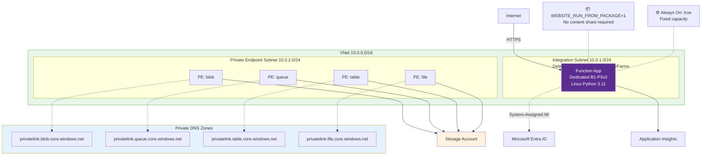
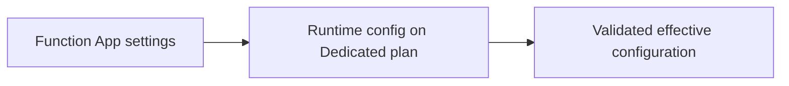

---
hide:
  - toc
validation:
  az_cli:
    last_tested: 2026-04-09
    cli_version: "2.83.0"
    core_tools_version: "4.8.0"
    result: pass
  bicep:
    last_tested: null
    result: not_tested
content_sources:
  - type: mslearn-adapted
    url: https://learn.microsoft.com/azure/azure-functions/functions-app-settings
  - type: mslearn-adapted
    url: https://learn.microsoft.com/azure/app-service/configure-common
  - type: mslearn-adapted
    url: https://learn.microsoft.com/azure/azure-functions/functions-scale
---

# 03 - Configuration (Dedicated)

This tutorial configures runtime settings for a Dedicated Function App using classic App Service configuration patterns. On Dedicated, use `siteConfig.appSettings` style settings and remember the plan is always running and billed 24/7.

## Prerequisites

- Completed [02 - First Deploy](02-first-deploy.md)
- Environment variables set:

```bash
export RG="rg-func-dedicated-dev"
export APP_NAME="func-dedi-<unique-suffix>"
export PLAN_NAME="asp-dedi-b1-dev"
export STORAGE_NAME="stdedidev<unique>"
export LOCATION="koreacentral"
```

## What You'll Build

You will configure required app settings, apply runtime options such as Always On, and validate Dedicated-specific scaling and timeout behavior.

!!! info "Infrastructure Context"
    **Plan**: Dedicated (B1) | **Network**: Public internet | **VNet**: ❌ (requires Standard+ tier)

    Basic B1 has no VNet integration or private endpoints. The app runs on a fixed App Service Plan (always on, no scale-to-zero). VNet support requires upgrading to Standard (S1) or Premium (P1v3) tier.

    <!-- diagram-id: what-you-ll-build -->


<!-- diagram-id: what-you-ll-build-2 -->


## Steps

### Step 1 - Review current app settings

```bash
az functionapp config appsettings list \
  --name $APP_NAME \
  --resource-group $RG \
  --output table
```

### Step 2 - Set required and custom app settings

Dedicated supports both connection-string and identity-based host storage configuration.

Connection-string option:

```bash
STORAGE_CONNECTION_STRING=$(az storage account show-connection-string \
  --name $STORAGE_NAME \
  --resource-group $RG \
  --query connectionString \
  --output tsv)

az functionapp config appsettings set \
  --name $APP_NAME \
  --resource-group $RG \
  --settings \
    FUNCTIONS_WORKER_RUNTIME=python \
    AzureWebJobsStorage="$STORAGE_CONNECTION_STRING" \
    APP_ENV=dedicated-dev
```

Identity-based option (alternative):

```bash
az functionapp identity assign \
  --name $APP_NAME \
  --resource-group $RG

az functionapp config appsettings set \
  --name $APP_NAME \
  --resource-group $RG \
  --settings \
    AzureWebJobsStorage__accountName=$STORAGE_NAME \
    AzureWebJobsStorage__credential=managedidentity
```

!!! warning "Identity-based storage requires Managed Identity and RBAC"
    Before using identity-based host storage, you must:

    1. Enable system-assigned managed identity on the Function App (as shown above).
    2. Grant host storage data-plane roles on the storage account scope. At minimum include **Storage Blob Data Owner**, **Storage Queue Data Contributor**, and **Storage Table Data Contributor** (the host uses blobs, queues, and tables): `az role assignment create --assignee-object-id "<principal-id>" --role "Storage Blob Data Owner" --scope "/subscriptions/<subscription-id>/resourceGroups/$RG/providers/Microsoft.Storage/storageAccounts/$STORAGE_NAME"`
    3. Set both `AzureWebJobsStorage__accountName` and `AzureWebJobsStorage__credential=managedidentity` app settings.

### Step 3 - Configure runtime behavior

```bash
az functionapp config set \
  --name $APP_NAME \
  --resource-group $RG \
  --always-on true \
  --number-of-workers 1
```

### Step 4 - Set function timeout in host.json

Update `apps/python/host.json` with a Dedicated-friendly timeout value:

```json
{
  "version": "2.0",
  "functionTimeout": "00:30:00"
}
```

On Dedicated, default timeout is 30 minutes and maximum timeout is unlimited.

### Step 5 - Understand plan behavior and scaling

- Dedicated does not scale to zero.
- Scaling on Basic (B1) is manual only. Autoscale rules are available on Standard and higher tiers.
- Typical maximum instance limits by Dedicated tier are Basic: 3, Standard: 10, Premium: 30.
- Memory and CPU are determined by plan SKU (B1, S1, P1v2, and others).
- Windows and Linux are both supported.

### Step 6 - Confirm effective configuration

```bash
az functionapp config show \
  --name $APP_NAME \
  --resource-group $RG \
  --query "{alwaysOn:alwaysOn,linuxFxVersion:linuxFxVersion,numberOfWorkers:numberOfWorkers}" \
  --output json
```

!!! info "Dedicated uses classic configuration model"
    For Dedicated (App Service Plan), configure settings through classic App Service app settings (`siteConfig.appSettings`). Do not use `functionAppConfig` in this plan.

## Verification

`az functionapp config appsettings set ...`:

```json
{
  "id": "/subscriptions/<subscription-id>/resourceGroups/rg-func-dedicated-dev/providers/Microsoft.Web/sites/func-dedi-<unique-suffix>/config/appsettings",
  "location": "Korea Central",
  "name": "appsettings",
  "properties": {
    "APP_ENV": "dedicated-dev",
    "AzureWebJobsStorage": "DefaultEndpointsProtocol=https;AccountName=<masked>;AccountKey=<masked>;EndpointSuffix=core.windows.net",
    "FUNCTIONS_WORKER_RUNTIME": "python"
  }
}
```

`az functionapp config show ... --query ...`:

```json
{
  "alwaysOn": true,
  "linuxFxVersion": "Python|3.11",
  "numberOfWorkers": 1
}
```

## Next Steps

You now have a correctly configured Dedicated app with explicit runtime settings and Always On enabled. Next you will add observability with logs, metrics, and alerts.

> **Next:** [04 - Logging & Monitoring](04-logging-monitoring.md)

## See Also

- [Tutorial Overview & Plan Chooser](../index.md)
- [Python Language Guide](../../index.md)
- [Platform: Hosting Plans](../../../../platform/hosting.md)
- [Operations: Deployment](../../../../operations/deployment.md)
- [Recipes Index](../../recipes/index.md)

## Sources

- [App settings reference for Azure Functions](https://learn.microsoft.com/azure/azure-functions/functions-app-settings)
- [Configure App Service app settings](https://learn.microsoft.com/azure/app-service/configure-common)
- [Functions scale and hosting behavior](https://learn.microsoft.com/azure/azure-functions/functions-scale)
