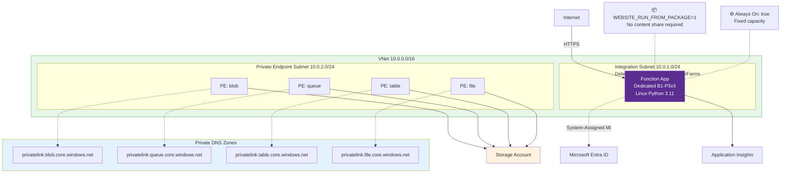
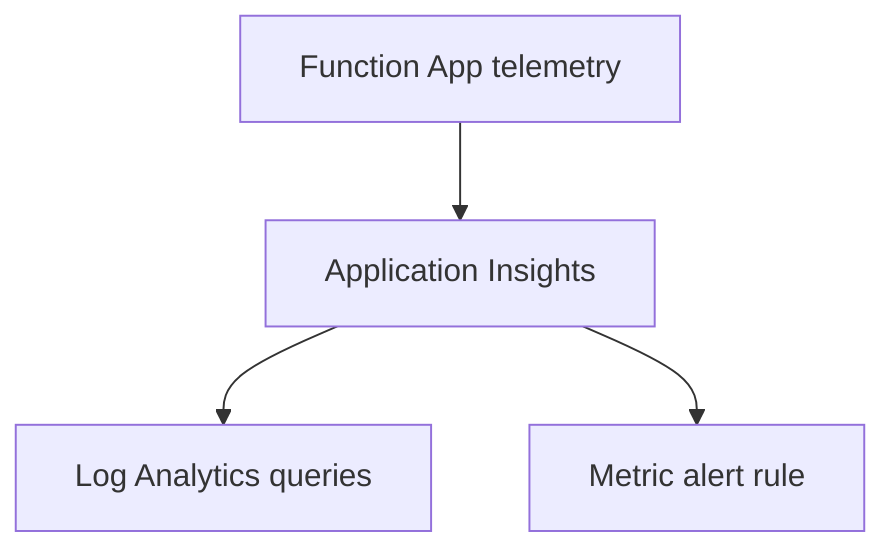

---
validation:
  az_cli:
    last_tested: 2026-04-09
    cli_version: "2.83.0"
    core_tools_version: "4.8.0"
    result: pass
  bicep:
    last_tested: null
    result: not_tested
content_sources:
  - type: mslearn-adapted
    url: https://learn.microsoft.com/azure/azure-functions/functions-monitoring
  - type: mslearn-adapted
    url: https://learn.microsoft.com/azure/azure-functions/functions-monitoring#application-insights
  - type: mslearn-adapted
    url: https://learn.microsoft.com/azure/app-service/overview-vnet-integration
  - type: mslearn-adapted
    url: https://learn.microsoft.com/azure/app-service/networking/private-endpoint
  - type: mslearn-adapted
    url: https://learn.microsoft.com/azure/azure-monitor/alerts/alerts-metric-overview
---

# 04 - Logging & Monitoring (Dedicated)

This tutorial enables monitoring for a Dedicated Function App with Application Insights and Log Analytics queries. Dedicated plans are always running, so telemetry volume and baseline cost are predictable and continuous.

## Prerequisites

- Completed [03 - Configuration](03-configuration.md)
- Azure CLI logged in and variables set:

```bash
export RG="rg-func-dedicated-dev"
export APP_NAME="func-dedi-<unique-suffix>"
export PLAN_NAME="asp-dedi-b1-dev"
export STORAGE_NAME="stdedidev<unique>"
export LOCATION="koreacentral"
export APPINSIGHTS_NAME="appi-dedi-<unique-suffix>"
export LOG_ANALYTICS_NAME="log-dedi-<unique-suffix>"
```

## What You'll Build

You will connect the Dedicated Function App to workspace-based Application Insights, run request queries, and configure a baseline alert for HTTP failures.

!!! info "Infrastructure Context"
    **Plan**: Dedicated (B1) | **Network**: Public internet in this tutorial | **VNet**: Supported by platform, not configured here

    The app runs on a fixed App Service Plan (always on, no scale-to-zero). Basic B1 supports App Service VNet integration and private endpoints, but this guide uses Standard (S1+) for private networking scenarios to provide scale headroom, deployment slots, and a production-oriented validation path.

    <!-- diagram-id: what-you-ll-build -->


<!-- diagram-id: what-you-ll-build-2 -->


## Steps

### Step 1 - Create Log Analytics workspace

```bash
az monitor log-analytics workspace create \
  --resource-group $RG \
  --workspace-name $LOG_ANALYTICS_NAME \
  --location $LOCATION
```

| CLI element | Explanation |
|---|---|
| Command(s) | `az monitor log-analytics workspace create` |
| Key flags | `--resource-group`, `--workspace-name`, `--location` |
| Variables | `$RG`, `$LOG_ANALYTICS_NAME`, `$LOCATION` |
| Expected result | Azure CLI returns provisioning details; confirm the resource name and successful provisioning state before continuing. |


### Step 2 - Create Application Insights (workspace-based)

```bash
WORKSPACE_ID=$(az monitor log-analytics workspace show \
  --resource-group $RG \
  --workspace-name $LOG_ANALYTICS_NAME \
  --query id \
  --output tsv)

az monitor app-insights component create \
  --app $APPINSIGHTS_NAME \
  --location $LOCATION \
  --resource-group $RG \
  --workspace $WORKSPACE_ID \
  --application-type web
```

| CLI element | Explanation |
|---|---|
| Command(s) | `az monitor log-analytics workspace show`, `az monitor app-insights component create` |
| Key flags | `--resource-group`, `--workspace-name`, `--query`, `--output`, `--app`, `--location`, `--workspace`, `--application-type` |
| Variables | `$RG`, `$LOG_ANALYTICS_NAME`, `$APPINSIGHTS_NAME`, `$LOCATION`, `$WORKSPACE_ID` |
| Expected result | Azure CLI returns provisioning details; confirm the resource name and successful provisioning state before continuing. |


### Step 3 - Connect Function App to Application Insights

```bash
APPINSIGHTS_CONNECTION_STRING=$(az monitor app-insights component show \
  --app $APPINSIGHTS_NAME \
  --resource-group $RG \
  --query connectionString \
  --output tsv)

az functionapp config appsettings set \
  --name $APP_NAME \
  --resource-group $RG \
  --settings \
    APPLICATIONINSIGHTS_CONNECTION_STRING="$APPINSIGHTS_CONNECTION_STRING"
```

| CLI element | Explanation |
|---|---|
| Command(s) | `az monitor app-insights component show`, `az functionapp config appsettings set` |
| Key flags | `--app`, `--resource-group`, `--query`, `--output`, `--name`, `--settings` |
| Variables | `$APPINSIGHTS_NAME`, `$RG`, `$APP_NAME`, `$APPINSIGHTS_CONNECTION_STRING` |
| Expected result | Azure CLI applies the configuration change; confirm the returned JSON or follow-up query shows the expected value. |


### Step 4 - Stream platform logs

```bash
az webapp log config \
  --name $APP_NAME \
  --resource-group $RG \
  --application-logging filesystem \
  --level information

az webapp log tail \
  --name $APP_NAME \
  --resource-group $RG
```

| CLI element | Explanation |
|---|---|
| Command(s) | `az webapp log config`, `az webapp log tail` |
| Key flags | `--name`, `--resource-group`, `--application-logging`, `--level` |
| Variables | `$APP_NAME`, `$RG` |
| Expected result | Azure CLI applies the configuration change; confirm the returned JSON or follow-up query shows the expected value. |


Kudu/SCM is available on Dedicated, so you can also inspect diagnostics through `https://$APP_NAME.scm.azurewebsites.net`.

### Step 5 - Run a basic query for requests

```bash
APPINSIGHTS_APP_ID=$(az monitor app-insights component show \
  --app $APPINSIGHTS_NAME \
  --resource-group $RG \
  --query appId \
  --output tsv)

az monitor app-insights query \
  --app $APPINSIGHTS_APP_ID \
  --analytics-query "requests | take 5" \
  --output json
```

| CLI element | Explanation |
|---|---|
| Command(s) | `az monitor app-insights component show`, `az monitor app-insights query` |
| Key flags | `--app`, `--resource-group`, `--query`, `--output`, `--analytics-query` |
| Variables | `$APPINSIGHTS_NAME`, `$RG`, `$APPINSIGHTS_APP_ID` |
| Expected result | Azure CLI returns the requested resource data; verify names, IDs, status fields, or metric values match the scenario. |


!!! tip "Use `--output json` for App Insights queries"
    The `--output table` format for `az monitor app-insights query` may return empty results even when data exists. Use `--output json` to reliably retrieve query results.

### Step 6 - Add an alert rule for failures

```bash
APP_ID=$(az functionapp show \
  --name $APP_NAME \
  --resource-group $RG \
  --query id \
  --output tsv)

ACTION_GROUP_ID=$(az monitor action-group create \
  --name "ag-dedi-alerts" \
  --resource-group $RG \
  --short-name "dediag" \
  --action webhook alertHook "https://example.com/webhook" \
  --query id \
  --output tsv)

az monitor metrics alert create \
  --name "alert-func-http5xx" \
  --resource-group $RG \
  --scopes $APP_ID \
  --condition "total Http5xx > 5" \
  --window-size 5m \
  --evaluation-frequency 1m \
  --action $ACTION_GROUP_ID
```

| CLI element | Explanation |
|---|---|
| Command(s) | `az functionapp show`, `az monitor action-group create`, `az monitor metrics alert create` |
| Key flags | `--name`, `--resource-group`, `--query`, `--output`, `--short-name`, `--action`, `--scopes`, `--condition`, `--window-size`, `--evaluation-frequency` |
| Variables | `$APP_NAME`, `$RG`, `$APP_ID`, `$ACTION_GROUP_ID` |
| Expected result | Azure CLI returns provisioning details; confirm the resource name and successful provisioning state before continuing. |


## Verification

`az monitor app-insights component create ...`:

```json
{
  "appId": "xxxxxxxx-xxxx-xxxx-xxxx-xxxxxxxxxxxx",
  "applicationType": "web",
  "connectionString": "InstrumentationKey=<masked>;IngestionEndpoint=https://<region>.in.applicationinsights.azure.com/;LiveEndpoint=https://<region>.livediagnostics.monitor.azure.com/",
  "id": "/subscriptions/<subscription-id>/resourceGroups/rg-func-dedicated-dev/providers/microsoft.insights/components/appi-dedi-<unique-suffix>",
  "name": "appi-dedi-<unique-suffix>"
}
```

`az monitor app-insights query --analytics-query "requests | take 5" --output json`:

```text
TimeGenerated                 name     resultCode    duration
----------------------------  -------  ------------  --------
2026-04-03T10:22:41.132000Z  GET /api/health  200   00:00:00.018
2026-04-03T10:22:35.917000Z  GET /api/info    200   00:00:00.025
```

`az monitor metrics alert create ...`:

```json
{
  "id": "/subscriptions/<subscription-id>/resourceGroups/rg-func-dedicated-dev/providers/microsoft.insights/metricAlerts/alert-func-http5xx",
  "name": "alert-func-http5xx",
  "enabled": true,
  "severity": 3
}
```

## Next Steps

Monitoring is now in place with logs, queries, and alerts. Next you will codify Dedicated infrastructure using Bicep.

> **Next:** [05 - Infrastructure as Code](05-infrastructure-as-code.md)

## See Also

- [Tutorial Overview & Plan Chooser](../index.md)
- [Python Language Guide](../../index.md)
- [Platform: Hosting Plans](../../../../platform/hosting.md)
- [Operations: Deployment](../../../../operations/deployment.md)
- [Recipes Index](../../recipes/index.md)

## Sources

- [Monitor Azure Functions](https://learn.microsoft.com/azure/azure-functions/functions-monitoring)
- [Application Insights for Azure Functions](https://learn.microsoft.com/azure/azure-functions/functions-monitoring#application-insights)
- [Azure Monitor metrics alerts](https://learn.microsoft.com/azure/azure-monitor/alerts/alerts-metric-overview)
