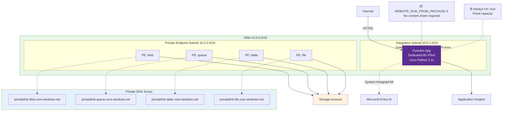
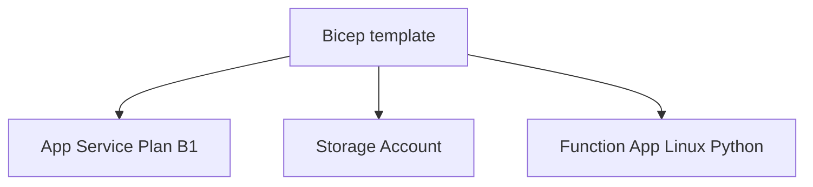

---
validation:
  az_cli:
    last_tested: 2026-04-09
    cli_version: "2.83.0"
    core_tools_version: "4.8.0"
    result: pass
  bicep:
    last_tested: null
    result: not_tested
content_sources:
  - type: mslearn-adapted
    url: https://learn.microsoft.com/azure/azure-resource-manager/bicep/
  - type: mslearn-adapted
    url: https://learn.microsoft.com/azure/templates/microsoft.web/serverfarms
  - type: mslearn-adapted
    url: https://learn.microsoft.com/azure/templates/microsoft.web/sites
  - type: mslearn-adapted
    url: https://learn.microsoft.com/azure/app-service/overview-vnet-integration
  - type: mslearn-adapted
    url: https://learn.microsoft.com/azure/app-service/networking/private-endpoint
---

# 05 - Infrastructure as Code (Dedicated)

This tutorial deploys a Dedicated Function App stack using Bicep. It uses a Linux Basic B1 App Service Plan for cost-efficient learning and provisions the core resources needed for a Python Function App.

## Prerequisites

- Completed [04 - Logging & Monitoring](04-logging-monitoring.md)
- Azure CLI with Bicep support
- Variables available:

```bash
export RG="rg-func-dedicated-dev"
export APP_NAME="func-dedi-<unique-suffix>"
export PLAN_NAME="asp-dedi-b1-dev"
export STORAGE_NAME="stdedidev<unique>"
export LOCATION="koreacentral"
```

## What You'll Build

You will define and deploy a Dedicated App Service Plan, storage account, and Linux Python Function App by using `infra/dedicated/main.bicep`, then validate the deployed resources.

!!! info "Infrastructure Context"
    **Plan**: Dedicated (B1) | **Network**: Public internet in this tutorial | **VNet**: Supported by platform, not configured here

    The app runs on a fixed App Service Plan (always on, no scale-to-zero). Basic B1 supports App Service VNet integration and private endpoints, but this guide uses Standard (S1+) for private networking scenarios to provide scale headroom, deployment slots, and a production-oriented validation path.

    <!-- diagram-id: what-you-ll-build -->


<!-- diagram-id: what-you-ll-build-2 -->


## Steps

### Step 1 - Create and review the Bicep entry point

Use `infra/dedicated/main.bicep` as the Dedicated template root.

```bash
mkdir --parents infra/dedicated
touch infra/dedicated/main.bicep
ls infra/dedicated/main.bicep
```

### Step 2 - Define Dedicated plan and Function App resources

Your template should include these Dedicated-specific values:

```bicep
param location string = resourceGroup().location
param planName string
param appName string
param storageName string

resource plan 'Microsoft.Web/serverfarms@2023-12-01' = {
  name: planName
  location: location
  kind: 'linux'
  sku: {
    name: 'B1'
    tier: 'Basic'
  }
  properties: {
    reserved: true
  }
}

resource storage 'Microsoft.Storage/storageAccounts@2023-05-01' = {
  name: storageName
  location: location
  sku: {
    name: 'Standard_LRS'
  }
  kind: 'StorageV2'
}

resource functionApp 'Microsoft.Web/sites@2023-12-01' = {
  name: appName
  location: location
  kind: 'functionapp,linux'
  properties: {
    serverFarmId: plan.id
    siteConfig: {
      alwaysOn: true
      linuxFxVersion: 'Python|3.11'
      appSettings: [
        {
          name: 'FUNCTIONS_WORKER_RUNTIME'
          value: 'python'
        }
        {
          name: 'AzureWebJobsStorage'
          value: '<connection-string-or-identity-based-setting>'
        }
      ]
    }
  }
}
```

This is the classic `siteConfig.appSettings` model for Dedicated (not `functionAppConfig`).

### Step 3 - Configure Function App settings for Dedicated

Dedicated does not require Azure Files content share settings such as `WEBSITE_CONTENTAZUREFILECONNECTIONSTRING` as a general rule.

```bicep
resource functionApp 'Microsoft.Web/sites@2023-12-01' = {
  name: appName
  location: location
  kind: 'functionapp,linux'
  properties: {
    serverFarmId: plan.id
    siteConfig: {
      alwaysOn: true
      linuxFxVersion: 'Python|3.11'
      appSettings: [
        {
          name: 'FUNCTIONS_WORKER_RUNTIME'
          value: 'python'
        }
        {
          name: 'AzureWebJobsStorage'
          value: '<connection-string-or-identity-based-setting>'
        }
      ]
    }
  }
}
```

### Step 4 - Deploy the Bicep template

```bash
az group create \
  --name $RG \
  --location $LOCATION

az deployment group create \
  --resource-group $RG \
  --template-file infra/dedicated/main.bicep \
  --parameters \
    location=$LOCATION \
    planName=$PLAN_NAME \
    appName=$APP_NAME \
    storageName=$STORAGE_NAME
```

| CLI element | Explanation |
|---|---|
| Command(s) | `az group create`, `az deployment group create` |
| Key flags | `--name`, `--location`, `--resource-group`, `--template-file`, `--parameters` |
| Variables | `$RG`, `$LOCATION`, `$PLAN_NAME`, `$APP_NAME`, `$STORAGE_NAME` |
| Expected result | Azure CLI returns provisioning details; confirm the resource name and successful provisioning state before continuing. |


### Step 5 - Validate deployed resources

```bash
az appservice plan show \
  --name $PLAN_NAME \
  --resource-group $RG \
  --query "{name:name,sku:sku.name,tier:sku.tier,kind:kind}" \
  --output json

az functionapp show \
  --name $APP_NAME \
  --resource-group $RG \
  --query "{name:name,kind:kind,defaultHostName:defaultHostName}" \
  --output json
```

| CLI element | Explanation |
|---|---|
| Command(s) | `az appservice plan show`, `az functionapp show` |
| Key flags | `--name`, `--resource-group`, `--query`, `--output` |
| Variables | `$PLAN_NAME`, `$RG`, `$APP_NAME` |
| Expected result | Azure CLI returns the requested resource data; verify names, IDs, status fields, or metric values match the scenario. |


### Option B: Deploy with Azure CLI (No Bicep)

Use this full CLI sequence when you want to provision the same Dedicated baseline without Bicep.

#### B-1: Resource Group

```bash
az group create \
  --name "$RG" \
  --location "$LOCATION"
```

| CLI element | Explanation |
|---|---|
| Command(s) | `az group create` |
| Key flags | `--name`, `--location` |
| Variables | `$RG`, `$LOCATION` |
| Expected result | Azure CLI returns provisioning details; confirm the resource name and successful provisioning state before continuing. |


#### B-2: Storage Account

```bash
az storage account create \
  --name "$STORAGE_NAME" \
  --resource-group "$RG" \
  --location "$LOCATION" \
  --sku "Standard_LRS" \
  --kind "StorageV2"
```

| CLI element | Explanation |
|---|---|
| Command(s) | `az storage account create` |
| Key flags | `--name`, `--resource-group`, `--location`, `--sku`, `--kind` |
| Variables | `$STORAGE_NAME`, `$RG`, `$LOCATION` |
| Expected result | Azure CLI returns provisioning details; confirm the resource name and successful provisioning state before continuing. |


#### B-3: App Service Plan (B1)

```bash
az appservice plan create \
  --name "$PLAN_NAME" \
  --resource-group "$RG" \
  --location "$LOCATION" \
  --sku "B1" \
  --is-linux
```

| CLI element | Explanation |
|---|---|
| Command(s) | `az appservice plan create` |
| Key flags | `--name`, `--resource-group`, `--location`, `--sku`, `--is-linux` |
| Variables | `$PLAN_NAME`, `$RG`, `$LOCATION` |
| Expected result | Azure CLI returns provisioning details; confirm the resource name and successful provisioning state before continuing. |


#### B-4: Function App (with Always On)

```bash
az functionapp create \
  --name "$APP_NAME" \
  --resource-group "$RG" \
  --plan "$PLAN_NAME" \
  --storage-account "$STORAGE_NAME" \
  --runtime "python" \
  --runtime-version "3.11" \
  --functions-version "4" \
  --os-type "Linux"

az functionapp config set \
  --name "$APP_NAME" \
  --resource-group "$RG" \
  --always-on true
```

| CLI element | Explanation |
|---|---|
| Command(s) | `az functionapp create`, `az functionapp config set` |
| Key flags | `--name`, `--resource-group`, `--plan`, `--storage-account`, `--runtime`, `--runtime-version`, `--functions-version`, `--os-type`, `--always-on` |
| Variables | `$APP_NAME`, `$RG`, `$PLAN_NAME`, `$STORAGE_NAME` |
| Expected result | Azure CLI returns provisioning details; confirm the resource name and successful provisioning state before continuing. |


#### B-5: App Settings (connection string or identity-based)

```bash
az functionapp config appsettings set \
  --name "$APP_NAME" \
  --resource-group "$RG" \
  --settings "WEBSITE_RUN_FROM_PACKAGE=1" "FUNCTIONS_WORKER_RUNTIME=python"
```

| CLI element | Explanation |
|---|---|
| Command(s) | `az functionapp config appsettings set` |
| Key flags | `--name`, `--resource-group`, `--settings` |
| Variables | `$APP_NAME`, `$RG` |
| Expected result | Azure CLI applies the configuration change; confirm the returned JSON or follow-up query shows the expected value. |


Connection string mode:

```bash
export STORAGE_CONN_STRING=$(az storage account show-connection-string \
  --name "$STORAGE_NAME" \
  --resource-group "$RG" \
  --query "connectionString" \
  --output tsv)

az functionapp config appsettings set \
  --name "$APP_NAME" \
  --resource-group "$RG" \
  --settings "AzureWebJobsStorage=$STORAGE_CONN_STRING"
```

| CLI element | Explanation |
|---|---|
| Command(s) | `az storage account show-connection-string`, `az functionapp config appsettings set` |
| Key flags | `--name`, `--resource-group`, `--query`, `--output`, `--settings` |
| Variables | `$STORAGE_NAME`, `$RG`, `$APP_NAME`, `$STORAGE_CONN_STRING` |
| Expected result | Azure CLI applies the configuration change; confirm the returned JSON or follow-up query shows the expected value. |


Identity-based mode:

```bash
az functionapp identity assign \
  --name "$APP_NAME" \
  --resource-group "$RG"

az functionapp config appsettings set \
  --name "$APP_NAME" \
  --resource-group "$RG" \
  --settings \
    "AzureWebJobsStorage__accountName=$STORAGE_NAME" \
    "AzureWebJobsStorage__credential=managedidentity"
```

| CLI element | Explanation |
|---|---|
| Command(s) | `az functionapp identity assign`, `az functionapp config appsettings set` |
| Key flags | `--name`, `--resource-group`, `--settings` |
| Variables | `$APP_NAME`, `$RG`, `$STORAGE_NAME` |
| Expected result | Azure CLI applies the configuration change; confirm the returned JSON or follow-up query shows the expected value. |


#### B-6: Application Insights

```bash
export APPINSIGHTS_NAME="appi-$APP_NAME"

az monitor app-insights component create \
  --app "$APPINSIGHTS_NAME" \
  --resource-group "$RG" \
  --location "$LOCATION" \
  --application-type "web"

export APPINSIGHTS_CONNECTION_STRING=$(az monitor app-insights component show \
  --app "$APPINSIGHTS_NAME" \
  --resource-group "$RG" \
  --query "connectionString" \
  --output tsv)

az functionapp config appsettings set \
  --name "$APP_NAME" \
  --resource-group "$RG" \
  --settings "APPLICATIONINSIGHTS_CONNECTION_STRING=$APPINSIGHTS_CONNECTION_STRING"
```

| CLI element | Explanation |
|---|---|
| Command(s) | `az monitor app-insights component create`, `az monitor app-insights component show`, `az functionapp config appsettings set` |
| Key flags | `--app`, `--resource-group`, `--location`, `--application-type`, `--query`, `--output`, `--name`, `--settings` |
| Variables | `$APP_NAME`, `$APPINSIGHTS_NAME`, `$RG`, `$LOCATION`, `$APPINSIGHTS_CONNECTION_STRING` |
| Expected result | Azure CLI returns provisioning details; confirm the resource name and successful provisioning state before continuing. |


??? example "Optional: VNet and Private Endpoints"
    Basic (B1) can use App Service VNet integration and private endpoints. This optional path upgrades to `S1` so the tutorial matches the guide-tested private networking scenario and provides more production headroom.

    !!! info "B1 network support and guide scope"
        B1 supports these platform networking features, but this guide validates private networking on Standard (S1+) for production-oriented examples.

        If you add optional VNet integration in this template, document subnet delegation to `Microsoft.Web/serverFarms` and use S1 or higher when you want to match this guide exactly.

    #### B-7: Upgrade to Standard (if needed)

    ```bash
    az appservice plan update \
      --name "$PLAN_NAME" \
      --resource-group "$RG" \
      --sku S1
    ```

    | CLI element | Explanation |
    |---|---|
    | Command(s) | `az appservice plan update` |
    | Key flags | `--name`, `--resource-group`, `--sku` |
    | Variables | `$PLAN_NAME`, `$RG` |
    | Expected result | Azure CLI applies the configuration change; confirm the returned JSON or follow-up query shows the expected value. |


    #### B-8: VNet and Subnets

    ```bash
    export VNET_NAME="vnet-dedicated-demo"

    az network vnet create \
      --name "$VNET_NAME" \
      --resource-group "$RG" \
      --location "$LOCATION" \
      --address-prefixes "10.0.0.0/16" \
      --subnet-name "snet-integration" \
      --subnet-prefixes "10.0.1.0/24"

    az network vnet subnet create \
      --name "snet-private-endpoints" \
      --resource-group "$RG" \
      --vnet-name "$VNET_NAME" \
      --address-prefixes "10.0.2.0/24"

    az network vnet subnet update \
      --name "snet-integration" \
      --resource-group "$RG" \
      --vnet-name "$VNET_NAME" \
      --delegations "Microsoft.Web/serverFarms"
    ```

    | CLI element | Explanation |
    |---|---|
    | Command(s) | `az network vnet create`, `az network vnet subnet create`, `az network vnet subnet update` |
    | Key flags | `--name`, `--resource-group`, `--location`, `--address-prefixes`, `--subnet-name`, `--subnet-prefixes`, `--vnet-name`, `--delegations` |
    | Variables | `$VNET_NAME`, `$RG`, `$LOCATION` |
    | Expected result | Azure CLI returns provisioning details; confirm the resource name and successful provisioning state before continuing. |


    #### B-9: VNet Integration

    ```bash
    az functionapp vnet-integration add \
      --name "$APP_NAME" \
      --resource-group "$RG" \
      --vnet "$VNET_NAME" \
      --subnet "snet-integration"
    ```

    | CLI element | Explanation |
    |---|---|
    | Command(s) | `az functionapp vnet-integration add` |
    | Key flags | `--name`, `--resource-group`, `--vnet`, `--subnet` |
    | Variables | `$APP_NAME`, `$RG`, `$VNET_NAME` |
    | Expected result | Azure CLI completes successfully and returns JSON, table, or no output depending on the command; verify the next documented check before continuing. |


    #### B-10: Managed Identity and RBAC

    ```bash
    az functionapp identity assign \
      --name "$APP_NAME" \
      --resource-group "$RG"

    export MI_PRINCIPAL_ID=$(az functionapp identity show \
      --name "$APP_NAME" \
      --resource-group "$RG" \
      --query "principalId" \
      --output tsv)

    export STORAGE_ID=$(az storage account show \
      --name "$STORAGE_NAME" \
      --resource-group "$RG" \
      --query "id" \
      --output tsv)

    az role assignment create \
      --assignee "$MI_PRINCIPAL_ID" \
      --role "Storage Blob Data Owner" \
      --scope "$STORAGE_ID"

    az role assignment create \
      --assignee "$MI_PRINCIPAL_ID" \
      --role "Storage Account Contributor" \
      --scope "$STORAGE_ID"

    az role assignment create \
      --assignee "$MI_PRINCIPAL_ID" \
      --role "Storage Queue Data Contributor" \
      --scope "$STORAGE_ID"
    ```

    | CLI element | Explanation |
    |---|---|
    | Command(s) | `az functionapp identity assign`, `az functionapp identity show`, `az storage account show`, `az role assignment create` |
    | Key flags | `--name`, `--resource-group`, `--query`, `--output`, `--assignee`, `--role`, `--scope` |
    | Variables | `$APP_NAME`, `$RG`, `$STORAGE_NAME`, `$MI_PRINCIPAL_ID`, `$STORAGE_ID` |
    | Expected result | Azure CLI returns provisioning details; confirm the resource name and successful provisioning state before continuing. |


    #### B-11: Lock Down Storage

    ```bash
    az storage account update \
      --name "$STORAGE_NAME" \
      --resource-group "$RG" \
      --allow-blob-public-access false
    ```

    | CLI element | Explanation |
    |---|---|
    | Command(s) | `az storage account update` |
    | Key flags | `--name`, `--resource-group`, `--allow-blob-public-access` |
    | Variables | `$STORAGE_NAME`, `$RG` |
    | Expected result | Azure CLI applies the configuration change; confirm the returned JSON or follow-up query shows the expected value. |


    #### B-12: Storage Private Endpoints (x4)

    ```bash
    for SVC in blob queue table file; do
      az network private-endpoint create \
        --name "pe-st-$SVC" \
        --resource-group "$RG" \
        --location "$LOCATION" \
        --vnet-name "$VNET_NAME" \
        --subnet "snet-private-endpoints" \
        --private-connection-resource-id "$STORAGE_ID" \
        --group-ids "$SVC" \
        --connection-name "conn-st-$SVC"
    done
    ```

    | CLI element | Explanation |
    |---|---|
    | Command(s) | `az network private-endpoint create` |
    | Key flags | `--name`, `--resource-group`, `--location`, `--vnet-name`, `--subnet`, `--private-connection-resource-id`, `--group-ids`, `--connection-name` |
    | Variables | `$SVC`, `$RG`, `$LOCATION`, `$VNET_NAME`, `$STORAGE_ID` |
    | Expected result | Azure CLI returns provisioning details; confirm the resource name and successful provisioning state before continuing. |


    #### B-13: Private DNS Zones and VNet Links (x4)

    ```bash
    for SVC in blob queue table file; do
      az network private-dns zone create \
        --resource-group "$RG" \
        --name "privatelink.$SVC.core.windows.net"

      az network private-dns link vnet create \
        --resource-group "$RG" \
        --zone-name "privatelink.$SVC.core.windows.net" \
        --name "link-$SVC" \
        --virtual-network "$VNET_NAME" \
        --registration-enabled false

      az network private-endpoint dns-zone-group create \
        --resource-group "$RG" \
        --endpoint-name "pe-st-$SVC" \
        --name "$SVC-dns-zone-group" \
        --private-dns-zone "privatelink.$SVC.core.windows.net" \
        --zone-name "$SVC"
    done
    ```

    | CLI element | Explanation |
    |---|---|
    | Command(s) | `az network private-dns zone create`, `az network private-dns link vnet`, `az network private-endpoint dns-zone-group create` |
    | Key flags | `--resource-group`, `--name`, `--zone-name`, `--virtual-network`, `--registration-enabled`, `--endpoint-name`, `--private-dns-zone` |
    | Variables | `$RG`, `$SVC`, `$VNET_NAME` |
    | Expected result | Azure CLI returns provisioning details; confirm the resource name and successful provisioning state before continuing. |


    #### B-14: Identity-Based Storage Config

    ```bash
    az functionapp config appsettings set \
      --name "$APP_NAME" \
      --resource-group "$RG" \
      --settings \
        "AzureWebJobsStorage__accountName=$STORAGE_NAME" \
        "AzureWebJobsStorage__credential=managedidentity"
    ```

    | CLI element | Explanation |
    |---|---|
    | Command(s) | `az functionapp config appsettings set` |
    | Key flags | `--name`, `--resource-group`, `--settings` |
    | Variables | `$APP_NAME`, `$RG`, `$STORAGE_NAME` |
    | Expected result | Azure CLI applies the configuration change; confirm the returned JSON or follow-up query shows the expected value. |


## Verification

`az deployment group create ...`:

```json
{
  "id": "/subscriptions/<subscription-id>/resourceGroups/rg-func-dedicated-dev/providers/Microsoft.Resources/deployments/<auto-generated-deployment-name>",
  "name": "<auto-generated-deployment-name>",
  "properties": {
    "provisioningState": "Succeeded",
    "timestamp": "2026-04-03T10:45:12.000000+00:00"
  },
  "resourceGroup": "rg-func-dedicated-dev"
}
```

`az appservice plan show ... --query ...`:

```json
{
  "kind": "linux",
  "name": "asp-dedi-b1-dev",
  "sku": "B1",
  "tier": "Basic"
}
```

## Next Steps

You now have reproducible Dedicated infrastructure in Bicep. Next you will automate deployment through CI/CD.

> **Next:** [06 - CI/CD](06-ci-cd.md)

## See Also

- [Tutorial Overview & Plan Chooser](../index.md)
- [Python Language Guide](../../index.md)
- [Platform: Hosting Plans](../../../../platform/hosting.md)
- [Operations: Deployment](../../../../operations/deployment.md)
- [Recipes Index](../../recipes/index.md)

## Sources

- [Bicep documentation](https://learn.microsoft.com/azure/azure-resource-manager/bicep/)
- [Microsoft.Web/serverfarms resource reference](https://learn.microsoft.com/azure/templates/microsoft.web/serverfarms)
- [Microsoft.Web/sites resource reference](https://learn.microsoft.com/azure/templates/microsoft.web/sites)
